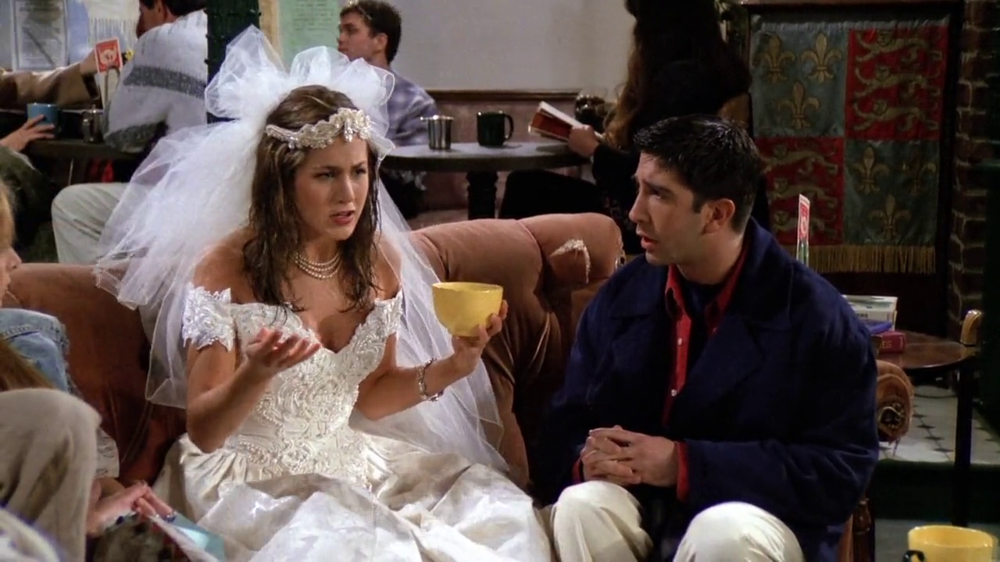
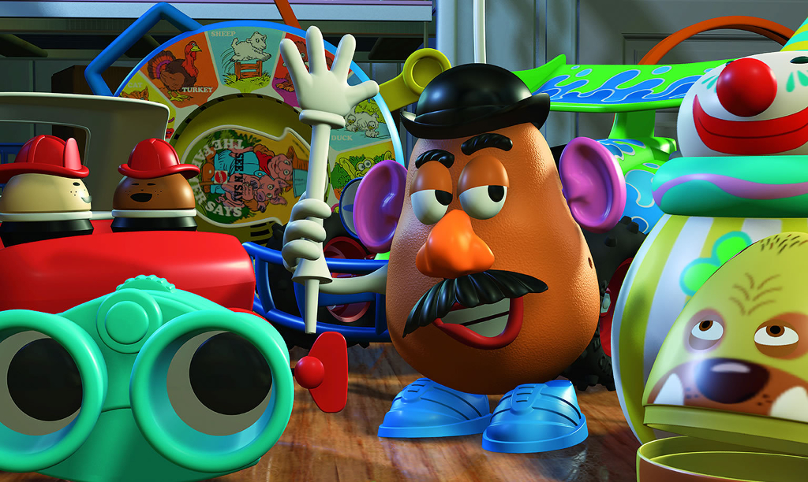
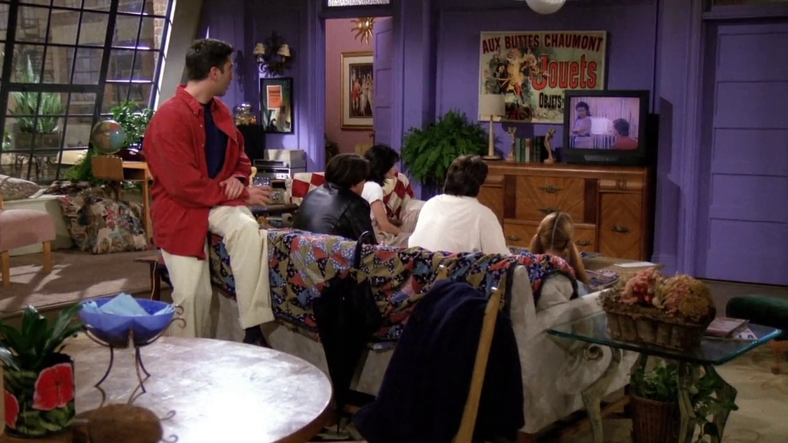

## Mr. Potato Head

Rachel menciona que Barry, seu ex-noivo, parece com o Mr. Potato Head. Trata-se
de um brinquedo inventado por George Lerner, lançado pela Hasbro em 1952. Em sua
versão original havia apenas as partes, tais como: os olhos, as orelhas e a boca,
e era obrigação dos pais fornecerem uma batata de verdade para formar a cabeça.

O Mr. Potato Head também pode ser visto nos filmes de Toy Story (1995, 1999,
2010, 2019), como um dos brinquedos do Andy.

### Referências

- [V&A Museum of Childhood](https://www.vam.ac.uk/moc/collections/mr-potato-head/)
- [Toy Story (IMDB)](https://www.imdb.com/title/tt0114709/)

## Tres Destinos

Os amigos são vistos assistindo a novela Tres Destinos (1993), produzida para o
mercado hispânico nos Estados Unidos. É a clássica novela mexicana, do tipo
popularmente exibido no Brasil, que conta a história de 3 jovens irmãs unidas
e separadas pelo mesmo homem, com todos os ingredientes usuais: intriga, paixão,
vingança, ódio, ternura e amor.

### Referências

- [EcuRed](https://www.ecured.cu/Tres_destinos_(Telenovela))
- [IMDB](https://www.imdb.com/title/tt0211876/)
- [Abertura (YouTube)](https://www.youtube.com/watch?v=kfIk131FZxU)

## Pinóquio

<cena>
    <monica
        original="- Wait, unless you happened to catch the Reruns' production of Pinocchio."
        traducao="- Espera, a não ser que tenha visto a refilmagem do Pinóquio."
    ></monica>
    <chandler
        original="- Look, Gepetto, I'm a real live boy."
        traducao="- Olha, Gepetto, sou um menino de verdade."
    ></chandler>
</cena>

Referência ao filme [Pinóquio](https://www.imdb.com/title/tt0032910/) (1940),
produzido pela Walt Disney, onde é contada a história de um velho carpinteiro chamado Gepetto,
que faz um boneco de madeira chamado Pinóquio, o qual é trazido a vida pela Fada Azul,
com a condição de que ele demonstre obediência, bravura e lealdade a seu criador.

O filme tem muitos trechos musicais, e é daí que o Chandler retira inspiração para a música
que ele canta ao sair do apartamento:

> _Once I was a wooden boy, a little wooden boy..._

### Referências

- [IMDB](https://www.imdb.com/title/tt0032910/)
- [Wikipédia](https://pt.wikipedia.org/wiki/Pin%C3%B3quio_(filme))
