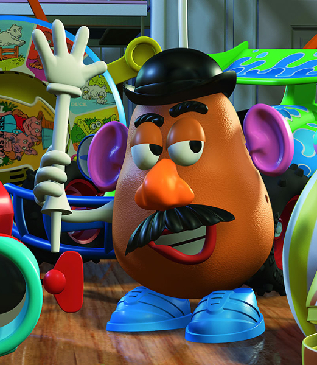
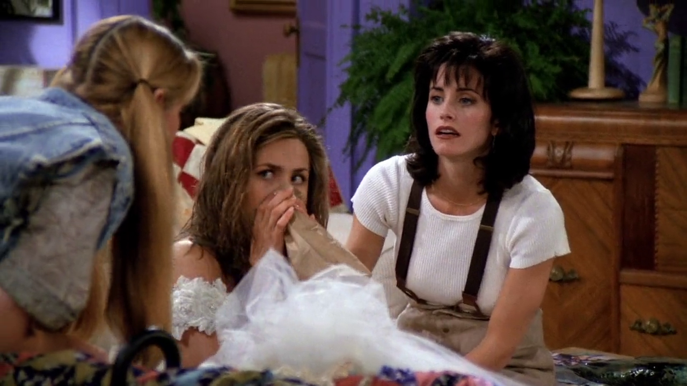

## Mr. Potato Head

{ fullpage=true, clipt=2cm, clipb=5cm }

<cena>
  <rachel
    original="- [...] and that's when it hit me: How much Barry looks like Mr. Potato Head."
    traducao="- [...] e me dei conta: O quanto Barry se parece com o Mr. Potato Head."
  ></rachel>
</cena>

Rachel menciona que Barry, seu ex-noivo, parece com o *Mr. Potato Head.* Trata-se
de um brinquedo inventado por George Lerner, lançado pela Hasbro em 1952. Em sua
versão original havia apenas as partes, tais como: os olhos, as orelhas e a boca,
e era obrigação dos pais fornecerem uma batata de verdade para formar a
cabeça.[^potato-head-museum]

O *Mr. Potato Head* também pode ser visto nos filmes de *Toy Story* (1995, 1999,
2010, 2019), como um dos brinquedos do Andy.[^potato-head-imdb]

{ bookwidth=50% }

[^potato-head-museum]: [Mr. Potato Head - V&A Museum of Childhood](https://www.vam.ac.uk/moc/collections/mr-potato-head/)
[^potato-head-imdb]: [Toy Story (IMDB)](https://www.imdb.com/title/tt0114709/)

## Tres Destinos

{ fullpage=true, clipt=1.5cm, clipb=10cm }

Os amigos são vistos assistindo a telenovela *Tres Destinos* (1993), produzida para o
mercado hispânico nos Estados Unidos. É a clássica novela mexicana, do tipo
popularmente exibida no Brasil, que conta a história de 3 jovens irmãs unidas
e separadas pelo mesmo homem, com todos os ingredientes usuais: intriga, paixão,
vingança, ódio, ternura e amor.[^tres-destinos-ecured] [^tres-destinos-imdb] [^tres-destinos-yt]

[^tres-destinos-ecured]: [Tres Destinos - EcuRed](https://www.ecured.cu/Tres_destinos_(Telenovela))
[^tres-destinos-imdb]: [Tres Destinos - IMDB](https://www.imdb.com/title/tt0211876/)
[^tres-destinos-yt]: [Tres Destinos - Abertura (YouTube)](https://www.youtube.com/watch?v=kfIk131FZxU)

## My Favorite Things

{ fullpage=true, clipt=0.5cm, clipb=6cm }

Para acalmar Rachel, Phoebe canta uma versão própria da música *My Favorite Things*
do musical *The Sound of Music* (1959). Em 1965 foi lançado o filme, conhecido no Brasil
como *A Noviça Rebelde*.[^novica-imdb] [^novica-yt]

A música expressa que você deve lembrar de suas coisas favoritas sempre que se
sentir triste.

<musica>
  <letra slot="original">
    When I'm feeling sad
    I simply remember my favorite things
  </letra>
  <letra slot="traducao">
    Quando me sinto triste
    Simplesmente lembro de minhas coisas favoritas
  </letra>
</musica>

Versão da Phoebe:

<musica>
  <letra slot="original">
    Raindrops on roses
    And whiskers on kittens
    Doorbells and sleigh bells
    And something with mittens
    La la la la something with strings
  </letra>
  <letra slot="traducao">
    Pingos de chuva em rosas
    E bigodes de gatinhos
    Campainhas e sinos
    E algo com luvas de lã
    La la la la algo com cordas
  </letra>
</musica>

Versão original[^novica-letra]:

<musica>
  <letra slot="original">
    Raindrops on roses
    And whiskers on kittens
    Bright copper kettles
    And warm woolen mittens
    Brown paper packages
    Tied up with strings
  </letra>
  <letra slot="traducao">
    Pingos de chuva em rosas
    E bigodes de gatinhos
    Brilhantes tachos de cobre
    E quentes luvas de lã
    Pacotes de papel pardo
    Amarrado com cordas
  </letra>
</musica>

<cena>
  <phoebe
    original="- I helped."
    traducao="- Eu ajudei."
  ></phoebe>
</cena>

[^novica-yt]: [Trecho do filme The Sound of Music, em que é possível ouvir My Favorite Things (Youtube)](https://www.youtube.com/watch?v=DGABqdbtQnA)
[^novica-imdb]: [A Noviça Rebelde (IMDB)](https://www.imdb.com/title/tt0059742/)
[^novica-letra]: [My Favorite Things - Letra e tradução - Vagalume](https://www.vagalume.com.br/julie-andrews/my-favorite-things-traducao.html)

## Maina La Voyante

{ fullpage=true, clipt=0.5cm, clipb=8cm }

<!-- {"latex":[{"begin":{"tag":"col-1","width":0.5}}]} -->

Quando Chandler vai atender ao interfone, o poster *Maina La Voyante*
pode ser visto, obra do ilustrador francês Louis Galice (1864-1935).[^maina]

<!--{"latex":[{"end":{"tag":"col-1"}},{"begin":{"tag":"col-2","width":0.6}}]}-->

{ bookwidth=70% }

<!--{"latex":[{"end":{"tag":"col-2"}}]}-->

[^maina]: [Maina La Voyante - PosterMuseum](https://postermuseum.com/products/maina-la-voyante)

## Speed Racer

{ fullpage=true, clipt=1cm, clipb=10cm }

<!-- {"latex":[{"begin":{"tag":"col-1","width":0.5}}]} -->

No novo apartamento do Ross, é possível ver um poster de *The Speed Racer Show*
(1967–1968) produzida pela *Tatsunoko Production*. Trata-se de uma série japonesa
animada protagonizada por *Go Mifune*, conhecido como *Speed Racer*. É baseada no mangá
*Mach Go Go Go* (1966) criada por *Tatsuo Yoshida*.[^sracer-imdb] [^sracer-ome] [^sracer-yt]

<!--{"latex":[{"end":{"tag":"col-1"}},{"begin":{"tag":"col-2","width":0.5}}]}-->

{ bookwidth=80% }

<!--{"latex":[{"end":{"tag":"col-2"}}]}-->

[^sracer-imdb]: [Speed Racer - IMDB](https://www.imdb.com/title/tt0061300/)
[^sracer-ome]: [Speed Racer - Review do Omelete](https://www.omelete.com.br/series-tv/lembra-desse-speed-racer-a-serie-original)
[^sracer-yt]: [Speed Racer - Abertura (YouTube)](https://www.youtube.com/watch?v=suCm1w_KTiY)

## Joanie Loves Chachi

{ fullpage=true, clipt=2cm, clipb=4cm }

<cena>
  <rachel
    original="- But Joanie loved Chachi. That's the difference."
    traducao="- Mas Joanie ama Chachi. Essa é a diferença."
  ></rachel>
</cena>

No apartamento de Monica, Rachel, ainda em seu vestido de noiva, assiste a
*Joanie Loves Chachi* (1982–1983) - *spin off* de *Happy Days* (1974) -, uma série de
TV que mostra as aventuras românticas de Joanie Cunningham e Chachi Arcola,
buscando uma carreira musical em Chicago.[^chachi-imdb]

[^chachi-imdb]: [Joanie Loves Chachi - IMDB](https://www.imdb.com/title/tt0083433/)

## Billy, don't be a hero

{ fullpage=true, clipt=2.5cm, clipb=6.5cm }

<cena>
  <ross
    original="- Do the words, 'Billy, don't be a hero', mean anything to you?"
    traducao="- As palavras, 'Billy, don't be a hero', significam alguma coisa pra vocês?"
  ></ross>
</cena>

<!-- {"latex":[{"begin":{"tag":"col-1","width":0.5}}]} -->

Ross faz menção a música *Billy, don't be a hero* (1974) composta por
Mitch Murray e Peter Callander. Lançada inicialmente no Reino Unido na voz de
*Paper Lace*, foi logo em seguida lançada também nos Estados Unidos pelo grupo
*Bo Donaldson and The Heywoods*.[^bodonaldson-site] [^billy-yt]

<!--{"latex":[{"end":{"tag":"col-1"}},{"begin":{"tag":"col-2","width":0.5}}]}-->

{ bookwidth=80% }

<!--{"latex":[{"end":{"tag":"col-2"}}]}-->

[^bodonaldson-site]: [Bo Donaldson - Site Oficial](http://www.bodonaldson.net/)
[^billy-yt]: [Billy, don't be a hero - YouTube](https://www.youtube.com/watch?v=1qlK9TJvuSk)

## Pinocchio

{ fullpage=true, clipt=2cm, clipb=5cm }

<cena>
    <monica
        original="- Wait, unless you happened to catch the Reruns' production of Pinocchio."
        traducao="- Espera, a não ser que tenha visto a refilmagem do Pinóquio."
    ></monica>
    <chandler
        original="- Look, Gepetto, I'm a real live boy."
        traducao="- Olha, Gepetto, sou um menino de verdade."
    ></chandler>
</cena>

Referência ao filme *Pinocchio* (1940) ou *Pinóquio* como ficou conhecido no Brasil.
Produzido pela *Walt Disney*, o filme conta a história de um velho carpinteiro chamado *Gepetto*,
que faz um boneco de madeira chamado *Pinóquio*, o qual é trazido a vida pela *Fada Azul*,
com a condição de que ele demonstre obediência, bravura e lealdade a seu criador.[^pinocchio-imdb]

<!-- {"latex":[{"begin":{"tag":"col-1","width":0.35}}]} -->

{ bookwidth=70% }

<!--{"latex":[{"end":{"tag":"col-1"}},{"begin":{"tag":"col-2","width":0.6}}]}-->

O filme tem muitos trechos musicais, e é daí que o Chandler retira inspiração para a música
que ele canta ao sair do apartamento:

<!--{"latex":[{"end":{"tag":"col-2"}}]}-->

<musica>
  <letra slot="original">
    Once I was a wooden boy,
    a little wooden boy...
  </letra>
  <letra slot="traducao">
    Uma vez eu era um garoto de madeira,
    Um pequeno garoto de madeira...
  </letra>
</musica>

[^pinocchio-imdb]: [Pinocchio - IMDB](https://www.imdb.com/title/tt0032910/)

## Liza Minnelli

{ fullpage=true, clipt=2cm, clipb=6cm }

<cena no-breakable>
  <chandler
    original="- Kids, new dream. I'm in Las Vegas. I'm Liza Minnelli."
    traducao="- Crianças, novo sonho. Tô em Las Vegas. Eu sou Liza Minelli."
  ></chandler>
</cena>

<!-- {"latex":[{"begin":{"tag":"col-1","width":0.5}}]} -->

Chandler menciona a atriz e cantora americana *Liza Minnelli* (1946-), é conhecida
por ganhar o Oscar de melhor atriz por sua atuação no filme *Cabaret* (1972).[^minnelli-imdb]

<!--{"latex":[{"end":{"tag":"col-1"}},{"begin":{"tag":"col-2","width":0.5}}]}-->

<!--{"latex":[{"end":{"tag":"col-2"}}]}-->

[^minnelli-imdb]: [Liza Minnelli - IDMB](https://www.imdb.com/name/nm0591485/)
