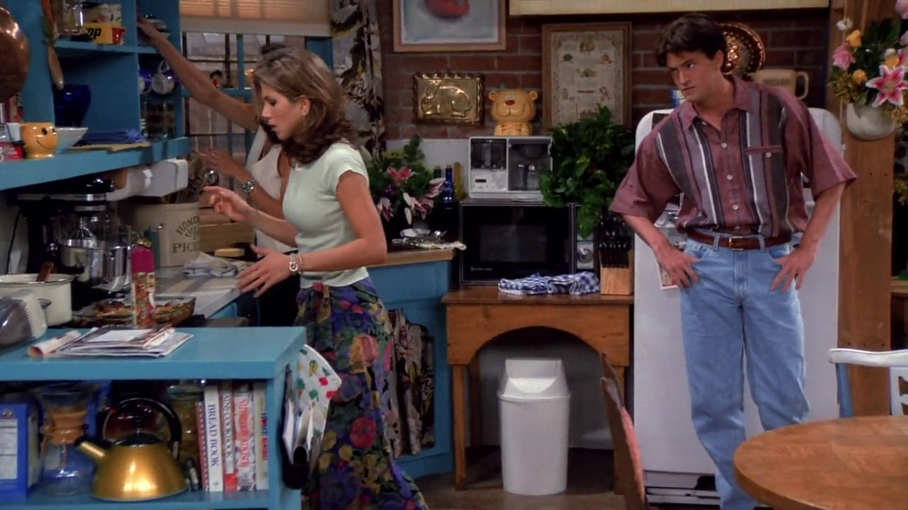

## Pink Floyd

{ fullpage=true, clipt=2cm, clipb=5cm }

<cena>
  <chandler
    original="- ...before Pink Floyd comes out."
    traducao="- ...antes do show do Pink Floyd."
    ></chandler>
</cena>

<!-- {"latex":[{"begin":{"tag":"col-1","width":0.5}}]} -->

Chandler menciona a banda britânica de rock progressivo *Pink Floyd*, formada
em 1965 e caracterizada por ter muitos elementos visuais no palco. A banda lança
o albúm *The Division Bell* em Março 1994, um pouco antes do começo da
série.[^pinkfloyd-site]

<!--{"latex":[{"end":{"tag":"col-1"}},{"begin":{"tag":"col-2","width":0.5}}]}-->

{ bookwidth=70% }

<!--{"latex":[{"end":{"tag":"col-2"}}]}-->

[^pinkfloyd-site]: [Pink Floyd - Site oficial](https://www.pinkfloyd.com/)

## Three's Company

{ fullpage=true, clipt=2cm, clipb=4cm }

<cena no-breakable>
  <chandler
    original="- I think this is the episode of Three's Company where's there's some kind of misunderstanding."
    traducao="- Acho que este é o episódio de Three's Company onde há um mal-entendido."
  ></chandler>
  <phoebe
    original="- Then I've already seen this one."
    traducao="- Então, eu já vi."
  ></phoebe>
</cena>

<!-- {"latex":[{"begin":{"tag":"col-1","width":0.5}}]} -->

Chandler, Joey, Phoebe e Monica assistem a *sitcom* *Three's Company* (1977-1984),
conhecida no Brasil como *Um é Pouco, Dois é Bom e Três é Demais*.[^threes-company-site]
Conta a história de Janet e Chrissy, que dividem um apartamento em Santa Monica e
conhecem um novo colega Jack. Ele estuda gastronomia e, quando pedem para ele provar
suas capacidades, finge ser gay. Eles passam a morar juntos e passar por desentendimentos, aventuras e brincadeiras. Daí a piada, o *plot* da história quase sempre envolve um
desentendimento.[^threes-company-adoro-cine]

<!--{"latex":[{"end":{"tag":"col-1"}},{"begin":{"tag":"col-2","width":0.5}}]}-->

{ bookwidth=70% }

<!--{"latex":[{"end":{"tag":"col-2"}}]}-->

[^threes-company-site]: [Three's Company - Site oficial](http://www.threescompany.com/)
[^threes-company-adoro-cine]: [Three's Company - Adoro Cinema](http://www.adorocinema.com/series/serie-387/foto-detalhada/?cmediafile=21161912)

## Thighmaster

{ fullpage=true, clipt=3cm, clipb=9cm }

<cena>
  <chandler
    original="- Ugly Naked Guy got a Thighmaster."
    traducao="- Peladão feio fazendo exercício!"
  ></chandler>
</cena>

<!-- {"latex":[{"begin":{"tag":"col-1","width":0.5}}]} -->

Chandler menciona que o *Ugly Naked Guy* está usando um *Thighmaster*, conhecido
aparelho aeróbico usado para tonificar a parte interna da coxa. O interessante
aqui é que o *Thighmaster* está diretamente relacionado à série *Three's Company*,
já que *Suzanne Somers* &#8212; que faz o papel de Chrissy na série &#8212; é a porta-voz
oficial do produto.[^thighmaster-fandom] [^thighmaster-yt]

<!--{"latex":[{"end":{"tag":"col-1"}},{"begin":{"tag":"col-2","width":0.45}}]}-->

{ bookwidth=70% }

<!--{"latex":[{"end":{"tag":"col-2"}}]}-->

[^thighmaster-fandom]: [Thighmaster - Fandom Wiki](https://threescompany.fandom.com/wiki/Suzanne_Somers#Spokeswoman_for_Thighmaster)
[^thighmaster-yt]: [Thighmaster - Trechos do comercial - YouTube](https://www.youtube.com/watch?v=2yVeef8AnYI)

## In the kitchen with... Dinah?

{ fullpage=true, clipt=1cm, clipb=6cm }

<cena>
  <rachel
    original="- I know I had it when I was in the kitchen with..."
    traducao="- Sei que estava com ela na cozinha com..."
  ></rachel>
  <chandler
    original="- Dinah?"
    traducao="- Dinah?"
  ></chandler>
</cena>

Enquanto procura sua aliança, Rachel menciona que estava na cozinha, e Chandler
pergunta se ela estava com Dinah. Isso é uma alusão a canção folclórica
*I've Been Working on the Railroad* (C. 1894).[^dinah-song] [^dinah-yt]
Segue um trecho da canção que é citado no diálogo:

<musica>
  <letra slot="original">
    Someone's in the kitchen with Dinah
    Someone's in the kitchen I know
    Someone's in the kitchen with Dinah
    Strummin' on the old banjo!
  </letra>
  <letra slot="traducao">
    Alguém está na cozinha com Dinah
    Alguém está na cozinha eu sei
    Alguém está na cozinha com Dinah
    Dedilhando no velho banjo
  </letra>
</musica>

[^dinah-song]: [I've Been Working on the Railroad - Live About (Inglês)](https://www.liveabout.com/ive-been-working-on-the-railroad-traditional-1322525)
[^dinah-yt]: [I've Been Working on the Railroad - John Denver - YouTube](https://www.youtube.com/watch?v=AAI6wjXEV6g)

## Minnie Mouse

{ fullpage=true, clipt=1cm, clipb=6cm }

<cena>
  <carol-one
    original="- Minnie, if it's a girl."
    traducao="- Minnie, se for menina.">
  </carol-one>
  <ross
    original="- As in Mouse?"
    traducao="- Minnie Mouse?">
  </ross>
</cena>

Ao discutir sobre o nome de seu filho com Carol e Susan, Ross menciona *Minnie Mouse*,
famosa personagem de *Walt Disney* criada em 1928.[^minnie-wiki] Aparece pela
primeira vez no episódio *Steamboat Willie* (1928), já como a namorada de
*Mickey Mouse*.[^minnie-yt]

[^minnie-wiki]: [Minnie Mouse - Wikipédia](https://pt.wikipedia.org/wiki/Minnie_Mouse)
[^minnie-yt]: [Steamboat Willie - YouTube](https://www.youtube.com/watch?v=BBgghnQF6E4)

## Enterprise

{ fullpage=true, clipt=2cm, clipb=5cm }

<cena no-breakable>
  <joey
    original="- What are we supposed to be seeing here?"
    traducao="- O que deveríamos ver?"
  ></joey>
  <chandler
    original="- I don't know, but I think it's about to attack the Enterprise."
    traducao="- Não sei, mas acho que vai atacar a Enterprise."
  ></chandler>
</cena>

Assistindo ao vídeo do ultrassom, Chandler faz uma piada comparando as imagens
a uma cena da séria *Star Trek* (1966), e *Enterprise* é o nome da principal nave estelar.
No Brasil a séria é conhecido como *Jornada nas Estrelas*.[^enterprise-site]

[^enterprise-site]: [Star Trek - Página oficial](https://intl.startrek.com/database_article/enterprise-nx-01)
