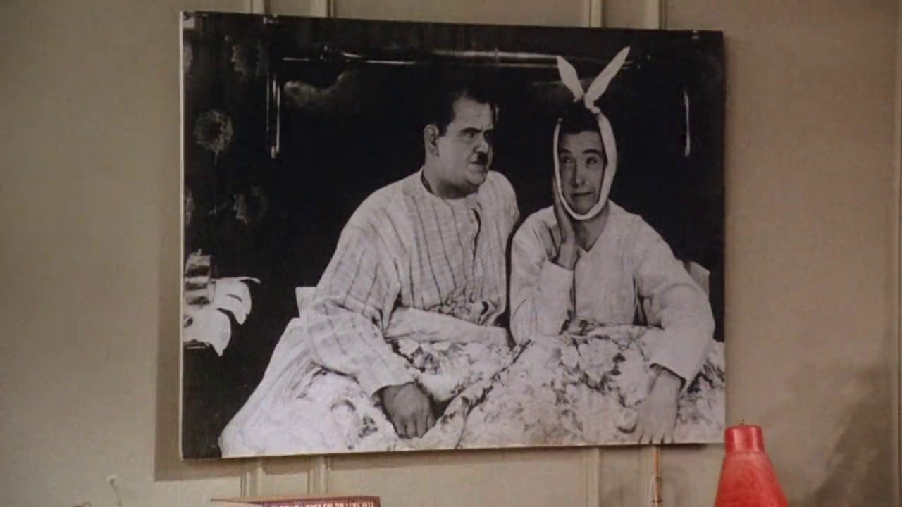

## Laurel & Hardy

{ fullpage=true, clipt=2cm, clipb=7cm }

No apartamento de Joey e Chandler, enquanto ensaiam para a audição, um poster
de *Laurel & Hardy* aparece na sala de estar. Esses personagens são conhecidos
no Brasil como *O Gordo e o Magro* e fizeram cerca de 106 filmes juntos, entre
curtas-metragem sonoros e mudos e filmes.[^laurel-and-hardy-site]

[^laurel-and-hardy-site]: [Laurel & Hardy - Site oficial](http://www.laurel-and-hardy.com/)

## Grand Jury Secrets

{ fullpage=true, clipt=3cm, clipb=6cm }

<!-- {"latex":[{"begin":{"tag":"col-1","width":0.5}}]} -->

*Grand Jury Secrets* (1939) é um filme de drama e mistério americano. Conta a história de
um repórter inescrupuloso que obtém notícias através de um rádio escondido na
sala de um júri, onde seu irmão trabalha como advogado. O repórter é sequestrado
e escapa devido sua capacidade de transmitir sua situação.[^jury-bfi] [^jury-loving]
[^jury-imdb]

<!--{"latex":[{"end":{"tag":"col-1"}},{"begin":{"tag":"col-2","width":0.5}}]}-->

{ bookwidth=70% }

<!--{"latex":[{"end":{"tag":"col-2"}}]}-->

[^jury-bfi]: [Grand Jury Secrets - BFI](https://www.bfi.org.uk/films-tv-people/4ce2b6ab720c8)
[^jury-loving]: [Grand Jury Secrets - Loving The Classics](https://www.lovingtheclassics.com/by-title/g/grand-jury-secrets-1939.html)
[^jury-imdb]: [Grand Jury Secrets - IMDB](https://www.imdb.com/title/tt0031390/)

## There was a crooked man...

{ fullpage=true, clipt=2cm, clipb=7cm }

<cena>
  <phoebe
    original="- From the nursery rhyme. 'There was a crooked man, Who had a crooked smile, Who lived in a shoe, For a... while...'"
    traducao="- Da musiquinha. 'Havia um cara de sorriso torto. E morava no sapato, por um... tempo..."
  ></phoebe>
</cena>

Enquanto os amigos discutem o quanto Alan é legal, Phoebe o compara com o homem no sapato,
que, como Joey notou, tem um sorisso torto. A "musiquinha" ou canção de ninar
é *There Was a Crooked Man* (C. 1840) de origem desconhecida.[^crooked-alchin]
[^crooked-yt]

Letra original e tradução da canção:

<musica>
  <letra slot="original">
    There was a crooked man, and he walked a crooked mile.
    He found a crooked sixpence upon a crooked stile.
    He bought a crooked cat, which caught a crooked mouse,
    And they all lived together in a little crooked house.
  </letra>
  <letra slot="traducao">
    Havia um homem torto, e ele andou em uma estrada torta
    Ele encontrou uma moeda torta sobre um rebordo torto
    Ele comprou um gato torto, que pegou um rato torto
    E eles todos viveram juntos em uma pequena casa torta
  </letra>
</musica>

[^crooked-yt]: [There Was A Crooked Man Nursery Rhyme - YouTube](https://www.youtube.com/watch?v=WqyUOlz_6i4)
[^crooked-alchin]: Alchin, Linda Kathryn. *Secret History of Nursery Rhymes.* Linda Alchin, 2010.

## David Hasselhoff

{ fullpage=true, clipt=2cm, clipb=6cm }

<cena no-breakable>
  <chandler
    original="- I'd marry him just for his David Hasselhoff impression alone."
    traducao="- Eu casaria por causa da imitação de David Hasselholff."
  ></chandler>
</cena>

*David Hasselhoff* é ator, cantor, produtor e empresário norte-americano. Um de seus
grandes papeis de sucesso foi o salva-vidas *Mitch Buchannon* em *Baywatch*
(1989-2001), conhecida no Brasil como *S.O.S. Malibu*[^hasselhoff-imdb] [^baywatch-site],
série que acaba sendo conhecida como a preferida de Joey no episódio
[S03E06 - Aquele do flashback](/temporada/3/episodio/6/), em que ele apresenta
a série a Chandler.

{ bookwidth=70% }

[^hasselhoff-imdb]: [David Hasselhoff - IMDB](https://www.imdb.com/name/nm0001327/)
[^baywatch-site]: [Baywatch - Site oficial](https://www.baywatch.com/)

## Bugs Bunny

{ fullpage=true, clipt=2cm, clipb=8cm }

<cena>
  <ross
    original="- He was like that Bugs Bunny cartoon where Bugs is playing all the positions."
    traducao="- Ele parecia o Pernalonga no desenho em que jogava em todas as posições."
  ></ross>
</cena>

<!-- {"latex":[{"begin":{"tag":"col-1","width":0.5}}]} -->

Enquanto explica como Alan joga bem *softball* [^baseball-vs-softball],
Ross menciona *Bugs Bunny*, conhecido no Brasil como *Pernalonga*, personagem da
*Looney Tunes*. O episódio citado por Ross é o
*Baseball Bugs* (1946).[^baseball-bugs-imdb] [^baseball-bugs-sc]

<!--{"latex":[{"end":{"tag":"col-1"}},{"begin":{"tag":"col-2","width":0.5}}]}-->

{ bookwidth=60% }

<!--{"latex":[{"end":{"tag":"col-2"}}]}-->

[^baseball-bugs-imdb]: [Baseball Bugs - IMDB](https://www.imdb.com/title/tt0038333/)
[^baseball-bugs-sc]: [Baseball Bugs - Episódio na SuperCartoons (Inglês)](https://www.supercartoons.net/cartoon/629/bugs-bunny-baseball-bugs.html)
[^baseball-vs-softball]: [Diferenças entre softball e baseball (Inglês)](https://www.dummies.com/sports/fantasy-sports/fantasy-baseball/the-differences-between-softball-and-baseball/)

## Lamb Chop

{ fullpage=true, clipt=3cm, clipb=6cm }

<cena>
  <chandler
    original="- If I had a sock on my hand for 30 years, it'd be talking too."
    traducao="- Se eu usasse uma meia na mão por 30 anos, ela também ia falar."
  ></chandler>
</cena>

No apartamento de Monica os amigos assistem a *Lamb Chop*, fantoche criado por
*Shari Lewis* (1934-1998). Sua filha, *Mallory Lewis*, continuou seu legado
e faz performances de *Lamb Chop* até hoje.[^lamb-site]

{ bookwidth=60% }

[^lamb-site]: [Lamb Chop - Site oficial](https://mallorylewisandlambchop.com/faqs/)
