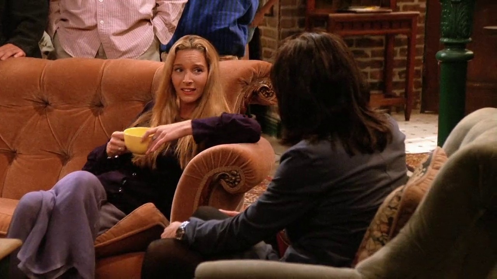

## Dairy Queen

<cena>
  <phoebe
    original="- There was a cave-in in one of the mines, and eight people were killed."
    traducao="- Uma mina desabou e oito pessoas morreram."
  ></phoebe>
  <monica
    original="- Wow, you worked in a mine?"
    traducao="- Trabalhou em uma mina?"
  ></monica>
  <phoebe
    original="- No, I worked at a Dairy Queen. Why?"
    traducao="- Não, em um Dairy Queen. Por quê?"
  ></phoebe>
</cena>

Enquanto discutem sobre empregos e salários, Phoebe menciona um de seus empregos
em uma mina. Monica fica abismada com o fato e quer saber se aquilo era verdade.
Phoebe, sarcasticamente, responde que não, na verdade era um *Dairy Queen*.

*Dairy Queen* (1940) é uma famosa rede de sorveterias e restaurantes de *fast-food*.

### Referências

- [Site oficial](https://dairyqueen.com/)
- [Fórum WordReference (Inglês)](https://forum.wordreference.com/threads/dairy-queen-mine.1442748/)
