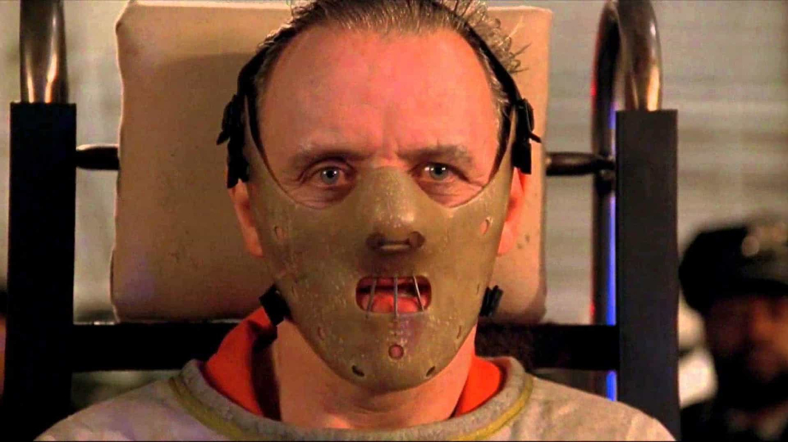

## Dairy Queen

{ fullpage=true, clipt=2cm, clipb=7cm }

<cena>
  <phoebe
    original="- There was a cave-in in one of the mines, and eight people were killed."
    traducao="- Uma mina desabou e oito pessoas morreram."
  ></phoebe>
  <monica
    original="- Wow, you worked in a mine?"
    traducao="- Trabalhou em uma mina?"
  ></monica>
  <phoebe
    original="- No, I worked at a Dairy Queen. Why?"
    traducao="- Não, em um Dairy Queen. Por quê?"
  ></phoebe>
</cena>

Enquanto discutem sobre empregos e salários, Phoebe menciona um de seus empregos
em uma mina. Monica fica abismada com o fato e quer saber se aquilo era verdade.
Phoebe, sarcasticamente, responde que não, na verdade era um *Dairy Queen*.
[^dairyqueen-site]

*Dairy Queen* (1940) é uma famosa rede de sorveterias e restaurantes de *fast-food*.

[^dairyqueen-site]: [Dairy Queen - Site oficial](https://dairyqueen.com/)

## Rachel has left the building

{ fullpage=true, clipt=2cm, clipb=6cm }

<cena>
  <monica
    original="- Rachel has left the building."
    traducao="- Rachel deixou o edifício."
  ></monica>
</cena>

Após atender a um telefonema da operadora de cartão perguntando sobre a Rachel,
Monica diz a frase *Rachel has left the building*. Isto é uma paráfrase de
*Elvis has left the building*. Era uma frase usada para dispersar o público
que ficava a espera do bis ao final do show do Rei do *Rock and Roll Elvis Presley*.
[^building-wiki]

[^building-wiki]: [Elvis has left the building - Wikipédia](https://en.wikipedia.org/wiki/Elvis_has_left_the_building)

## Jack and the Beanstalk

{ fullpage=true, clipt=2cm, clipb=6cm }

<cena>
  <phoebe
    original="- You are just like Jack."
    traducao="- Você é igual ao João."
  ></phoebe>
  <rachel
    original="- Jack from downstairs?"
    traducao="- João, do andar de baixo?"
  ></rachel>
  <phoebe
    original="- No, Jack and the Beanstalk."
    traducao="- Não, João e o Pé de Feijão."
  ></phoebe>
</cena>

*Jack and the Beanstalk* (1807), conhecido no Brasil como *João e o Pé de Feijão*,
é um conto de fadas de origem inglesa. A Phoebe conta bem o enredo da história na cena.
É uma história bastante conhecida e referenciada diversas vezes, como em *O Pica-pau*,
*Mickey Mouse*, entre outros.[^jack-pitt]

[^jack-pitt]: [Jack and the Beanstalk - Universidade de Pittsburgh (Inglês)](https://www.pitt.edu/~dash/type0328jack.html)

## George Stephanopoulos

{ fullpage=true, clipt=3cm, clipb=10cm }

<cena>
  <monica
    original="- Did you say G. Stephanopoulos?"
    traducao="- Calma, você falou G. Stephanopoulos?"
  ></monica>
</cena>

<!-- {"latex":[{"begin":{"tag":"col-1","width":0.5}}]} -->

*George Stephanopoulos* (1961-) [^gsteph-twitter] realmente existe e na época dessa temporada era
diretor de comunicações da campanha presidencial de Bill Clinton. Atualmente é,
entre outras coisas, âncora do telejornal *Good Morning America*.[^gsteph-imdb]

Essa passagem de sua vida virou o documentário *The War Room* (1993).[^gsteph-doc-imdb]

<!--{"latex":[{"end":{"tag":"col-1"}},{"begin":{"tag":"col-2","width":0.45}}]}-->

{ bookwidth=80% }

<!--{"latex":[{"end":{"tag":"col-2"}}]}-->

[^gsteph-twitter]: [George Stephanopoulos - Twitter](https://twitter.com/gstephanopoulos)
[^gsteph-imdb]: [George Stephanopoulos - IMDB](https://www.imdb.com/name/nm0826888/)
[^gsteph-doc-imdb]: [The War Room - IMDB](https://www.imdb.com/title/tt0108515/)

## George "Snuffleupagus"

{ fullpage=true, clipt=1cm, clipb=8cm }

<cena no-breakable>
  <rachel
    original="- Who's George Snuffleupagus?"
    traducao="- Quem é George Snuffleupagus?"
  ></rachel>
  <phoebe
    original="- That's Big Bird's friend."
    traducao="- É o amigo do Garibaldo."
  ></phoebe>
</cena>

Rachel confunde o sobrenome de George e o chama de *Snuffleupagus* [^snuffleupagus-fandom].
Ele é realmente amigo de *Big Bird* [^big-bird-fandom] e, ambos, fazem parte do
programa de televisão educacional *Sesame Street* (1969), conhecido no Brasil
como *Vila Sésamo* [^sesamestreet-site]. Em nossa versão, *Snuffleupagus* era
*Funga-Funga* (à direita) e *Big Bird* era *Garibaldo* (à esquerda).

{ bookwidth=50% }

[^snuffleupagus-fandom]: [Fandom Wiki - Mr. Snuffleupagus](https://muppet.fandom.com/wiki/Mr._Snuffleupagus)
[^big-bird-fandom]: [Fandom Wiki - Big Bird](https://muppet.fandom.com/wiki/Big_Bird)
[^sesamestreet-site]: [Sesame Street - Site oficial](https://www.sesamestreet.org/)

## Silence of the Lambs

{ fullpage=true, clipt=3cm, clipb=8cm }

<cena>
  <chandler
    original="- Oh, I thought you were great in Silence of the Lambs."
    traducao="- Você estava ótimo em Silêncio dos Inocentes."
  ></chandler>
</cena>

*Silence of the Lambs* (1991) é um filme norte-americano de suspense, drama e terror,
estrelado por *Jodie Foster* e *Anthony Hopkins*. A comparação feita por Chandler
se refere ao modo como o *Dr. Hannibal Lecter*, interpretado por *Hopkins*, era
transportado quando precisava sair da cadeia. No Brasil o filme ficou conhecido como
*Silêncio dos Inocentes*.[^hannibal-imdb]

{ bookwidth=50% }

[^hannibal-imdb]: [The Silence of the Lambs - IMDB](https://www.imdb.com/title/tt0102926/)
