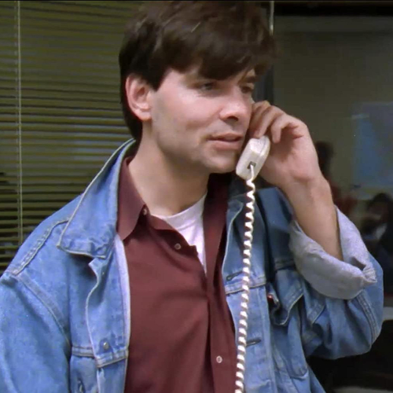

## Dairy Queen

<cena>
  <phoebe
    original="- There was a cave-in in one of the mines, and eight people were killed."
    traducao="- Uma mina desabou e oito pessoas morreram."
  ></phoebe>
  <monica
    original="- Wow, you worked in a mine?"
    traducao="- Trabalhou em uma mina?"
  ></monica>
  <phoebe
    original="- No, I worked at a Dairy Queen. Why?"
    traducao="- Não, em um Dairy Queen. Por quê?"
  ></phoebe>
</cena>

Enquanto discutem sobre empregos e salários, Phoebe menciona um de seus empregos
em uma mina. Monica fica abismada com o fato e quer saber se aquilo era verdade.
Phoebe, sarcasticamente, responde que não, na verdade era um *Dairy Queen*.

*Dairy Queen* (1940) é uma famosa rede de sorveterias e restaurantes de *fast-food*.

### Referências

- [Site oficial](https://dairyqueen.com/)
- [Fórum WordReference (Inglês)](https://forum.wordreference.com/threads/dairy-queen-mine.1442748/)

## Rachel has left the building

<cena>
  <monica
    original="- Rachel has left the building."
    traducao="- Rachel deixou o edifício."
  ></monica>
</cena>

Após atender a um telefonema da operadora de cartão perguntando sobre a Rachel,
Monica diz a frase *Rachel has left the building*. Isto é uma paráfrase de
*Elvis has left the building*. Era uma frase usada para dispersar o público
que ficava a espera do bis ao final do show do Rei do *Rock and Roll Elvis Presley*.

### Referências

- [Fandom Wiki](https://friends.fandom.com/wiki/The_One_With_George_Stephanopoulos)
- [Wikipédia](https://en.wikipedia.org/wiki/Elvis_has_left_the_building)

## Jack and the Beanstalk

<cena>
  <phoebe
    original="- You are just like Jack."
    traducao="- Você é igual ao João."
  ></phoebe>
  <rachel
    original="- Jack from downstairs?"
    traducao="- João, do andar de baixo?"
  ></rachel>
  <phoebe
    original="- No, Jack and the Beanstalk."
    traducao="- Não, João e o Pé de Feijão."
  ></phoebe>
</cena>

*Jack and the Beanstalk* (1807), conhecido no Brasil como *João e o Pé de Feijão*,
é um conto de fadas de origem inglesa. A Phoebe conta bem o enredo da história na cena.
É uma história bastante conhecida e referenciada diversas vezes, como em *O Pica-pau*,
*Mickey Mouse*, entre outros.

### Referências

- [Página da Universidade de Pittsburgh (Inglês)](https://www.pitt.edu/~dash/type0328jack.html)

## George Stephanopoulos

<cena>
  <monica
    original="- Did you say G. Stephanopoulos?"
    traducao="- Calma, você falou G. Stephanopoulos?"
  ></monica>
</cena>

*George Stephanopoulos* (1961-) realmente existe e na época dessa temporada era
diretor de comunicações da campanha presidencial de Bill Clinton. Atualmente é,
entre outras coisas, âncora do telejornal *Good Morning America*.

Essa passagem de sua vida virou o documentário *The War Room* (1993).

### Referências

- [Twitter](https://twitter.com/gstephanopoulos)
- [IMDB](https://www.imdb.com/name/nm0826888/?ref_=tt_ov_st_sm)
- [IMDB Documentário](https://www.imdb.com/title/tt0108515/)

## George "Snuffleupagus"

<cena>
  <rachel
    original="- Who's George Snuffleupagus?"
    traducao="- Quem é George Snuffleupagus?"
  ></rachel>
  <phoebe
    original="- That's Big Bird's friend."
    traducao="- Amigo do Garibaldo."
  ></phoebe>
</cena>

Rachel confunde o sobrenome de George e o chama de *Snuffleupagus*. Ele é realmente
amigo de *Big Bird* e, ambos, fazem parte do programa de televisão educacional
*Sesame Street* (1969), conhecido no Brasil como *Vila Sésamo*. Em nossa versão,
*Snuffleupagus* era *Funga-Funga* (à direita) e *Big Bird* era *Garibaldo* (à esquerda).

### Referências

- [Fandom Wiki - Mr. Snuffleupagus](https://muppet.fandom.com/wiki/Mr._Snuffleupagus)
- [Fandom Wiki - Big Bird](https://muppet.fandom.com/wiki/Big_Bird)
- [Site oficial - Sesame Street](https://www.sesamestreet.org/)

## Silence of the Lambs

<cena>
  <chandler
    original="- Oh, I thought you were great in Silence of the Lambs."
    traducao="- Você estava ótimo em Silêncio dos Inocentes."
  ></chandler>
</cena>

*Silence of the Lambs* (1991) é um filme norte-americano de suspense, drama e terror,
estrelado por *Jodie Foster* e *Anthony Hopkins*. A comparação feita por Chandler
se refere ao modo como o *Dr. Hannibal Lecter*, interpretado por *Hopkins*, era
transportado quando precisava sair da cadeia. No Brasil o filme ficou conhecido como
*Silêncio dos Inocentes*.

### Referências

- [IMDB](https://www.imdb.com/title/tt0102926/)
- [Wikipédia](https://pt.wikipedia.org/wiki/O_Sil%C3%AAncio_dos_Inocentes)
