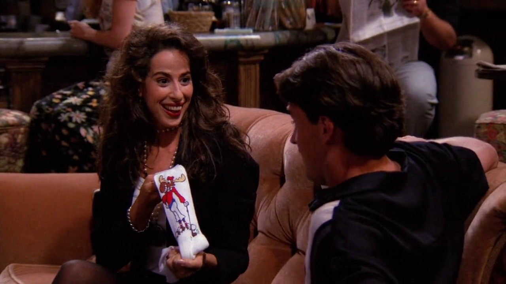
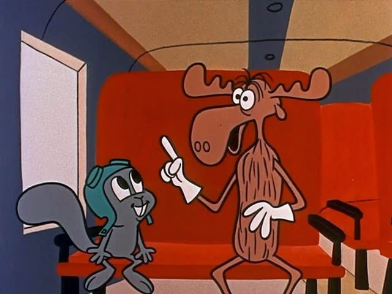
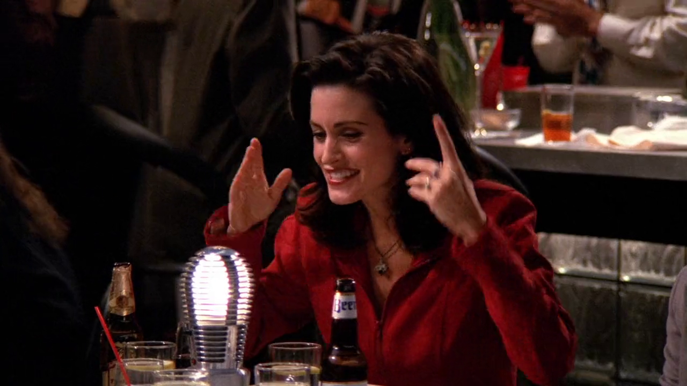
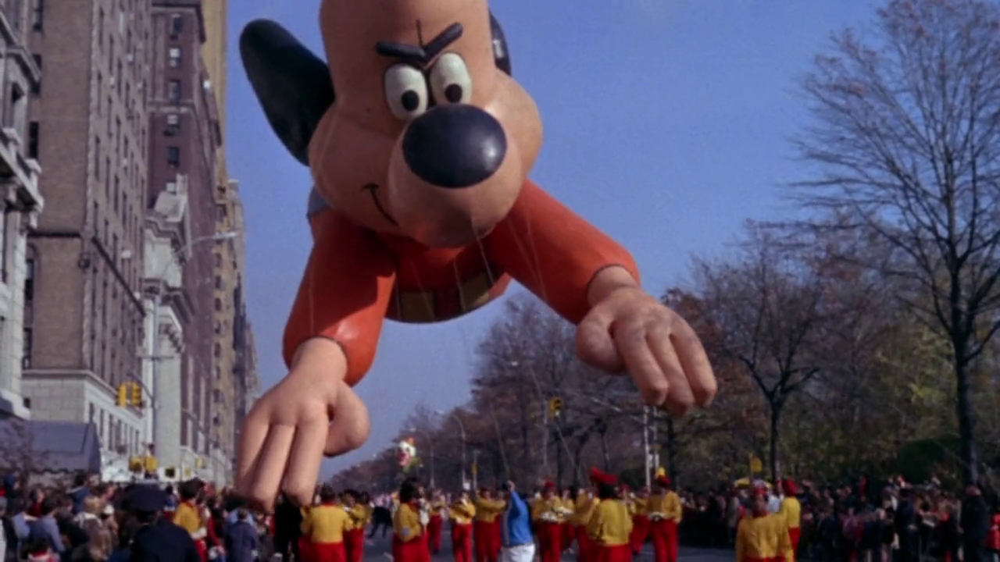
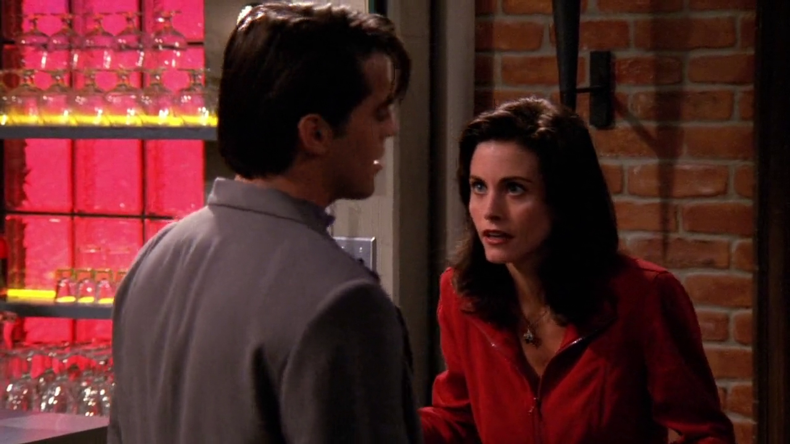

## Bullwinkle socks

{ fullpage=true, clipt=3cm, clipb=4cm }

<cena>
  <janice
    original="- I got you... these."
    traducao="- Comprei... isto."
  ></janice>
  <chandler
    original="- Bullwinkle socks."
    traducao="- Uma meia do Alceu."
  ></chandler>
</cena>

<!-- {"latex":[{"begin":{"tag":"col-1","width":0.5}}]} -->

Para o dia dos namorados, Janice compra para Chandler meias do *Bullwinkle*,
personagem de desenho animado, que junto com *Rocky*, estrelavam o programa
*The Rocky and Bullwinkle Show* (1959). No Brasil a dupla ficou conhecida
como Alceu (*Bullwinkle*) e Dentinho (*Rocky*).[^bullwinkle-fandom]

<!--{"latex":[{"end":{"tag":"col-1"}},{"begin":{"tag":"col-2","width":0.5}}]}-->

{ bookwidth=80% }

<!--{"latex":[{"end":{"tag":"col-2"}}]}-->

[^bullwinkle-fandom]: [Bullwinkle - Fandom Wiki (Inglês)](https://rockyandbullwinkle.fandom.com/wiki/Bullwinkle_J._Moose)

## Underdog

{ fullpage=true, clipt=2.5cm, clipb=6.5cm }

<cena no-breakable>
  <monica
    original="- Something went wrong with Underdog, and they couldn't get his head to inflate."
    traducao="- Aconteceu algo com o Vira-lata. E a cabeça dele não inflava."
  ></monica>
</cena>

No "encontro duplo", Monica menciona o *Underdog* (1964) [^underdog-imdb],
desenho animado americano protagonizado por um cão super-herói. O interessante
dessa cena é que Monica menciona algo que só vai ocorrer no episódio
[S01E09 - Aquele em que o Underdog Escapa](/temporada/1/episodio/9/),
quatro episódios mais tarde.

{ bookwidth=70% }

[^underdog-imdb]: [Underdog - IMDB](https://www.imdb.com/title/tt0060037/)

## Cocktails in Appalachia

{ fullpage=true, clipt=1cm, clipb=7cm }

<cena>
  <monica
    original="- Hello! Were we at the same table? It's like... Cocktails in Appalachia."
    traducao="- Estamos na mesma mesa? Os dois estão pegando fogo!"
  ></monica>
</cena>

Abismada com o fato de Bob e Angela estarem se pegando, Monica menciona que aquilo
parecia *Cocktails in Appalachia*. *Appalachia* é uma cidade do estado da Virgínia.
O termo refere-se a esteriótipos do local, que incluem incesto. Daí o termo usado
por Monica, já que ela pensa que os dois são irmãos.[^cocktails-abc]

[^cocktails-abc]: [MD Recruits Face Culture Shock in Appalachia - ABS News (Inglês)](https://abcnews.go.com/Health/story?id=5922943&page=1)
