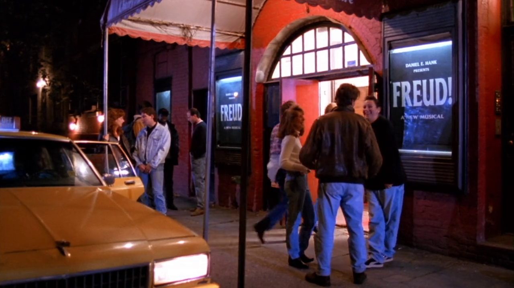
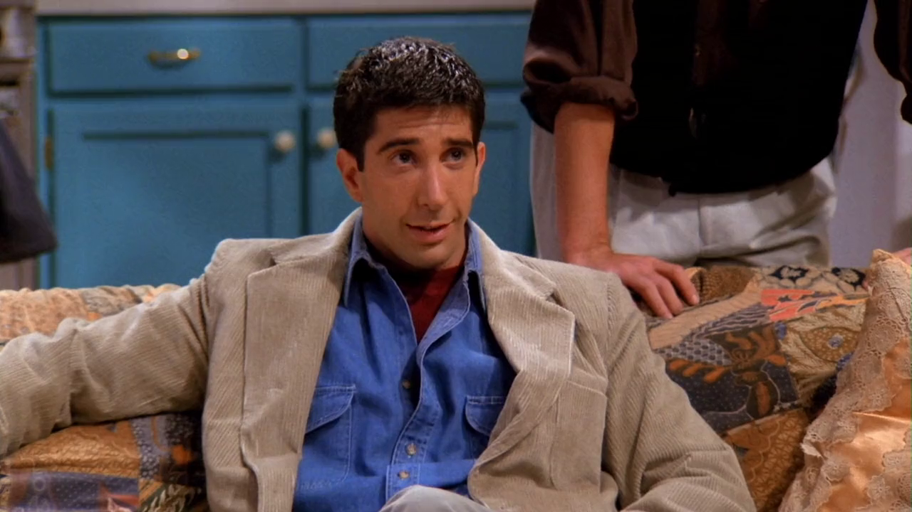

## Freud!

Joey é o protagonista do musical *Freud!*, atuando como *Sigmund Freud* (1856),
considerado o Pai da Psicanálise. No musical, Joey canta uma música sobre um
assunto abordado num livro de Freud chamado
*The Psychical Consequences of the Anatomic Distinction Between the Sexes* (1925),
em que ele explica algo que ficou conhecido como 'Penis Envy' (Inveja do pênis).

> All you want is a dinkle

> What you envy's a schwang

> A thing through which you can tinkle

> To play with or simply let hang

Na letra, *dinkle* e *schwang* são metáforas para pênis.

### Referências

- [Freud and penis envy - a failure of courage? - The British Psychological Society (Inglês)](https://thepsychologist.bps.org.uk/volume-31/june-2018/freud-and-penis-envy-failure-courage)

## Richard Leakey

<cena>
  <ross
    original="- All right. There's a theory put forth by Richard Leakey..."
    traducao="- Certo. Há uma teoria de Richard Leakey..."
  ></ross>
</cena>

Enquanto discutem a relação de Chandler com Aurora, Ross tenta explicar uma teoria
de *Richard Leakey* (1944), um antropologista queniano. Uma das suas mais importantes
descobertas foi um esqueleto quase completo de 1,6 milhão de anos.

### Referências

- [Site oficial](http://www.leakey.com/bios/richard-leakey)
- [Wikipédia](https://en.wikipedia.org/wiki/Richard_Leakey)

## Raggedy Ann

<cena>
  <ross
    original="- When we were kids, yours was the only Raggedy Ann doll that wasn't raggedy."
    traducao="- Quando criança, sua Raggedy Ann era a única boneca intacta."
  ></ross>
</cena>

Enquanto discutem como Monica é organizada, Ross menciona a boneca *Raggedy Ann*,
personagem criada por *Johnny Gruelle* (1880-1938), que mais tarde se tornaria
brinquedo. A ideia é que a boneca parecesse velha e desgastada, daí o nome *Raggedy*,
que significa esfarrapada.

### Referências

- [Wikipédia](https://pt.wikipedia.org/wiki/Raggedy_Ann)
- [Livro Raggedy Ann Stories - Projeto Gutemberg (Inglês)](https://www.gutenberg.org/ebooks/18190)

## Al Pacino

<cena>
  <joey
    original="- My agent has just gotten me a job in the new Al Pacino movie!"
    traducao="- Minha agente arranjou um papel no novo filme de Al Pacino!"
  ></joey>
</cena>

Após conversar com sua agente, Joey dá a notícia que estará no novo filme de
*Al Pacino* (1940), ator, diretor e produtor americano de origem italiana.
Joey ainda faz referências a dois filmes protagonizados por Al Pacino:

> I'm out of order? You're out of order! This whole courtroom's out of order!

Trecho do filme *...And Justice for All* (1979), conhecido no Brasil como
*Justiça para Todos*.

E:

> Just when I thought I was out, they pull me back in!

Trecho do filme *The Godfather: Part III* (1990), conhecido no Brasil como
*O Poderoso Chefão III*.

### Referências

- [IMDB ...And Justice for All](https://www.imdb.com/title/tt0078718/?ref_=nv_sr_srsg_0)
- [Citação de ...And Justice for All - Shmoop](https://www.shmoop.com/quotes/whole-courts-out-of-order.html)
- [IMDB The Godfather: Part III](https://www.imdb.com/title/tt0099674/?ref_=nv_sr_srsg_3)
- [Citação de The Godfather: Part III - Shmoop](https://www.shmoop.com/quotes/just-when-i-thought-i-was-out.html)

## It's a Wonderful Life

Após termino do namoro com Aurora, é possível ver no quarto de Chandler um poster
do filme *It's a Wonderful Life* (1946), filme norte-americano de drama e fantasia.
No Brasil, ficou conhecido como *A Felicidade Não se Compra*. É um dos filmes que Monica
sugere a Phoebe no episódio [S02E20 - The One Where Old Yeller Dies](/temporada/2/episodio/20/).

### Referências

- [IMDB](https://www.imdb.com/title/tt0038650/)
