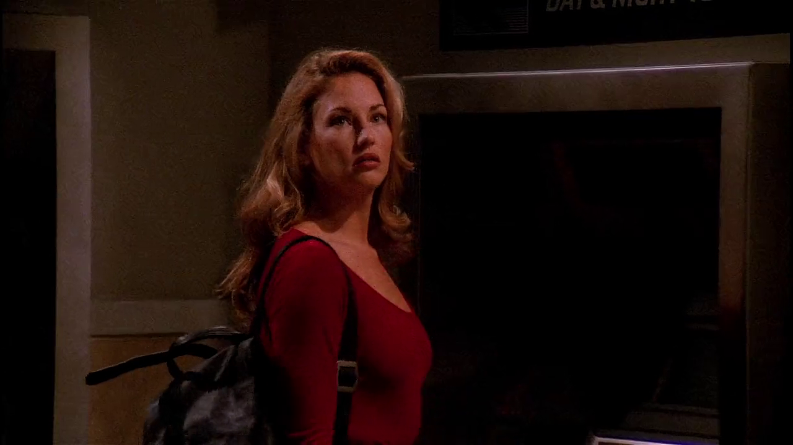
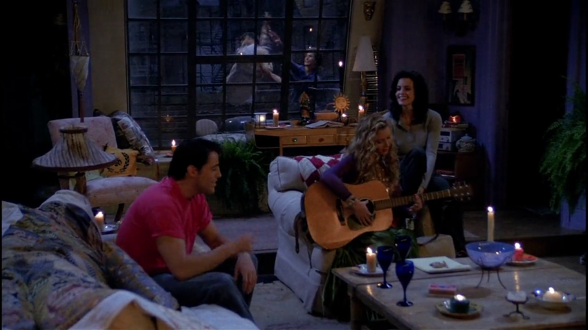
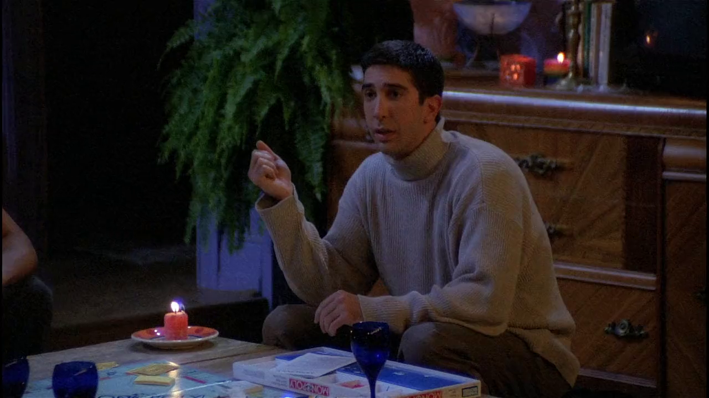

## Jill Goodacre

<cena>
  <chandler
    original="- I am trapped in an ATM vestibule with Jill Goodacre."
    traducao="- Estou preso num caixa 24 horas com Jill Goodacre."
  ></chandler>
</cena>

Ao ficar preso no banco devido ao blecaute, Chandler se vê acompanhado da modelo
e atriz *Jill Goodacre* (1964), que foi uma das modelos principais da
*Victoria's Secret* nos anos 80 e começo dos 90.

### Referências

- [Fandom Wiki](https://friends.fandom.com/wiki/Jill_Goodacre)
- [IMDB](https://www.imdb.com/name/nm0004969/)

## Top of the World

Enquanto Ross tenta se declarar para Rachel mas é atacado pelo gato do Paolo,
os amigos Monica, Joey e Phoebe cantam a música *Top of the World* (1972) do *The Carpenters*.
Segue o trecho cantado pelos três:

> I'm on the top of the world looking

> Down on creation and the only explanation I can find

> Is the love that I've found, ever since you've been around

> Your love's put me at the top of the world

Essa deve ser a única música que a Phoebe canta que não seja autoral ou que
não seja uma versão, por assim dizer.

### Referências

- [YouTube](https://www.youtube.com/watch?v=vupwAFMXLkA)
- [Letra](https://www.letras.mus.br/carpenters/7023/traducao.html)

## Monopoly

Enquanto esperam o blecaute passar, os amigos jogam *Monopoly* (1935), jogo de
tabuleiro onde os jogadores devem se mover por meio do lançamento de 2 dados
de 6 faces, comprando e trocando propriedades, e construindo casas e hotéis.
No Brasil o jogo ganhou uma versão adaptada conhecida como *Banco Imobiliário*.

### Referências

- [Site oficial](https://monopoly.hasbro.com/pt-br)
- [Wikipédia](https://pt.wikipedia.org/wiki/Monopoly)
