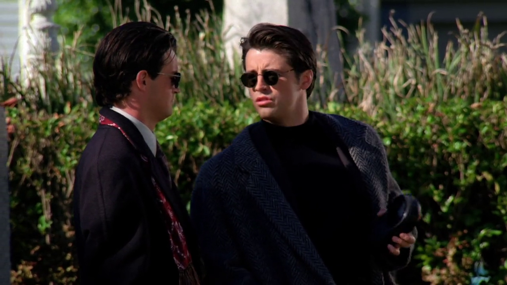

## Sweet'n Low

Ross menciona que sua vó Althea adorava *Sweet'n Low* (1957),
conhecida marca de adoçantes americana, que possui a característica marcante
do sachê cor de rosa.

### Referências

- [Site oficial](http://www.sweetnlow.com/brand)

## Brent Musburger

<cena>
  <joey
    original="- What?"
    traducao="- Que foi?"
  />
  <chandler
    original="- Nothing. Just your overcoat sounds remarkably like Brent Musburger."
    traducao="- Nada. Seu casaco tem a voz de Brent Musburger."
  />
</cena>

Enquanto caminham para a recepção do enterro da vó de Ross e Monica, Chandler
menciona que o casaco de Joey soa como *Brent Musburger* (1939), narrador esportivo
que iniciou sua carreira na *CBS Sport* em 1975. Na época do episódio estava na
*ABC/ESPN*, cobrindo inclusive, como é visto, partidas de Futebol Americano.

### Referências

- [Brent Musburger Biography - VSIN](https://www.vsin.com/about/brent-musburger-biography/)
- [Twitter](https://twitter.com/brentmusburger)
