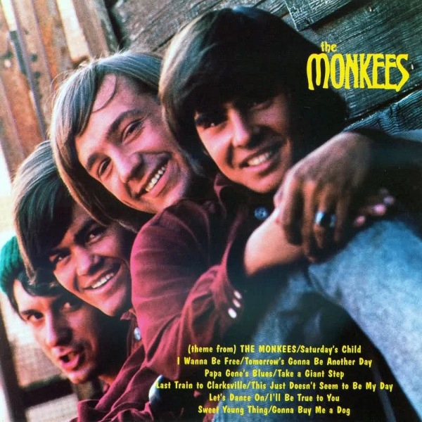

## Yertle the Turtle

<cena>
  <ross
    original="- Hey, hey, Yertle the Turtle. A classic."
    traducao="- A Tartaruga Yertle. Um clássico."
  />
</cena>

Quando foi buscar seu "crânio" que havia emprestado a Carol, Ross notou na mesa
da cozinha o livro *Yertle the Turtle* (1958), conhecido livro de fábula do
*Dr. Seuss* (1904-1991), um renomado autor infantil que criou, entre outros
personagens, o *Grinch*.

### Referências

- [Site oficial](https://www.seussville.com/characters/yertle-the-turtle/)
- [Fandom Wiki](https://seuss.fandom.com/wiki/Yertle_the_Turtle_and_Other_Stories)

## Macy's

<cena>
  <joey
    original="- We used to work together."
    traducao="- Nós trabalhávamos juntos."
  />
  <dialogo
    :imagem="require('~/assets/img/obsession-girl.png')"
    cor-fundo="bg-orange-200"
    original="- We did?"
    traducao="- Trabalhamos?"
  />
  <joey
    original="- Yeah, at Macy's. You're the Obsession girl, right? I was the Aramis guy."
    traducao="- Na Macy's. Era a garota Obsession, certo? Eu era o cara Aramis."
  />
</cena>

Num reencontro com uma conhecida de trabalho, Joey menciona que trabalhou com ela
na *Macy's* (1830), conhecida loja de departamento americana. Ele menciona
*Obsession* e *Aramis*, ambos perfumes que podem ser comprados na loja. O
movimento que ele faz com a mão faz referência a maneira como ele oferecia
uma amostra do perfume.

Joey volta a trabalhar oferecendo amostras de perfume no episódio
[S02E02 - Aquele do leite materno](/temporada/2/episodio/2/).

### Referências

- [Site oficial (Inglês)](https://www.macysinc.com/about/history)

## Don't Stand So Close To Me

Após Joey descobrir que foi escolhido para o poster sobre VD (abreviação
de *Venereal disease* ou Doença Venérea), é possível ouvir a música
*Don't Stand So Close To Me* do álbum *Zenyattà Mondatta* (1980) da
banda de rock britânica *The Police*.

A banda é novamente citada no episódio [S08E10 - Aquele das botas da Monica](/temporada/8/episodio/10/), onde a Phoebe tenta conhecer o *Sting*, vocalista do *The Police*,
através do Ben, filho do Ross.

### Referências

- [Site oficial](https://www.thepolice.com/zenyatta-mondatta)
- [Vídeo clip - YouTube](https://www.youtube.com/watch?v=KNIZofPB8ZM)

## A very special Blossom

<cena>
  <joey
    original="- Set another place for Thanksgiving. My entire family thinks I have VD."
    traducao="- Vou jantar aqui. Minha família acha que tenho doença venérea."
  />
  <chandler
    original="- Tonight, on a very special Blossom."
    traducao="- Esta noite, em um capítulo muito especial de Blossom."
  />
</cena>

A fala de Chandler possui duas referências. Em uma temos a *sitcom* americana
*Blossom* (1991-1995), que conta a história de uma garota, *Blossom Russo*,
interpretada por *Mayim Bialik*, que mora com dois irmãos e o pai solteiro.
Na outra temos o termo *on a very special...*, bastante usado por *sitcoms*
ou séries dramáticas para indicar que o episódio tratará de assuntos controversos,
como por exemplo doenças venéreas.

Esse diálogo é relevante também quando leva-se em conta a carreira de Matthew Perry.
Ele participou de um episódio especial de *Growing Pains*, chamado
*Second Chance* (1989). No papel de Sandy ele namorava Carol, uma das protagonistas
da série. Com a relação se tornando cada vez mais séria, eles decidem comemorar
e acabam exagerando. Mais tarde Carol descobre que Sandy se envolveu em um acidente
de carro e está gravemente ferido no hospital. Ao final, Sandy acaba falecendo,
mostrando que nem sempre temos segundas chances.

### Referências

- [Blossom - Fandom](https://blossompedia.fandom.com/)
- [Ep. Second Chance de Growing Pains - Fandom](https://growing-pains.fandom.com/wiki/Second_Chance)
- [Cenas de Matthew em Growing Pains - YouTube](https://www.youtube.com/watch?v=o1nO-k1cw-w)
- [Very especial episodes - Wikipédia](https://en.wikipedia.org/wiki/Very_special_episode)
- [Ep. The One Where Underdog Gets Away comentado - Genius](https://genius.com/Friends-tv-the-one-where-underdog-gets-away-annotated)

## Smokey

Enquanto os amigos assistem ao desfile de Ação de Graças, é possível ver um balão
inflado do urso *Smokey* (1944), personagem criado para a campanha de prevenção de
incêndios florestais. Esse personagem é baseado em um urso de verdade, que foi
resgatado de uma floresta em chamas no Novo México.

### Referências

- [Site oficial](https://www.smokeybear.com/en/smokeys-history/story-of-smokey)

## The Monkees

Quando finalmente decide cantar para o bebê ainda na barriga de Carol, Ross escolhe
a canção *(Theme From) The Monkees* (1966) da série de comédia americana *The Monkees*.
Ross canta o primeiro trecho corretamente, mas depois, notavelmente, inventa o
restante. Confira o trecho cantado corretamente:

> Here we come

> Walkin' down the street

> We get the funniest looks from

> Everyone we meet

### Referências

- [Fandom - Wiki](https://monkees.fandom.com/wiki/Monkeepedia)
- [Tema de abertura - YouTube](https://www.youtube.com/watch?v=96A0uyFWQHs)
