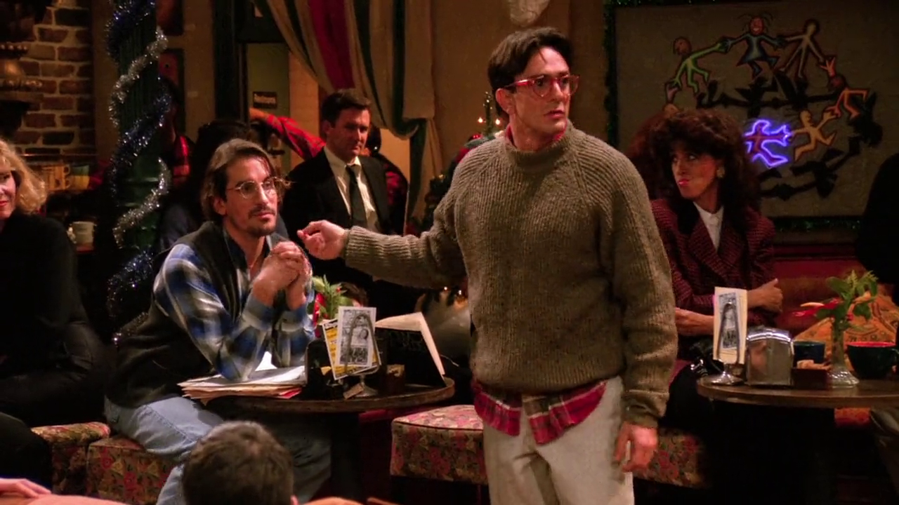
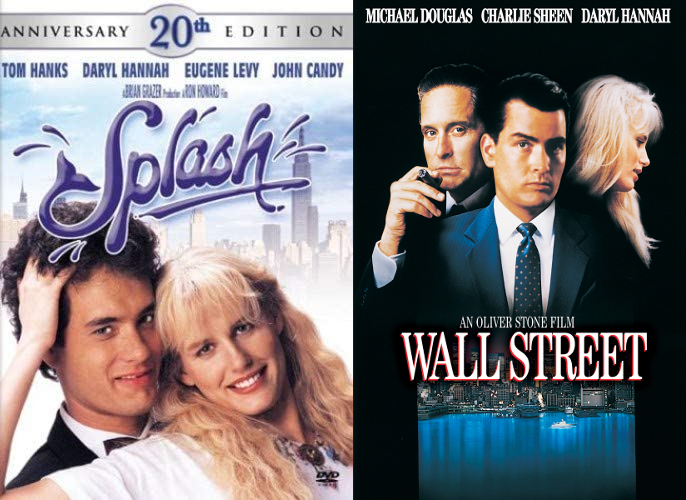
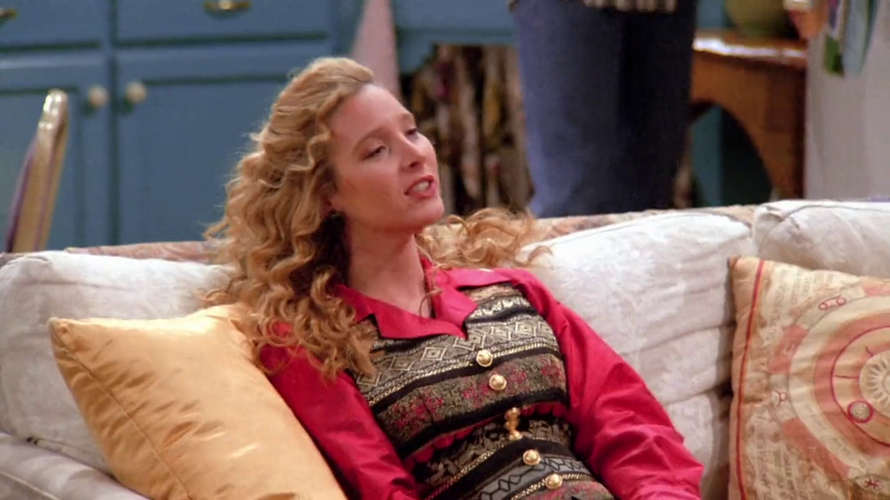
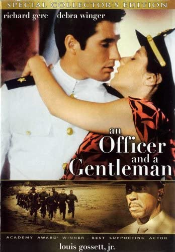
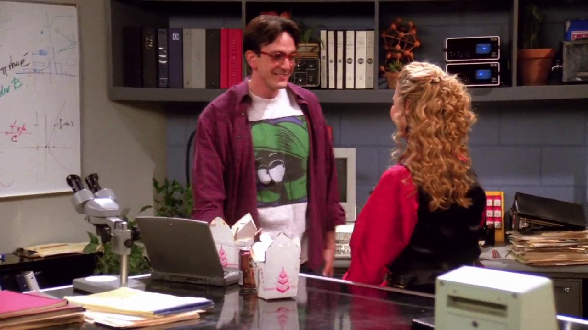
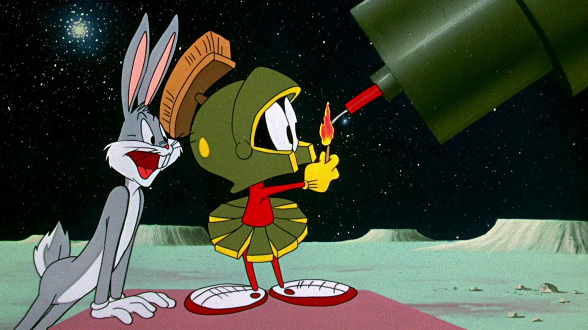
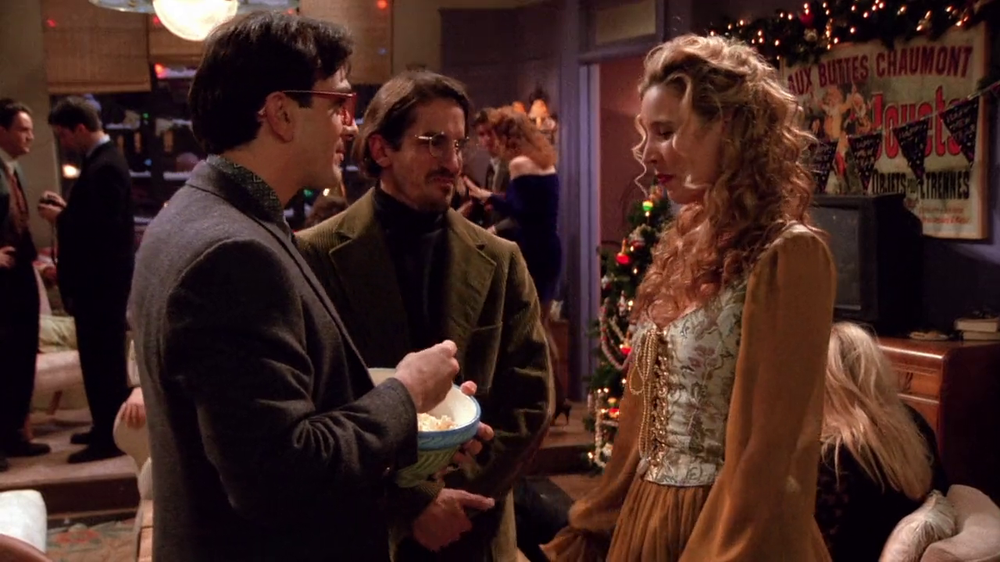

## Daryl Hannah

{ fullpage=true, clipt=1cm, clipb=8cm }

<cena>
  <david
    original="- I was just saying to my friend, you were the most beautiful woman I'd ever seen. And you said Daryl Hannah..."
    traducao="- Estava dizendo que acho você a mulher mais linda que já vi. Ele disse que achava Daryl Hannah..."
  />
  <max
    original="- Daryl Hannah."
    traducao="- Daryl Hannah."
  />
</cena>

Phoebe cantava no Central Perk e logo foi interrompida pela discussão de Max e
David, sobre como David achava que Phoebe era a mulher mais bonita que ele havia
visto. Max menciona então *Daryl Hannah* (1960-), conhecida atriz, diretora e
roteirista americana.[^hannah-imdb]

David ainda menciona dois filmes em que a atriz participou. O primeiro é *Splash*
(1984), uma comédia romântica onde ela protagoniza uma sereia.[^splash-imdb] O outro é
*Wall Street* (1987), interpretando o papel de *Darien Taylor* numa história
sobre o mercado de ações de Nova York.[^wall-street-imdb] No Brasil, os filmes ficaram conhecidos
como *Splash - Uma Sereia em Minha Vida* e *Wall Street - Poder e Cobiça*,
respectivamente.

{ bookwidth=60% }

[^hannah-imdb]: [Daryl Hannah - IMDB](https://www.imdb.com/name/nm0000435/)
[^splash-imdb]: [Splash - IMDB](https://www.imdb.com/title/tt0088161/)
[^wall-street-imdb]: [Wall Street - IMDB](https://www.imdb.com/title/tt0094291/)

## An officer and a Gentleman

{ fullpage=true, clipt=2cm, clipb=6cm }

<cena>
  <phoebe
    original="- Did you ever see An Officer and a Gentleman?"
    traducao="- Viu A Força do Destino?"
  />
  <monica
    original="- Yeah."
    traducao="- Sim."
  />
  <phoebe
    original="- Well, he's kind of like the guy I went to see that with."
    traducao="- Ele parece o cara que viu o filme comigo."
  />
</cena>

<!-- {"latex":[{"begin":{"tag":"col-1","width":0.5}}]} -->

Enquanto fala sobre David, Phoebe menciona o filme *An Officer and a Gentleman*
(1982), que conta a história de *Zack Mayo* (*Richard Gere*), garoto que cansado
de sua vida nas Filipinas decide entrar para Marinha, mas para isso precisa
passar por um intenso treinamento com *Sgt. Emil Foley* (*Louis Gossett Jr.*).
No Brasil, o longa ficou conhecido como *A Força do Destino*.[^officer-imdb]

<!--{"latex":[{"end":{"tag":"col-1"}},{"begin":{"tag":"col-2","width":0.45}}]}-->

{ bookwidth=70% }

<!--{"latex":[{"end":{"tag":"col-2"}}]}-->

[^officer-imdb]: [An Officer and a Gentleman - IMDB](https://www.imdb.com/title/tt0084434/)

## Marvin the Martian

{ fullpage=true, clipt=0cm, clipb=8cm }

<!-- {"latex":[{"begin":{"tag":"col-1","width":0.5}}]} -->

Enquanto tenta explicar a Phoebe sobre seu trabalho, David veste uma camisa com
o personagem *Marvin the Martian* (1948), criatura extraterrestre da *Looney Tunes*.
Aparece pela primeira vez no episódio *Haredevil Hare*.[^marvin-fandom] [^haredevil-hare-dm]

<!--{"latex":[{"end":{"tag":"col-1"}},{"begin":{"tag":"col-2","width":0.5}}]}-->

{ bookwidth=80% }

<!--{"latex":[{"end":{"tag":"col-2"}}]}-->

[^marvin-fandom]: [Marvin the Martian - Fandom Wiki](https://looneytunes.fandom.com/wiki/Marvin_the_Martian)
[^haredevil-hare-dm]: [Haredevil Hare - Dailymotion](https://www.dailymotion.com/video/x7sk3yr)

## Yoko

{ fullpage=true, clipt=1cm, clipb=11cm }

Após cumprimentar David, seu colega de laboratório, Max chama Phoebe de *Yoko*,
alusão a *Yoko Ono* (1933-), que teve um relacionamento com *John Lennon* (1940-1980)
e que isso teria sido um dos motivos da seperação da banda, por volta de 1968 durante
as gravações de *The White Album* (1968).[^yoko-independent] [^yoko-biography]

[^yoko-independent]: [Yoko Ono - Independent (Inglês)](https://bit.ly/2KG9zoM)
[^yoko-biography]: [Yoko Ono - Biography (Inglês)](https://www.biography.com/news/did-yoko-ono-break-up-the-beatles)
