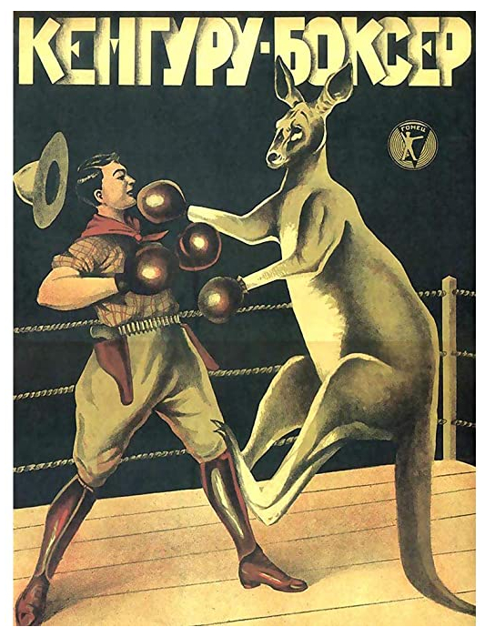

## Jay Leno

Os amigos assistem a escritora Nora Bing, mãe de Chandler, no programa
*Tonight with Jay Leno* (1992-2014) do apresentador *Jay Leno*. O *talk show*
era filmado na California, no mesmo bloco do estúdio da NBC onde era gravado
*Friends*.

O elenco de *Friends* ainda faria uma reunião em 6 de Maio de 2004, data em que
os dois últimos episódios da série foram ao ar, num programa especial apresentado
no *Central Perk*.

### Referências

- [Página do ep. no Fandom Wiki (Inglês)](https://friends.fandom.com/wiki/The_One_With_Mrs._Bing)
- [Wikipédia](https://en.wikipedia.org/wiki/List_of_The_Tonight_Show_with_Jay_Leno_episodes_(2000%E2%80%932009)#May_5)
- [The Last One, Part 1 - Fandom Wiki (Inglês)](https://friends.fandom.com/wiki/The_Last_One,_Part_1)

## Weekend at Bernie's

<cena>
  <chandler
    original="- Don't watch this. Weekend at Bernie's is on Showtime and HBO and Cinemax."
    traducao="- Não vamos ver isto. Tá passando Um Morto Muito Louco na Showtime, HBO e Cinemax."
  />
</cena>

Para evitar que os amigos vejam sua mãe falar sobre o novo livro dela, Chandler
sugere que eles assistam o filme *Weekend at Bernie's* (1989). O filme também é
citado no episódio [S04E12 - Aquele com os embriões](/temporada/4/episodio/12/)
como sendo o favorito da Rachel.

Chandler ainda cita *Showtime*, *HBO* e *Cinemax*, todas redes de televisão por
assinatura americanas.

### Referências

- [IMDB](https://www.imdb.com/title/tt0098627/)
- [Página do ep. no Fandom Wiki (Inglês)](https://friends.fandom.com/wiki/The_One_With_Mrs._Bing)
- [Página do quiz (S04E12) no Fandom Wiki (Inglês)](https://friends.fandom.com/wiki/The_Contest)

## Les Mystères de New York

No apartamento de Chandler e Joey é possível ver um poster de *Les Mystères de New York*
(1915), versão francesa do seriado estadunidense *The Exploits of Elaine*.
Baseado na obra de *Arthur B. Reeve* (1880-1936), conta a história
do detetive e cientista *Craig Kennedy*, que usa seus aparelhos de laboratório para
descobrir a identidade do assassino de *Elaine Dodge*, que ficou conhecido como
*A mão do diabo*.

Essa versão do seriado foi concebida pelo escritor *Pierre Decourcelle* (1856-1926).
O poster é uma campanha promocional entre o filme e o jornal francês *Le Matin*,
já que *Decourcelle* estava publicando uma versão impressa da história.

### Referências

- [The One with the Illustrated Posters (Inglês)](https://illustrationchronicles.com/The-One-with-the-Illustrated-Posters)
- [Serial Squadron (Inglês)](http://serialsquadron.com/sites/ithacamademovies/serials/elaine/)
- [IMDB](https://www.imdb.com/title/tt0003897/)
- [Wikipédia](https://pt.wikipedia.org/wiki/The_Exploits_of_Elaine)
- [Mucem (Francês)](https://www.mucem.org/programme/les-mysteres-de-new-york-exploits-elaine)

## Кенгуру -Боксер (Kangaroo Boxer)

Ainda no apartamento dos rapazes, na parede oposta, podemos ver o poster
*Кенгуру -Боксер (Kangaroo Boxer)*, que é uma referência à família circense
*Durov* (1912), responsável por trazer renome e prestígio ao circo Russo. São conhecidos
por serem ótimos palhaços e treinadores de animais.

Não foi possível encontrar referências diretas de uma luta entre *Durov* e um
canguru, mas o poster destaca a habilidade da família no treinamento de animais
dos mais variados, inclusive um hipopótamo. Um fato importante foi a criação de
um novo método de treinamento, o qual não envolvia maus-tratos aos animais.

### Referências

- [The One with the Illustrated Posters (Inglês)](https://illustrationchronicles.com/The-One-with-the-Illustrated-Posters)
- [Website oficial (Russo)](https://www.ugolokdurova.ru/istoriya-teatra)
- [Circopedia (Inglês)](http://www.circopedia.org/The_Durov_Dynasty)
