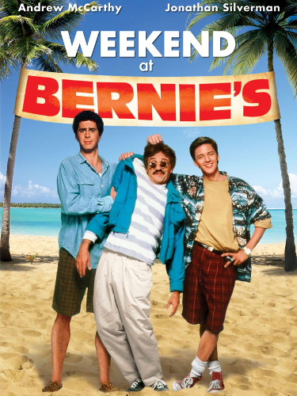

## Jay Leno

{ fullpage=true, clipt=1cm, clipb=7cm }

Os amigos assistem a escritora Nora Bing, mãe de Chandler, no programa
*Tonight with Jay Leno* (1992-2014) do apresentador *Jay Leno*. O *talk show*
era filmado na California, no mesmo bloco do estúdio da NBC onde era gravado
*Friends*.

O elenco de *Friends* ainda faria uma reunião em 6 de Maio de 2004, data em que
os dois últimos episódios da série foram ao ar, num programa especial apresentado
no *Central Perk*.[^tonight-wiki]

[^tonight-wiki]: [Tonight with Jay Leno com elenco de Friends - Wikipédia](https://bit.ly/3q3spX8)

## Weekend at Bernie's

{ fullpage=true, clipt=1cm, clipb=9cm }

<cena>
  <chandler
    original="- Don't watch this. Weekend at Bernie's is on Showtime and HBO and Cinemax."
    traducao="- Não vamos ver isto. Tá passando Um Morto Muito Louco na Showtime, HBO e Cinemax."
  />
</cena>

<!-- {"latex":[{"begin":{"tag":"col-1","width":0.5}}]} -->

Para evitar que os amigos vejam sua mãe falar sobre o novo livro dela, Chandler
sugere que eles assistam ao filme *Weekend at Bernie's* (1989). O filme também é
citado no episódio [S04E12 - Aquele com os embriões](/temporada/4/episodio/12/)
como sendo o favorito da Rachel.[^bernie-imdb]

Chandler ainda cita *Showtime*, *HBO* e *Cinemax*, todas redes de televisão por
assinatura americanas.

<!--{"latex":[{"end":{"tag":"col-1"}},{"begin":{"tag":"col-2","width":0.5}}]}-->

{ bookwidth=70% }

<!--{"latex":[{"end":{"tag":"col-2"}}]}-->

[^bernie-imdb]: [Weekend at Bernie's - IMDB](https://www.imdb.com/title/tt0098627/)

## Les Mystères de New York

{ fullpage=true, clipt=1cm, clipb=5cm }

No apartamento de Chandler e Joey é possível ver um poster de *Les Mystères de New York*
(1915), versão francesa do seriado estadunidense
*The Exploits of Elaine*.[^elaine-serialsquadron] [^elaine-imdb]
Baseado na obra de *Arthur B. Reeve* (1880-1936), conta a história
do detetive e cientista *Craig Kennedy*, que usa seus aparelhos de laboratório para
descobrir a identidade do assassino de *Elaine Dodge*, que ficou conhecido como
*A mão do diabo*.[^mysteres-mucem]

<!-- {"latex":[{"begin":{"tag":"col-1","width":0.5}}]} -->

Essa versão do seriado foi concebida pelo escritor *Pierre Decourcelle* (1856-1926).
O poster é uma campanha promocional entre o filme e o jornal francês *Le Matin*,
já que *Decourcelle* estava publicando uma versão impressa da história.

<!--{"latex":[{"end":{"tag":"col-1"}},{"begin":{"tag":"col-2","width":0.5}}]}-->

{ bookwidth=80% }

<!--{"latex":[{"end":{"tag":"col-2"}}]}-->

[^elaine-serialsquadron]: [The Exploits of Elaine - Serial Squadron (Inglês)](http://serialsquadron.com/sites/ithacamademovies/serials/elaine/)
[^elaine-imdb]: [The Exploits of Elaine - IMDB](https://www.imdb.com/title/tt0003897/)
[^mysteres-mucem]: [Les Mystères de New York - Mucem (Francês)](https://www.mucem.org/programme/les-mysteres-de-new-york-exploits-elaine)

## Кенгуру -Боксер (Kangaroo Boxer)

{ fullpage=true, clipt=1cm, clipb=5cm }

<!-- {"latex":[{"begin":{"tag":"col-1","width":0.5}}]} -->

Ainda no apartamento dos rapazes, na parede oposta, podemos ver o poster
*Кенгуру -Боксер (Kangaroo Boxer)*, que é uma referência à família circense
*Durov* (1912), responsável por trazer renome e prestígio ao circo Russo. São conhecidos
por serem ótimos palhaços e treinadores de animais.[^durov-website]

<!--{"latex":[{"end":{"tag":"col-1"}},{"begin":{"tag":"col-2","width":0.5}}]}-->

{ bookwidth=80% }

<!--{"latex":[{"end":{"tag":"col-2"}}]}-->

Não foi possível encontrar referências diretas de uma luta entre *Durov* e um
canguru, mas o poster destaca a habilidade da família no treinamento de animais
dos mais variados, inclusive um hipopótamo. Um fato importante foi a criação de
um novo método de treinamento, o qual não envolvia maus-tratos aos animais.[^durov-circopedia]

{ bookwidth=60% }

[^durov-website]: [Durov - Website oficial (Russo)](https://www.ugolokdurova.ru/istoriya-teatra)
[^durov-circopedia]: [The Durov Dynasty - Circopedia (Inglês)](http://www.circopedia.org/The_Durov_Dynasty)
