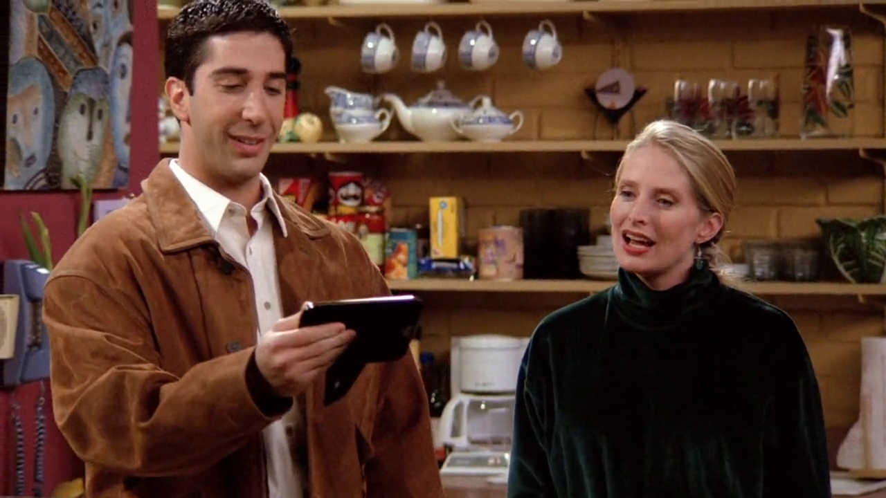

## The Odd Couple

{ fullpage=true, clipt=2cm, clipb=6cm }

A música cantada logo no início do episódio é o tema de abertura da série
*The Odd Couple* (1970-1975), que conta a história de dois amigos tentando dividir
um apartamento, mas cada um tem uma maneira de viver muito diferente e isso gera
muitos conflitos.[^odd-couple-70-tmdb] [^odd-couple-70-yt]

**Matthew Perry** ainda estrelou uma releitura da série em 2015 junto com *Thomas Lennon*,
com a mesma premissa.[^odd-couple-2015-imdb] [^odd-couple-2015-yt]

{ bookwidth=70% }

[^odd-couple-70-tmdb]: [The Odd Couple (1970) - TMDB](https://www.themoviedb.org/tv/1809-the-odd-couple)
[^odd-couple-2015-imdb]: [The Odd Couple (2015) - IMDB](https://www.imdb.com/title/tt0065329/)
[^odd-couple-70-yt]: [The Odd Couple - Tema de abertura (1970) - YouTube](https://www.youtube.com/watch?v=kDrfHj3j398)
[^odd-couple-2015-yt]: [The Odd Couple - Tema de abertura (2015) - YouTube](https://www.youtube.com/watch?v=mrsj4yd_c3I)

## I Dream of Jeannie

{ fullpage=true, clipt=2cm, clipb=6cm }

<!-- {"latex":[{"begin":{"tag":"col-1","width":0.5}}]} -->

Logo após a bem sucedida vocalização de *The Odd Couple*, Ross tenta emendar o
tema de *I Dream of Jeannie* (1965-1970), *sitcom* americana que conta a história
de *Tony Nelson*, um astronauta que liberta um gênio da garrafa, *Jeannie*.[^jeannie-tmdb]

<!--{"latex":[{"end":{"tag":"col-1"}},{"begin":{"tag":"col-2","width":0.5}}]}-->

{ bookwidth=60% }

<!--{"latex":[{"end":{"tag":"col-2"}}]}-->

<cena>
    <chandler
        original="- No, no, we're done. We're done, man."
        traducao="- Não, já chega, já chega cara."
    />
</cena>

O tema é referenciado novamente em [S08E20 - Aquele com o chá de bebê](/temporada/8/episodio/20/),
quando Joey está praticando para seu *game show Bamboozled*[^bamboozled-fandom],
onde ele pergunta a Ross:

> *Audio question: Name this television theme song...*

[^jeannie-tmdb]: [I Dream of Jeannie - TMDB](https://www.themoviedb.org/tv/1660-i-dream-of-jeannie)
[^bamboozled-fandom]: [Bamboozled - Fandom Wiki](https://friends.fandom.com/wiki/Bamboozled)

## Huey Lewis

{ fullpage=true, clipt=0cm, clipb=7cm }

<cena>
    <ross
      original="- Hey. When did you and Susan meet Huey Lewis?"
      traducao="- Quando vocês conheceram Huey Lewis?"
    />
    <carol
      original="- Uh, that's our friend Tanya."
      traducao="- Essa é nossa amiga Tanya."
    />
    <ross
      original="- Of course it's your friend Tanya."
      traducao="- Claro que é sua amiga Tanya."
    />
</cena>

*Hugh Anthony Cregg III* ou simplesmente *Huey Lewis* (1950-) é um cantor, compositor e
ator americano. É o vacalista principal e toca gaita na banda *Huey Lewis and the News*
(1980).[^lewis-website]

[^lewis-website]: [Huey Lewis and the News - Site oficial](http://www.hueylewisandthenews.com/)

## Hibachi

{ fullpage=true, clipt=1cm, clipb=7cm }

<cena>
    <chandler
        original="- We bought a hibachi together, and then he ran off and got married... and things got pretty ugly."
        traducao="- Compramos um hibachi juntos, ele se casou...  e as coisas ficaram feias."
    />
</cena>

Chandler menciona que comprou um *hibachi* com *Kip*, seu antigo companheiro de
apartamento, mas depois que ele casou
acabou levando o aparelho, que nada mais é que uma espécie de chapa para preparar
comida. No episódio [S01E14 - Aquele com os Corações Doces](/temporada/1/episodio/14/),
podemos ver um *hibachi* no restaurante japonês onde Ross e Kristen se encontram
com Carol e Susan.[^hibachi]

[^hibachi]: [Shinto Restaurants (Inglês)](https://shintorestaurants.com/what-is-hibachi/)
