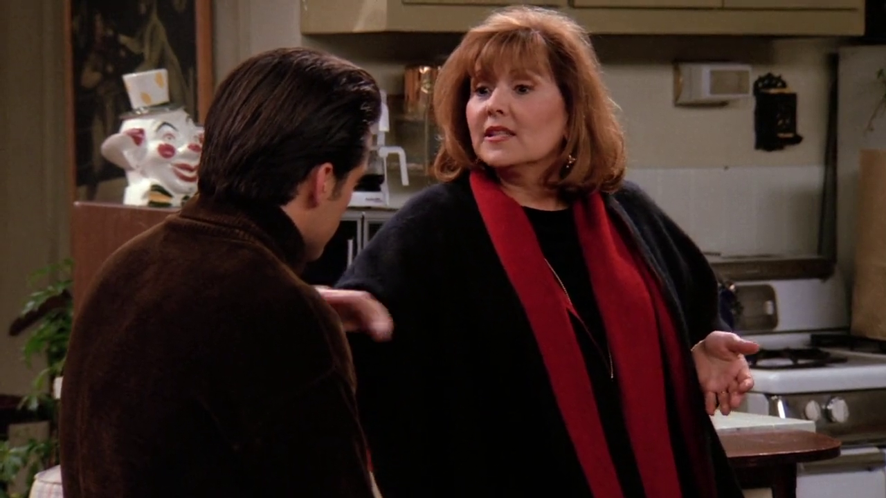
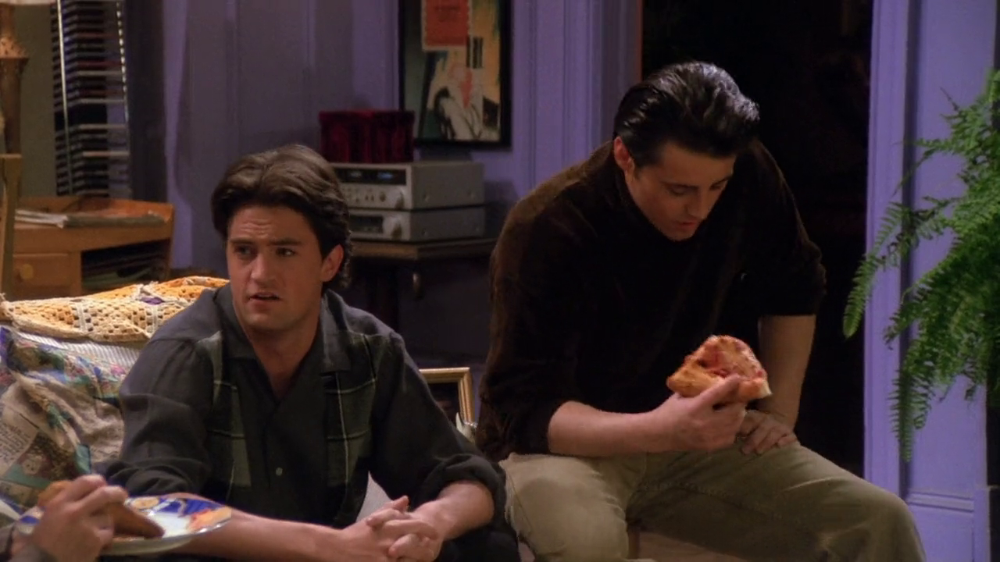
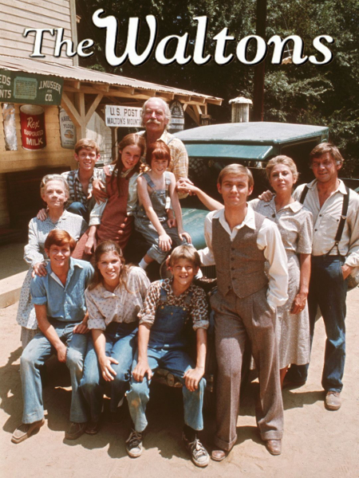

## Weebles

{ fullpage=true, clipt=1cm, clipb=8cm }

<cena>
    <rachel
        original="- It wasn't just the Weebles, but it was the Weeble Play Palace, and the Weeble's Cruise Ship, which had this little lifeboat for the Weebles to wobble in."
        traducao="- Não foram só os Weebles, foi o palácio dos Weebles, e o navio dos Weebles, com barquinhos salva-vidas para não se afogarem."
    />
</cena>

Abrindo seu coração para o Roger *(I hate that guy!)* sobre sua infância, Rachel
menciona *Weebles* (1971), um brinquedo em formato de ovo com um peso na parte de
baixo que o fazia ficar em pé. Daí o bordão **Weebles wobble, but they don't fall down**,
que em português é algo como **Weebles balançam, mas não caem**.[^weebles-wiki]

{ bookwidth=70% }

[^weebles-wiki]: [Weebles - Wikipédia](https://en.wikipedia.org/wiki/Weeble)

## KerPlunk

{ fullpage=true, clipt=1cm, clipb=8cm }

<cena no-breakable>
    <chandler
        original="- So who's up for a big game of Kerplunk?"
        traducao="- Quem quer jogar Kerplunk?"
    />
</cena>

Para quebrar o gelo após o encontro entre Ronnie e o Papai Joey, Chandler sugere
uma partida de *KerPlunk* (1967), jogo de 2 a 4 competidores em que, em cada rodada,
uma vareta deve ser retirada de um tubo plástico, e em cima das varetas há bolinhas.
O objetivo é derrubar o menor número de bolinhas. No Brasil o jogo foi lançado pela
*Estrela* com o nome *Cai não cai*. [^ker-plunk-ludo] [^ker-plunk-yt]

{ bookwidth=60% }

[^ker-plunk-ludo]: [KerPlunk - Ludopedia](https://www.ludopedia.com.br/jogo/ker-plunk?v=)
[^ker-plunk-yt]: [KerPlunk - YouTube (Inglês)](https://www.youtube.com/watch?v=Aslf72DPSR0)

## James Bond

{ fullpage=true, clipt=1cm, clipb=8cm }

<cena>
    <joey
        original="- Hold on. You knew?"
        traducao="- Espera aí. Você sabia?"
    />
    <gloria
      original="- Of course I knew. What do you think? Your father is no James Bond."
      traducao="- Claro! O que achou? Seu pai não é James Bond."
    />
</cena>

Gloria, mãe de Joey, menciona que Big Joey não é nenhum *James Bond* (1953), um
agente secreto britânico fictício, protagonista da franquia *007*. Apareceu
inicialmente no livro *Casino Royale*, para logo em seguida ser o mocinho de
vários filmes.[^bond-wiki]

[^bond-wiki]: [James Bond - Wikipédia](https://pt.wikipedia.org/wiki/James_Bond)

## Sting

{ fullpage=true, clipt=0cm, clipb=8cm }

<cena>
    <gloria
      original="- Look, honey, in an ideal world there'd be no her and your father would look like Sting."
      traducao="- Ouça, em um mundo ideal ela não existiria e o seu pai se pareceria com o Sting."
    />
</cena>

<!-- {"latex":[{"begin":{"tag":"col-1","width":0.5}}]} -->

Ponderando como seria se Big Joey fosse diferente, Gloria menciona *Sting* (1951),
nome artístico de *Gordon Matthew Thomas Sumner*, conhecido por ser o vocalista
da banda britânica *The Police* (Ver [S01E09 - Aquele em que o Oprimido Escapa](/temporada/1/episodio/9/#dont-stand-so-close-to-me)).[^sting-website]

<!--{"latex":[{"end":{"tag":"col-1"}},{"begin":{"tag":"col-2","width":0.5}}]}-->

{ bookwidth=80% }

<!--{"latex":[{"end":{"tag":"col-2"}}]}-->

[^sting-website]: [Sting - Site oficial](https://www.sting.com/)

## Walton's Mountain

{ fullpage=true, clipt=3cm, clipb=9cm }

<cena>
  <chandler
    original="- Things sure have changed here on Walton's mountain."
    traducao="- Tudo mudou na montanha dos Walton."
  />
</cena>

<!-- {"latex":[{"begin":{"tag":"col-1","width":0.5}}]} -->

Joey faz um resumo de tudo que aconteceu após a revelação da traição por parte de
seu pai. Chandler, sarcástico como sempre, cita *Walton's mountain*, local fictício
onde se passa a história de *The Waltons* (1972), premiada série americana que tem
como trama principal a história de uma família que mora na zona rural da Virginia,
na época entre a *Grande Depressão* (também conhecida como a *Crise de 29*) e a
*Segunda Guerra Mundial* (1939-1945).[^waltons-website]

<!--{"latex":[{"end":{"tag":"col-1"}},{"begin":{"tag":"col-2","width":0.5}}]}-->

{ bookwidth=80% }

<!--{"latex":[{"end":{"tag":"col-2"}}]}-->

[^waltons-website]: [All about The Waltons](http://www.allaboutthewaltons.com/)
