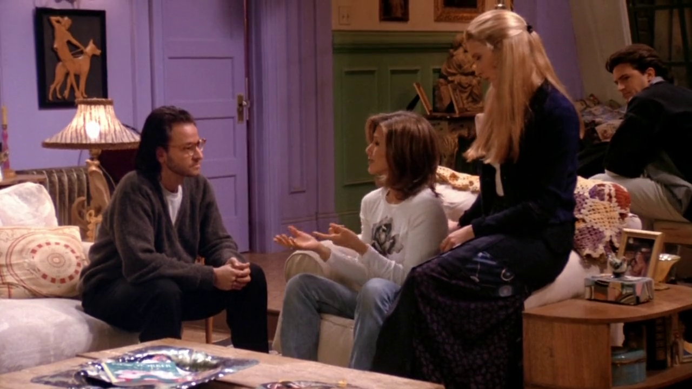
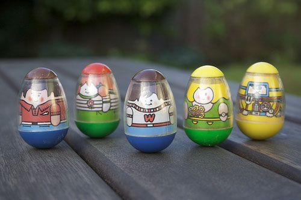
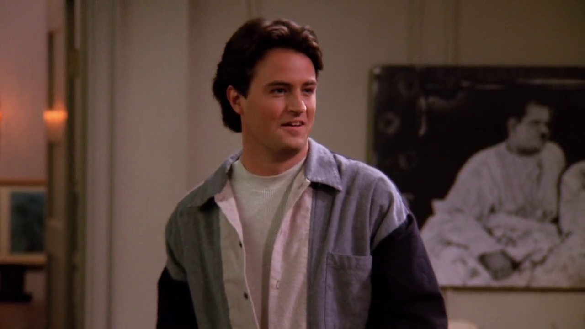
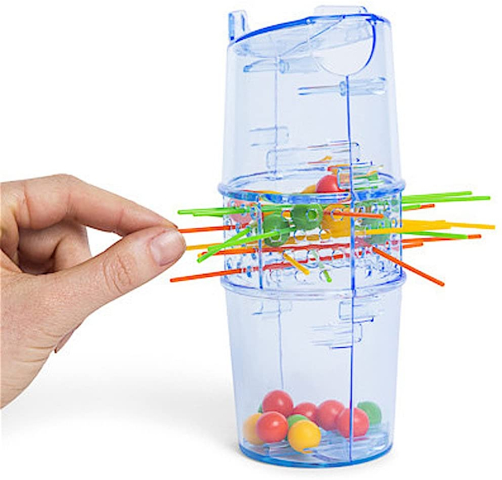
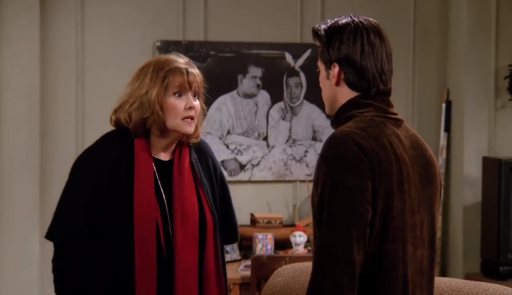

## Weebles

<cena>
    <rachel
        original="- It wasn't just the Weebles, but it was the Weeble Play Palace, and the Weeble's Cruise Ship, which had this little lifeboat for the Weebles to wobble in."
        traducao="- Não foram só os Weebles, foi o palácio dos Weebles, e o navio dos Weebles, com barquinhos salva-vidas para não se afogarem."
    />
</cena>

Abrindo seu coração para o Roger *(I hate that guy!)* sobre sua infância, Rachel
menciona *Weebles* (1971), um brinquedo em formato de ovo com um peso na parte de
baixo que o fazia ficar em pé. Daí o bordão **Weebles wobble, but they don't fall down**,
que em português é algo como **Weebles balançam, mas não caem**.

### Referências

- [Wikipédia](https://en.wikipedia.org/wiki/Weeble)

## KerPlunk

<cena>
    <chandler
        original="- So who's up for a big game of Kerplunk?"
        traducao="- Quem quer jogar Kerplunk?"
    />
</cena>

Para quebrar o gelo após o encontro entre Ronnie e o Papai Joey, Chandler sugere
uma partida de *KerPlunk* (1967), jogo de 2 a 4 competidores em que, em cada rodada,
uma vareta deve ser retirada de um tubo plástico, e em cima das varetas há bolinhas.
O objetivo é derrubar o menor número de bolinhas. No Brasil o jogo foi lançado pela
*Estrela* com o nome *Cai não cai*.

### Referências

- [Ludopedia](https://www.ludopedia.com.br/jogo/ker-plunk?v=)
- [Wikipédia](https://en.wikipedia.org/wiki/KerPlunk_(game))
- [Vídeo explicativo - YouTube (Inglês)](https://www.youtube.com/watch?v=Aslf72DPSR0)

## James Bond

<cena>
    <joey
        original="- Hold on. You knew?"
        traducao="- Espera aí. Você sabia?"
    />
    <gloria
      original="- Of course I knew. What do you think? Your father is no James Bond."
      traducao="- Claro! O que achou? Seu pai não é James Bond."
    />
</cena>

Gloria, mãe de Joey, menciona que Big Joey não é nenhum *James Bond* (1953), um
agente secreto britânico fictício, protagonista da franquia *007*. Apareceu
inicialmente no livro *Casino Royale*, para logo em seguida ser o mocinho de
vários filmes.

### Referências

- [Wikipédia](https://pt.wikipedia.org/wiki/James_Bond)
