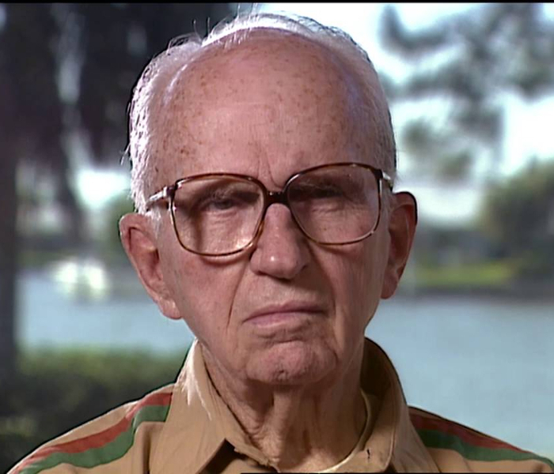

## I don't have a dream

{ fullpage=true, clipt=1cm, clipb=8cm }

<cena>
  <chandler
    original="- I don't have a dream."
    traducao="- Eu não tenho um sonho."
  />
  <ross
    original="- Ah, the lesser known I Don't Have a Dream speech."
    traducao="- Esse discurso é menos conhecido."
  />
</cena>

<!-- {"latex":[{"begin":{"tag":"col-1","width":0.5}}]} -->

Ross faz um trocadilho com o discurso de *Martin Luther King Jr.* (1929-1968)
*I have a dream*, *Eu tenho um sonho* em português. O discurso vocalizado em
28 de Agosto de 1963 pedia igualdade para o povo negro americano.[^king-projuris] [^king-yt]

<!--{"latex":[{"end":{"tag":"col-1"}},{"begin":{"tag":"col-2","width":0.5}}]}-->

{ bookwidth=80% }

<!--{"latex":[{"end":{"tag":"col-2"}}]}-->

[^king-projuris]: [ProJuris - Discurso de Martin Luther King Jr.](https://bit.ly/3lioimk)
[^king-yt]: [Martin Luther King Jr. - Discurso com legendas - YouTube](https://www.youtube.com/watch?v=fz_7luovxPc)

## Brian's Song

{ fullpage=true, clipt=2cm, clipb=7cm }

<cena no-breakable>
  <monica
    original="- Oh, I love my life. I love my life."
    traducao="- Eu adoro a minha vida!"
  />
  <phoebe
    original="- Brian's Song."
    traducao="- Brian's Song."
  />
</cena>

Enquanto Monica entra no apartamento alegre por ter tido uma boa entrevista, Phoebe
acha que a fala dela é uma referência ao filme *Brian's Song* (1971), que conta a
histório de *Brian Piccolo*, um atleta de futebol americano que descobre um câncer
terminal logo que entra para o time profissional.[^brian-tmdb]

Isso, certamente, remete ao fato de que sua mãe evitava que ela assistisse ao final
de filmes trágicos, como mais tarde seria revelado em
[S02E20 - Aquele em que o velho Yeller morre](/temporada/2/episodio/20/).

[^brian-tmdb]: [Brian's Song - TMDB](https://www.themoviedb.org/movie/18047-brian-s-song)

## A blond woman and some bears

{ fullpage=true, clipt=1cm, clipb=7cm }

<cena>
  <monica
    original="- It's not too big, not too small. It's just right."
    traducao="- Não é nem grande nem pequeno, é perfeito."
  />
  <chandler
    original="- Was it formerly owned by a blond woman and some bears?"
    traducao="- A antiga dona era loira e tinha ursos?"
  />
</cena>

Depois de Monica explicar como era o restaurante que ela poderia trabalhar caso
passasse na entrevista, Chandler menciona uma antiga dona loira e uns ursos. Ele
faz referência ao conto *The Story of the Three Bears* (1837) de *Robert Southey*
(1744-1843)[^southey-britannica], no qual há uma paráfrase do diálogo de Monica
com o livro.[^goldilocks-al]
No Brasil a história ficou conhecida como *Cachinhos Dourados e os Três Ursos*.

Para dar um exemplo, o texto conta como *Cachinhos Dourados* experimentou o mingau
do Papai Urso e achou quente, depois experimentou o da Mamãe Urso e achou frio, e,
por fim, experimentou o mingau do Pequeno Urso, e ele nem estava quente nem frio,
estava perfeito.[^goldilocks-batten]

[^goldilocks-al]: [The Story of the Three Bears na American Literature (Inglês)](https://bit.ly/2L7Vn8e)
[^goldilocks-batten]: Batten, Cundall, Lang. *Goldilocks and the Three Bears: Special Edition*. John Batten 2014.
[^southey-britannica]: [Robert Southey - Encyclopædia Britannica](https://www.britannica.com/biography/Robert-Southey)

## Innsbruck

{ fullpage=true, clipt=1cm, clipb=9cm }

<cena>
  <rachel
    original="- [...] And I've sort of been maintaining my amateur status so that I can waitress in the Olympics."
    traducao="- [...] E eu continuo sendo amadora para poder competir nas Olimpíadas."
  />
  <chandler
    original="- You know, I don't mean to brag, but I waited tables at Innsbruck in '76. Amuse-bouche?"
    traducao="- Não quero me gabar, mas fui garçom em Innsbruck, em '76. Amuse-bouche?"
  />
</cena>

Chandler faz pouco da Rachel e insinua que foi garçom em *Innsbruck* em '76. Ele se
refere aos *Jogos Olímpicos de Inverno* (1976), ocorridos na cidade de *Innsbruck*,
na Áustria. Os jogos ocorreram entre os dias 4 e 15 de Fevereiro com representantes
de 37 países. O Brasil não participou.[^innsbruck-1976]

[^innsbruck-1976]: [Innsbruck 176 - Página oficial (Inglês)](https://www.olympic.org/innsbruck-1976)

## Cheech

{ fullpage=true, clipt=1cm, clipb=9cm }

<cena>
  <phoebe
    original="- Smoked a joint, you know? Lit a bone. Weed, hemp, ganja."
    traducao="- Fumou um baseado, maconha, erva, hemp."
  />
  <rachel
    original="- Okay, I'm with you, Cheech."
    traducao="- Já entendi, Cheech."
  />
</cena>

Phoebe conta a Rachel que Steve, o dono do restaurante, havia dado um "tapa" no
caminho até o apartamento. Percebendo que Rachel não havia entendido bem, Phoebe
menciona vários sinônimos para maconha, até que Rachel a interrompe e menciona *Cheech*.
*Richard "Cheech" Marin* junto com *Tommy Chong* formam a dupla de comédia
*Cheech & Chong* (1971). Eles se apresentavam em *stand-up's*, gravaram discos e
filmes baseados na era *hippie*.[^cheech-wiki]

Abaixo uma cena do filme *Up in Smoke* (1978), *Cheech* à direita e *Chong*
à esquerda.

{ bookwidth=60% }

[^cheech-wiki]: [Cheech & Chong - Wikipédia](https://bit.ly/3qbBZY0)

## James Michener

{ fullpage=true, clipt=2cm, clipb=9cm }

<cena>
  <joey
    original="- So, uh, how did it go with Celia?"
    traducao="- Então, como foi com Celia?"
  />
  <ross
    original="- I was unbelievable."
    traducao="- Eu fui inacreditável."
  />
  <joey
    original="- All right, Ross."
    traducao="- É isso aí, Ross."
  />
  <ross
    original="- I was the James Michener of dirty talk."
    traducao="- Fui o James Michener da sacanagem."
  />
</cena>

<!-- {"latex":[{"begin":{"tag":"col-1","width":0.5}}]} -->

Descrevendo seu encontro com Celia, Ross menciona *James Michener* (1907-1997),
autor norte-americano conhecido por seus romances extensos devido a detalhadas
descrições, tanto geográficas, familiares e históricas. Ele às vezes levava anos na
preparação de seus livros, como por exemplo em
*Spain for Iberia: Spanish Travels and Reflections* (1968).[^michener-britannica]

<!--{"latex":[{"end":{"tag":"col-1"}},{"begin":{"tag":"col-2","width":0.5}}]}-->

<!--{"latex":[{"end":{"tag":"col-2"}}]}-->

[^michener-britannica]: [James Michener - Encyclopædia Britannica (Inglês)](https://www.britannica.com/biography/James-Albert-Michener)
[^michener-psu]: [James Michener - Pennsylvania Library (Inglês)](https://pabook.libraries.psu.edu/michener__james_albert)
