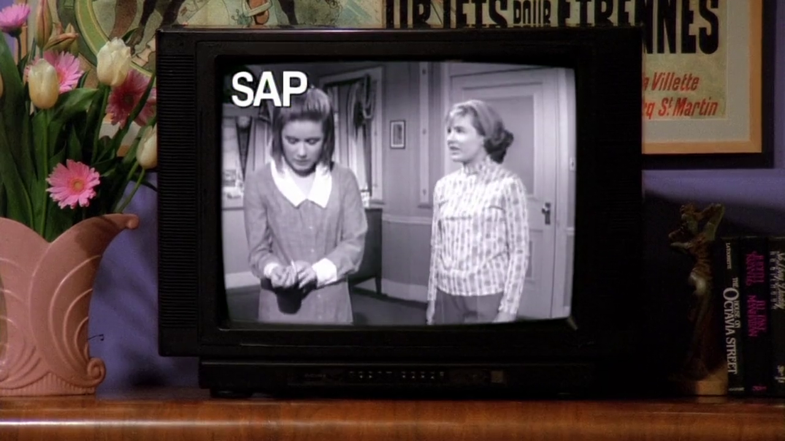
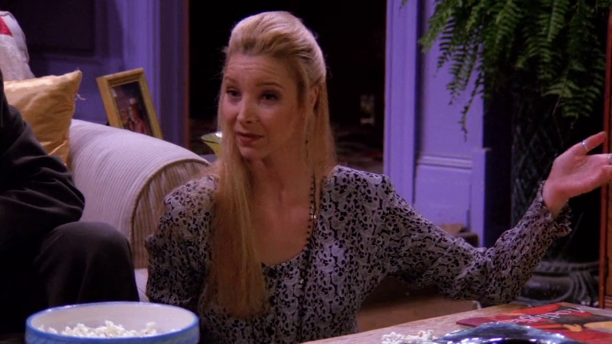
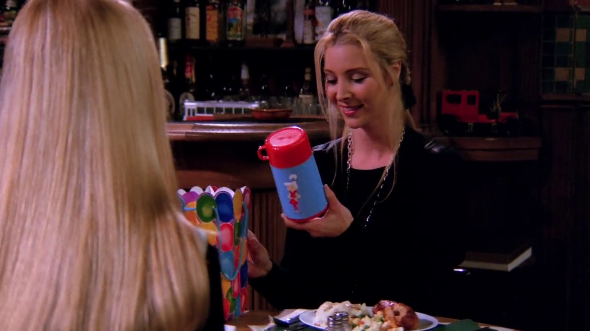

## Ursula Buffay

{ fullpage=true, clipt=2cm, clipb=8cm }

Nesse episódio conhecemos Ursula, irmã gêmea da Phoebe. Ursula é, originalmente,
uma personagem da série *Mad About You* (1992-1999). Quando Lisa Kudrow foi
chamada para o elenco de Friends os produtores decidiram fazer um *crossover*
com a série, já que *Mad About You* também se passa em Nova Iorque.[^ursula-fandom]

[^ursula-fandom]: [Ursula Buffay - Fandom Wiki](https://friends.fandom.com/wiki/Ursula_Buffay)

## Liam Neeson e Morley Safer

{ fullpage=true, clipt=1cm, clipb=7cm }

<cena>
  <joey
    original="- Hey, Pheebs. Guess who we saw today."
    traducao="- Ei, Pheebs. Adivinha quem vimos hoje."
  />
  <phoebe
    original="- Liam Neeson. Morley Safer."
    traducao="- Liam Neeson. Morley Safer."
  />
</cena>

Joey tenta surpreender Phoebe com a notícia de que conheceu Ursula e faz um jogo de
adivinhação. Phoebe chuta *Liam Neeson* (1952-) e *Morley Safer* (1931-2016).

*Liam Neeson* é um ator norte-americano de ascendência irlandese que, um ano antes de
Friends estrear, faria um de seus papéis mais emblemáticos no cinema interpretando
*Oskar Schindler* no filme *Schindler's List* (1993) ou *A lista de Schindler* em
português, no qual *Neeson* foi nomeado para o prêmio de melhor ator no
Oscar de 1994.[^neeson-britannica]

<!-- {"latex":[{"begin":{"tag":"col-1","width":0.45}}]} -->

*Morley Safer*, jornalista americano-canadense, se destacou na cobertura da guerra do
Vietnã e foi um dos correspondentes por 46 anos do programa
*60 Minutes* da CBS.[^safer-britannica]

No foto, *Liam Neeson* à esquerda em seu papel de *Oskar Schindler*, e *Morley Safer*
à direita.

<!--{"latex":[{"end":{"tag":"col-1"}},{"begin":{"tag":"col-2","width":0.5}}]}-->

<!--{"latex":[{"end":{"tag":"col-2"}}]}-->

[^neeson-britannica]: [Liam Neeson - Encyclopædia Britannica](https://www.britannica.com/biography/Liam-Neeson)
[^safer-britannica]: [Morley Safer - Encyclopædia Britannica](https://www.britannica.com/biography/Morley-Safer)

## Family Matters

{ fullpage=true, clipt=1cm, clipb=7cm }

Com a TV ainda em modo SAP os amigos assistem a série *Family Matters* (1989-1998),
*sitcom* americana que conta a história de uma família de classe média afro-americana
que mora em Chicago.[^familymatters-fandom]

<cena>
  <rachel
    original="- Oh, cool. Urkel in Spanish is Urkel."
    traducao="- Que barato. Urkel, em espanhol, é Urkel."
  />
</cena>

Rachel também menciona *Urkel*, personagem que iniciou como secundário na primeira
temporada, mas logo se tornou um personagem principal e um dos mais populares da
série. Na foto, *Urkel* é o garoto de óculos e camisa amarela.[^urkel-fandom]

[^familymatters-fandom]: [Family Matters - Fandom Wiki](https://familymatters.fandom.com/wiki/Family_Matters)
[^urkel-fandom]: [Steve Urkel - Fandom Wiki](https://familymatters.fandom.com/wiki/Steve_Urkel)

## Crabtree & Evelyn

{ fullpage=true, clipt=1cm, clipb=7cm }

<cena>
  <rachel
    original="- Anything from Crabtree & Evelyn?"
    traducao="- Alguma coisa de Crabtree & Evelyn?"
  />
  <phoebe
    original="- Bath salts would be nice."
    traducao="- Sais de banho seriam uma boa."
  />
</cena>

Rachel pergunta a Phoebe o que ela quer de aniversário. Quando Phoebe menciona que
o que ela realmente queria era que sua mãe estivesse viva e comemorando com ela,
Rachel pede algo mais simples e menciona *Crabtree & Evelyn* (1971), loja varejista
especializada em produtos para higiene do corpo.[^crabtree-website]

[^crabtree-website]: [Crabtree & Evelyn - Site oficial](https://www.crabtree-evelyn.com/pages/about-us)

## Jamie e Fran

{ fullpage=true, clipt=2cm, clipb=10cm }

Em mais um *crossover* de *Mad About You* vemos as personagens *Jamie* e *Fran*,
interpretadas por *Helen Hunt* (1963-)[^hunt-imdb] e *Leila Kenzle* (1960-)[^kenzle-imdb],
respectivamente. Ne cena *Jamie* e *Fran* confundem Phoebe com Ursula, e acham que
ela foi demitida do *Riff's*, restaurante que também aparece em ambas as séries.

[^hunt-imdb]: [Helen Hunt - IMDB](https://www.imdb.com/name/nm0000166/)
[^kenzle-imdb]: [Leila Kenzle - IMDB](https://www.imdb.com/name/nm0005087/)

## Laverne & Shirley

{ fullpage=true, clipt=2cm, clipb=8cm }

Os amigos assistem, ainda em espanhol, um episódio de *Laverne & Shirley* (1976-1983),
um *spin-off* de *Happy Days*. É uma *sitcom* americana que conta a história
de *Laverne DeFazio* e *Shirley Feeney* que trabalham em uma cervejaria em
Milwaukee.[^laverne-fandom]

[^laverne-fandom]: [Laverne & Shirley - Fandom Wiki](https://bit.ly/3o9s1ol)

## Judy Jetson

{ fullpage=true, clipt=1cm, clipb=7cm }

<cena>
  <phoebe
    original="- When I was 8, I wouldn't let her have my Judy Jetson Thermos, so she threw it under the bus."
    traducao="- Aos oito anos, não deixei pegar minha garrafa térmica da Judy Jetson. Ela jogou embaixo do ônibus."
  />
</cena>

Phoebe explica sua relação com a irmã na infância e menciona que Ursula queria
sua garrafa térmica da *Judy Jetson*, personagem da série animada *The Jetsons*
(1962-1987) produzida pela *Hanna-Barbera*, conhecida no Brasil como
*Os Jetsons*.[^judy-fandom]

Phoebe, num ato altruísta, presenteia Ursula com a garrafa térmica que ela tanto
queria quando criança no episódio seguinte, [S01E17 - Aquele com Duas Partes (Parte 2)](/temporada/1/episodio/17/). Em troca Phoebe ganha o presente que Joey deu originalmente a Ursula,
e ela sabia disso mas nada disse.

[^judy-fandom]: [Judy Jetson - Fandom Wiki](https://thejetsons.fandom.com/wiki/Judy_Jetson)
