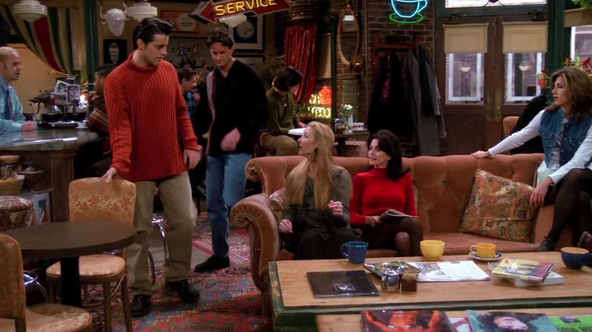
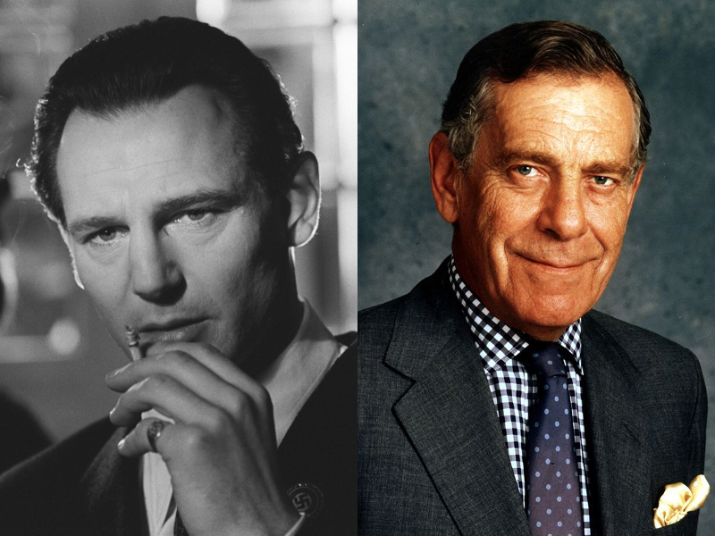
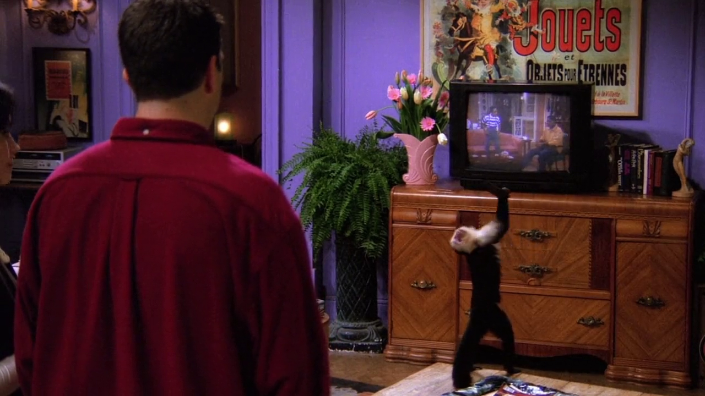
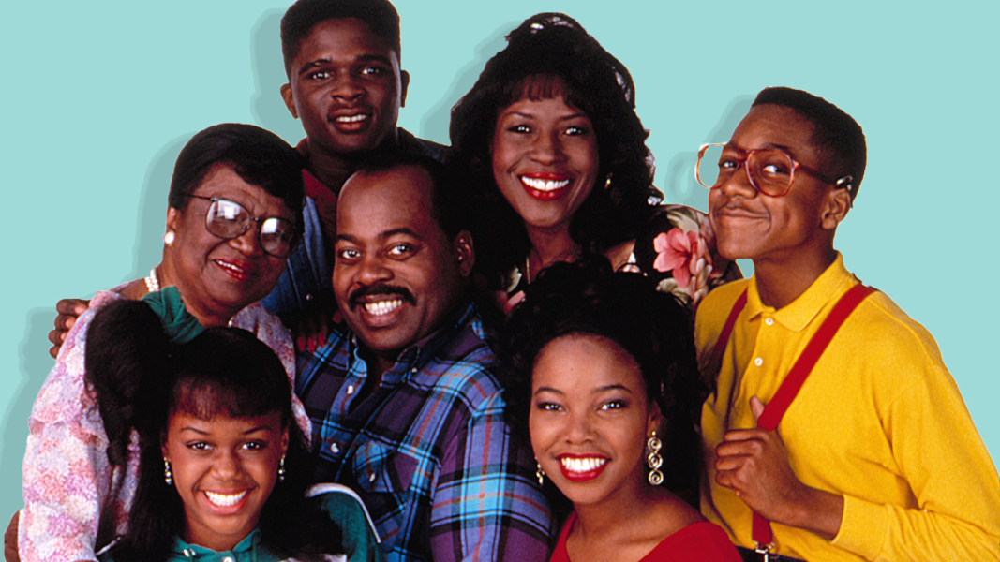
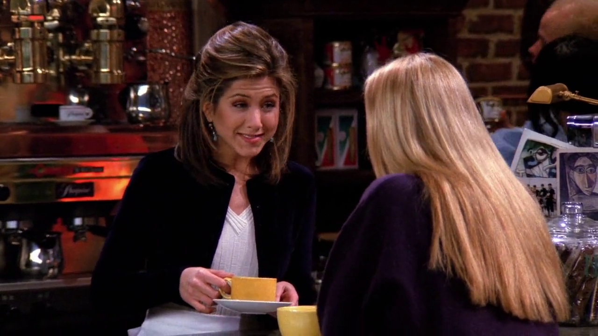
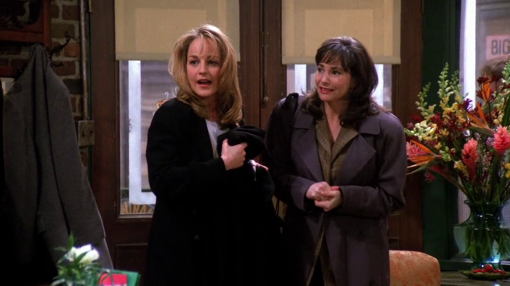

## Ursula Buffay

Nesse episódio conhecemos Ursula, irmã gêmea da Phoebe. Ursula é, originalmente,
uma personagem da série *Mad About You* (1992-1999). Quando Lisa Kudrow foi
chamada para o elenco de Friends os produtores decidiram fazer um *cross over*
com a série, já que *Mad About You* também se passa em Nova Iorque.

### Referências

- [Fandom Wiki](https://friends.fandom.com/wiki/Ursula_Buffay)

## Liam Neeson e Morley Safer

<cena>
  <joey
    original="- Hey, Pheebs. Guess who we saw today."
    traducao="- Ei, Pheebs. Adivinha quem vimos hoje."
  />
  <phoebe
    original="- Liam Neeson. Morley Safer."
    traducao="- Liam Neeson. Morley Safer."
  />
</cena>

Joey tenta surpreender Phoebe com a notícia de que conheceu Ursula e faz um jogo de
adivinhação. Phoebe chuta *Liam Neeson* (1952-) e *Morley Safer* (1931-2016).

*Liam Neeson* é um ator norte-americano de ascendência irlandese que, um ano antes de
Friends estrear, faria um de seus papéis mais emblemáticos no cinema interpretando
*Oskar Schindler* no filme *Schindler's List* (1993) ou *A lista de Schindler* em
português, no qual *Neeson* foi nomeado para o prêmio de melhor ator no Oscar de 1994.

*Morley Safer*, jornalista americano-canadense, se destacou na cobertura da guerra do
Vietnã e foi um dos correspondentes por 46 anos do programa *60 Minutes* da CBS.

No foto, *Liam Neeson* à esquerda em seu papel de *Oskar Schindler*, e *Morley Safer*
à direita.

### Referências

- [Liam Neeson - Encyclopædia Britannica](https://www.britannica.com/biography/Liam-Neeson)
- [Morley Safer - Encyclopædia Britannica](https://www.britannica.com/biography/Morley-Safer)

## Family Matters

Com a TV ainda em modo SAP os amigos assistem a série *Family Matters* (1989-1998),
*sitcom* americana que conta a história de uma família de classe média afro-americana
que mora em Chicago.

<cena>
  <rachel
    original="- Oh, cool. Urkel in Spanish is Urkel."
    traducao="- Que barato. Urkel, em espanhol, é Urkel."
  />
</cena>

Rachel também menciona *Urkel*, personagem que iniciou como secundário na primeira
temporada, mas logo se tornou um personagem principal e um dos mais populares da
série. Na foto, *Urkel* é o garoto de óculos e camisa amarela.

### Referências

- [Family Matters - Fandom](https://familymatters.fandom.com/wiki/Family_Matters)
- [Urkel - Fandom](https://familymatters.fandom.com/wiki/Steve_Urkel)

## Crabtree & Evelyn

<cena>
  <rachel
    original="- Anything from Crabtree & Evelyn?"
    traducao="- Alguma coisa de Crabtree & Evelyn?"
  />
  <phoebe
    original="- Bath salts would be nice."
    traducao="- Sais de banho seriam uma boa."
  />
</cena>

Rachel pergunta a Phoebe o que ela quer de aniversário. Quando Phoebe menciona que
o que ela realmente queria era que sua mãe estivesse viva e comemorando com ela,
Rachel pede algo mais simples e menciona *Crabtree & Evelyn* (1971), loja varejista
especializada em produtos para higiene do corpo.

### Referências

- [Site oficial](https://www.crabtree-evelyn.com/pages/about-us)

## Jamie e Fran

Em mais um *cross-over* de *Mad About You* vemos as personagens *Jamie* e *Fran*,
interpretadas por *Helen Hunt* (1963-) e *Leila Kenzle* (1960-), respectivamente.
Ne cena *Jamie* e *Fran* confundem Phoebe com Ursula, e acham que ela foi demitida
do *Riff's*, restaurante que também aparece em ambas as séries.

### Referências

- [Helen Hunt - TMDB](https://www.themoviedb.org/person/9994-helen-hunt)
- [Leila Kenzle - IMDB](https://www.imdb.com/name/nm0005087/)
