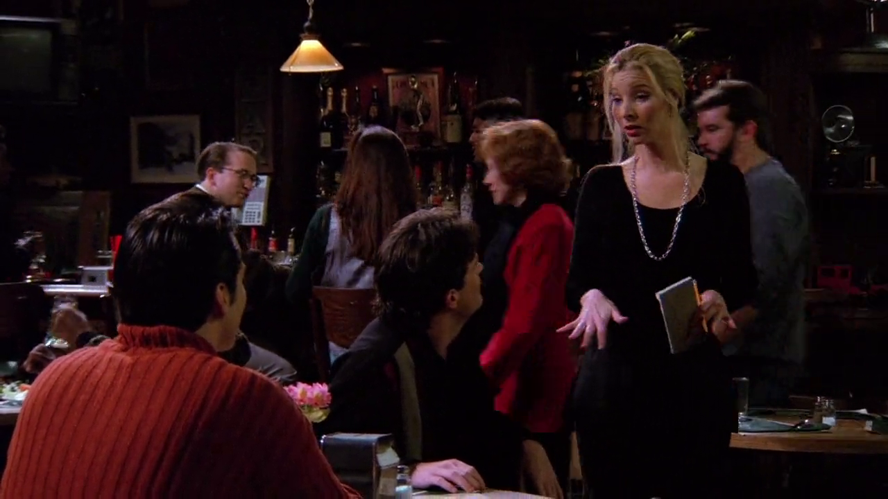

## Ursula Buffay

Nesse episódio conhecemos Ursula, irmã gêmea da Phoebe. Ursula é, originalmente,
uma personagem da série *Mad About You* (1992-1999). Quando Lisa Kudrow foi
chamada para o elenco de Friends os produtores decidiram fazer um *cross over*
com a série, já que *Mad About You* também se passa em Nova Iorque.

### Referências

- [Fandom Wiki](https://friends.fandom.com/wiki/Ursula_Buffay)

## Liam Neeson e Morley Safer

<cena>
  <joey
    original="- Hey, Pheebs. Guess who we saw today."
    traducao="- Ei, Pheebs. Adivinha quem vimos hoje."
  />
  <phoebe
    original="- Liam Neeson. Morley Safer."
    traducao="- Liam Neeson. Morley Safer."
  />
</cena>

Joey tenta surpreender Phoebe com a notícia de que conheceu Ursula e faz um jogo de
adivinhação. Phoebe chuta *Liam Neeson* (1952-) e *Morley Safer* (1931-2016).

*Liam Neeson* é um ator norte-americano de ascendência irlandese que, um ano antes de
Friends estrear, faria um de seus papéis mais emblemáticos no cinema interpretando
*Oskar Schindler* no filme *Schindler's List* (1993) ou *A lista de Schindler* em
português, no qual *Neeson* foi nomeado para o prêmio de melhor ator no Oscar de 1994.

*Morley Safer*, jornalista americano-canadense, se destacou na cobertura da guerra do
Vietnã e foi um dos correspondentes por 46 anos do programa *60 Minutes* da CBS.

No foto, *Liam Neeson* à esquerda em seu papel de *Oskar Schindler*, e *Morley Safer*
à direita.

### Referências

- [Liam Neeson - Encyclopædia Britannica](https://www.britannica.com/biography/Liam-Neeson)
- [Morley Safer - Encyclopædia Britannica](https://www.britannica.com/biography/Morley-Safer)
