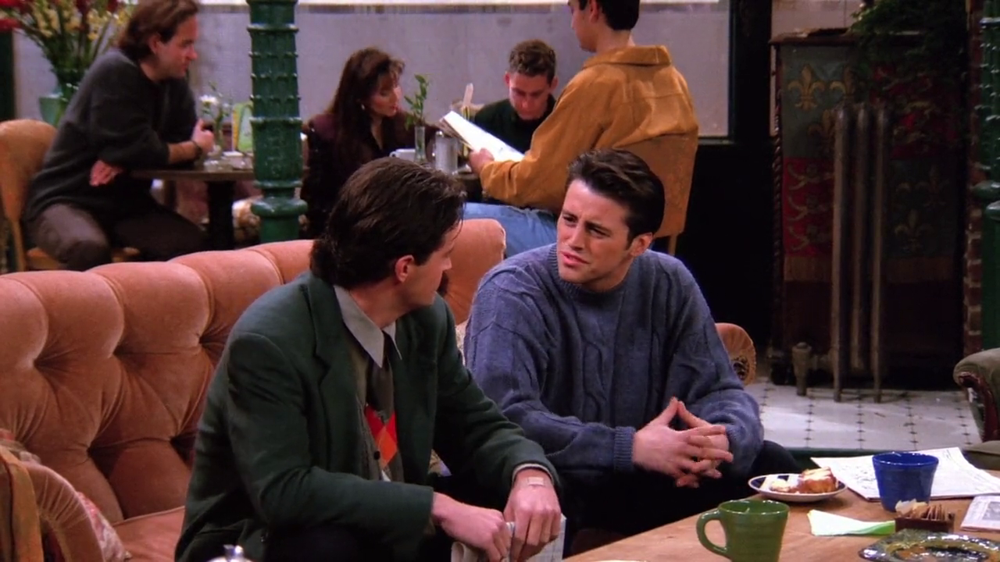
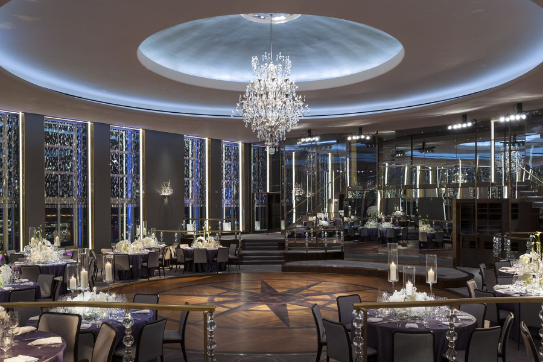

## Rainbow Room

<cena>
  <joey
    original="- Have either of you ever been to the Rainbow Room? Is it expensive?"
    traducao="- Algum de vocês já foi ao Rainbow Room? É caro?"
  />
  <chandler
    original="- Only if you order stuff."
    traducao="- Só se você pedir alguma coisa."
  />
</cena>

Querendo levar Ursula a um local bacana em seu encontro Joey menciona o
*Rainbow Room* (1934), salão para eventos situado no prédio *Rockefeller Plaza*,
no centro de *Manhattan* em Nova Iorque. É um local realmente caro devido a sua
localização, ambientação e serviço de alimentação.

### Referências

- [Site oficial (Inglês)](https://rainbowroom.com/our-history/)
