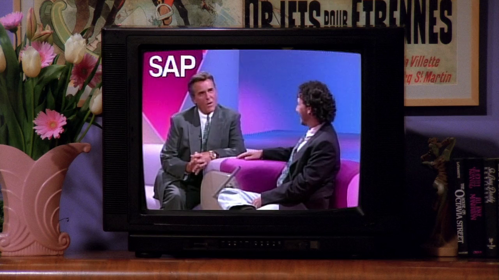
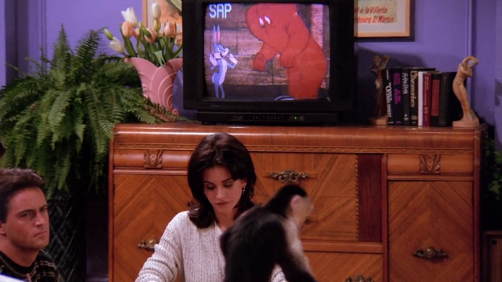

## Rainbow Room

<cena>
  <joey
    original="- Have either of you ever been to the Rainbow Room? Is it expensive?"
    traducao="- Algum de vocês já foi ao Rainbow Room? É caro?"
  />
  <chandler
    original="- Only if you order stuff."
    traducao="- Só se você pedir alguma coisa."
  />
</cena>

Querendo levar Ursula a um local bacana em seu encontro Joey menciona o
*Rainbow Room* (1934), salão para eventos situado no prédio *Rockefeller Plaza*,
no centro de *Manhattan* em Nova Iorque. É um local realmente caro devido a sua
localização, ambientação e serviço de alimentação.

### Referências

- [Site oficial (Inglês)](https://rainbowroom.com/our-history/)

## Colonial Williamsburg

<cena>
  <jack
    original="- You always wanted to go to Colonial Williamsburg. How about we do that?"
    traducao="- Você sempre quis ir a Colonial Williamsburg. Que tal?"
  />
</cena>

Conversando com Ross sobre paternidade Jack o convida a ir para *Colonial Williamsburg*
(1926), é o maior museu a céu aberto dos EUA. Oferece uma autêntica experiência de
como era o local no século XVIII. O *Reverendo Dr. William Goodwin* com o apoio
financeiro de *John D. Rockefeller Jr.* foram os responsáveis por restaurar
*Williamsburg*, que tem, hoje, pelo menos 88 edificações originais.

### Referências

- [Site oficial (Inglês)](https://www.colonialwilliamsburg.org/learn/about-colonial-williamsburg/)

## Love Connection

À espera dos doutores para um encontro, Rachel e Monica assistem a um programa
chamado *Love Connection* (1983-1994), um programa de encontros americano nos
mesmos moldes de programas exibidos no SBT na década de 90. Na época de lançamento
do episódio, o *Love Connection* estava sendo reexibido. Na cena é possível ver
o apresentador *Chuck Woolery* (1941-), à esquerda, conversando com um participante.

### Referências

- [Love Connection in Popular Culture - Fandom Wiki (Inglês)](https://gameshows.fandom.com/wiki/Love_Connection/In_Popular_Culture)
- [Love Connection - Fandom Wiki (Inglês)](https://gameshows.fandom.com/wiki/Love_Connection)

## Water, Water Every Hare

Os amigos assistem ao episódio *Water, Water Every Hare* (1952) do *Pernalonga*.
O desenho ja foi citado no episódio [S01E03 - Aquele com o Dedão](/temporada/1/episodio/3/#bugs-bunny).

### Referências

- [Water, Water Every Hare - Fandom Wiki (Inglês)](https://looneytunes.fandom.com/wiki/Water,_Water_Every_Hare)
- [Vídeo - Dailymotion](https://www.dailymotion.com/video/x2fgf28)
