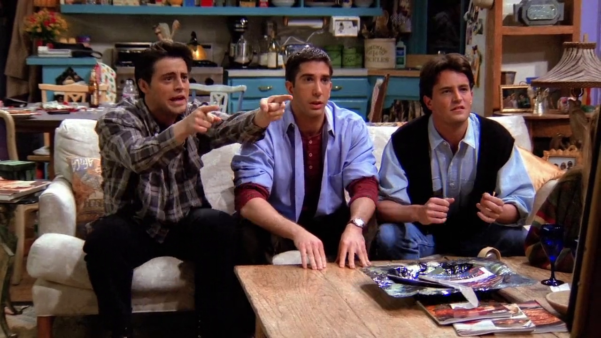

## Colonel Bogey March

{ fullpage=true, clipt=1cm, clipb=8cm }

Ajudando Rachel com o envio de seu currículo, os amigos assobiam a melodia
*Colonel Bogey March* (1914), composta pelo diretor de música da *Marinha Real
de Plymouth*, o tenente inglês *Frederick Joseph Ricketts* (1881-1945).

Ela também foi usada no filme *The Bridge on the River Kwai* (1957), e pode ser
ouvida em sua trilha sonora. O compositor *Malcolm Arnold* (1921-2006) ainda criaria uma
contra-marcha chamada *River Kwai March*, que faz o acompanhamento de uma banda
de música com o assobio.

### Referências

- [Minor British Institutions: Colonel Bogey - Independent (Inglês)](https://www.independent.co.uk/news/uk/this-britain/minor-british-institutions-colonel-bogey-2080160.html)
- [The Bridge On The River Kwai (Soundtrack) - YouTube](https://music.youtube.com/playlist?list=OLAK5uy_mfzGk0bXhekFyvLnYSMtJw-AX61a9dpHQ)

## Popular Mechanics

{ fullpage=true, clipt=1cm, clipb=7cm }

<cena>
  <monica
    original="- Do you really want a job with Popular Mechanics?"
    traducao="- Quer mesmo trabalhar com a Popular Mechanics?"
  />
  <chandler
    original="- Well, if you're gonna work for mechanics, those are the ones to work for."
    traducao="- Se quer trabalhar com mecânicos, é com esses que você deve trabalhar."
  />
</cena>

Monica se espanta que Rachel queira trabalhar com a *Popular Mechanics* (1902),
revista especializada em trazer as últimas novidades no mundo da tecnologia,
ciência e indústria automotiva.

Chandler brinca com a palavra *mechanics* e seu gênero indefinido. Assim
*Mecânicas Polulares* podem ser tornar *mecânicos populares* (atentem as iniciais
dos termos), e é para esses que ele acha que ela deve trabalhar.

### Referências

- [Site oficial (Inglês)](https://www.popularmechanics.com/about/a45/about-us/)

## Flintstones

{ fullpage=true, clipt=1cm, clipb=7cm }

<cena>
  <chandler
    original="- Is this still about her whole The 'Flintstones could have really happened' thing?"
    traducao="- Isso é porque ela disse 'A história dos Flintstones poderia ter acontecido'?"
  />
</cena>

Chandler menciona que um dos encontros de Ross havia dito que a história dos
*Flintstones* (1960-1966) poderia ter acontecido. Para um paleontólogo ouvir isso
deve ser realmente frustante, visto que a história, produzida pela *Hanna-Barbera*,
mostra a vida da família *Flintstone* que vive na idade da pedra, mas que convive
com dinosauros.

### Referências

- [Fandom Wiki (Inglês)](https://flintstones.fandom.com/wiki/The_Flintstones_(TV_series))

## Dee

{ fullpage=true, clipt=2cm, clipb=6cm }

<cena>
  <chandler
    original="- Could you want her more?"
    traducao="- Poderia estar mais apaixonado?"
  />
  <ross
    original="- Who?"
    traducao="- Por quem?"
  />
  <chandler
    original="- Who? Dee, the sarcastic sister from What's Happening!!"
    traducao="- Por quem? Dee, a irmã sarcástica de What's Happening!!"
  />
</cena>

Ross tenta disfarçar sua paixão por Rachel, mas Chandler logo se toca e tenta fazer
com que ele admita. Ele menciona *Dee*, personagem da *sitcom* americana
*What's Happening!!* (1976-1979). *Dee Thomas* é irmã mais nova de *Raj*,
protagonista da série.

### Referências

- [Wikipédia](https://en.wikipedia.org/wiki/What%27s_Happening!!)

## The Jamestown colony of Virginia

{ fullpage=true, clipt=1cm, clipb=7cm }

<cena>
  <ross
    original="- Rach, we've got to settle."
    traducao="- Rach, vamos se acertar."
  />
  <rachel
    original="- Settle what?"
    traducao="- 'Assentar' o quê?"
  />
  <chandler
    original="- The Jamestown colony of Virginia."
    traducao="- A colônia de Jamestown da Virginia."
  />
</cena>

Tomada a devida liberdade com a tradução, Chandler faz um trocadilho com a palavra
*settle*, que pode ter o sentido de pagamento ou de colonização. Daí sua referência
à *The Jamestown colony of Virginia* (1607), onde um grupo de aproximadamente 100
colonos fundaram o primeiro assentamento da América do Norte, às margens do *Rio James*.
A Companhia *Virginia*, como ficou conhecido o grupo, planejava buscar depósitos
de ouro e prata no *Novo Mundo*.

Na fala seguinte, Chandler diz que o *Rei George* os deu a terra, mas na verdade
quem o fez foi o *Rei James I*.

### Referências

- [History (Inglês)](https://www.history.com/topics/colonial-america/jamestown)

## Ya-ya's from Ikea

{ fullpage=true, clipt=1cm, clipb=7cm }

<cena>
  <rachel
    original="- So, basically, you get your ya-yas by taking money from all of your friends."
    traducao="- Basicamente, você obtém divertimento tomando dinheiro dos seus amigos."
  />
  <ross
    original="- Yeah."
    traducao="- Pois é."
  />
  <chandler
    original="- Yes, and I get my ya-yas from Ikea. You have to put them together yourself, but they cost a little less."
    traducao="- Sim, e eu obtenho meu divertimento da Ikea. Você mesmo tem que montar, mas custa um pouco menos."
  />
</cena>

Rachel usa a expressão *get your ya-yas*, como uma forma de dizer que Ross se diverte
com a desgraça dos outros. Chandler, então, usa a expressão *ya-yas* e se refere
a *Ikea* (1943), empresa de mobiliário e decoração de baixo custo para casas, em que
os clientes montam os próprios móveis. A expressão *ya-yas* soa como uma palavra
sueca, e ele tira proveito disso já que a *Ikea* tem a mesma origem.

### Referências

- [Site oficial](https://www.ikea.com/pt/pt/this-is-ikea/)
- [Discussão sobre a cena - Reddit (Inglês)](https://www.reddit.com/r/EnglishLearning/comments/3h2ww5/what_is_you_get_your_yayas_by_taking_money_from/)

## Black Bart speech

{ fullpage=true, clipt=2cm, clipb=8cm }

<cena>
  <chandler
    original="- What was with that whole Black Bart speech? &quot;When I play poker, I'm not a nice guy&quot;."
    traducao="- E aquele discurso de Black Bart? &quot;Quando jogo pôquer, não sou bonzinho!&quot;"
  />
</cena>

Ainda na intenção de fazer Ross admitir que está apaixonado por Rachel, Chandler
compara a maneira de falar de Ross com a de *Black Bart*, personagem principal do
filme *Blazing Saddles* (1974), uma comédia de faroeste estadunidense.

### Referências

- [Connections - IMDB](https://www.imdb.com/title/tt0583510/movieconnections)

## The Lion Sleeps Tonight

{ fullpage=true, clipt=3cm, clipb=7cm }

Enquanto os rapazes discutem se Ross ainda sente algo por Rachel, Marcel aproveita
para colocar um CD com a música *The Lion Sleeps Tonight* (1961), uma versão criada
pela banda *The Tokens* (1955). A canção original chama-se *Mbube* e foi gravada
em 1939 pelo cantor sul-africano *Solomon Linda* (1909-1962) e sua banda *Evening Birds*.

A música ficou conhecida por estar na trilha sonora do filme *The Lion King* (1994),
no Brasil *O Rei Leão*, filme produzido pela *Walt Disney*. Ela voltará a ser citada
no episódio [S02E12 - Aquele depois do Super Bowl: Parte 1](/temporada/2/episodio/12/),
quando os amigos reencontram Marcel no *set* de filmagem.

### Referências

- [Revista Rolling Stones (Inglês)](https://www.rollingstone.com/music/music-features/lion-sleeps-tonight-lion-king-update-879663/)
- [The Tokens - Last.fm](https://www.last.fm/music/The+Tokens/+wiki)

## Kettle, you're black

{ fullpage=true, clipt=2cm, clipb=6cm }

<cena>
  <monica
    original="- Yeah, I know. He can get really competitive. What?"
    traducao="- É, eu sei. Ele pode ser muito competitivo. Quê?"
  />
  <phoebe
    original="- Oh. 'Hello, Kettle, this is Monica. You're black.'"
    traducao="- Oh. 'Olá, Chaleira, é a Monica. Você tá preta.'"
  />
</cena>

As garotas discutem sobre o quão competitivo Ross é. Phoebe utiliza a expressão
idiomática *The pot calling the kettle black*. Em português, uma expressão com o
mesmo significado seria *O sujo falando do mal lavado*, indicando a hipocrisia
ao criticar uma outra pessoa por um defeito que você também possui.

A expressão em Inglês vêm do fato de que os utensílios culinários eram utilizados
sobre chama de fogueiras, que, devido a fumaça, deixam panelas e chaleiras com
manchas pretas.

### Referências

- [Cambridge Dictionary (Inglês)](https://dictionary.cambridge.org/pt/dicionario/ingles/pot-calling-the-kettle-black)

## Pictionary

{ fullpage=true, clipt=2cm, clipb=6cm }

<cena>
  <rachel
    original="- Oh, I beg to differ. The Pictionary incident?"
    traducao="- Tenho que discordar. O incidente com o Imagem e Ação?"
  />
</cena>

Monica tenta escapar da pecha de ser tão competitiva quanto Ross, mas Rachel
lembra do incidente com o jogo *Pictionary* (1985), onde ela, aparentemente sem querer,
arremessou um prato na direção de sua equipe. Ao final do episódio os amigos acabam
jogando uma partida e o jogo deve ser jogado por equipes onde um membro da equipe precisa
desenhar e os outros precisam adivinhar do que se trata o desenho. Além de adivinhar,
é preciso percorrer um tabuleiro que irá ajudar a selecionar que tipo de palavra
pode ser escolhida, seja uma pessoa, um lugar, um objeto, uma ação, um filme, etc.

No Brasil o jogo foi adaptado pela *Grow* com o nome de *Imagem & Ação*.

### Referências

- [Site oficial (Inglês)](https://www.mattelgames.com/en-us/family/pictionary)
- [Fandom Wiki (Inglês)](https://pictionary.fandom.com/wiki/Pictionary)
- [Imagem & Ação - Metropoly](https://www.metropolybar.com.br/imagem-e-acao-um-sucesso-na-vida-real-na-tv-e-nos-games/)

## Saks Fifth Avenue

{ fullpage=true, clipt=2cm, clipb=6cm }

<cena>
  <rachel
    original="- I got an interview. I got an interview."
    traducao="- Tenho uma entrevista. Tenho uma entrevista."
  />
  <monica
    original="- You're kidding. Where? Where?"
    traducao="- Tá brincando. Onde? Onde?"
  />
  <rachel
    original="- Saks Fifth Avenue."
    traducao="- Saks Fifth Avenue."
  />
  <phoebe
    original="- Oh, it's like the mother ship is calling you home."
    traducao="- É como se a nave-mãe a chamasse para voltar."
  />
</cena>

Rachel recebe uma carta informando que ela foi selecionada para uma entrevista na
*Saks Fifth Avenue* (1924), uma cadeia americana de lojas de departamento de luxo.
Seu nome vem do fato de sua localização, a famosa *Fifth Avenue*, ou *Quinta Avenida*,
situada em *Manhattan - NY*.

### Referências

- [Site oficial (Inglês)](https://www.saksfifthavenue.com/main/static_content.jsp?pageId=about-us)

## Tony Randall

{ fullpage=true, clipt=2cm, clipb=8cm }

<cena>
  <iris
    original="- Is Tony Randall dead?"
    traducao="- Tony Randall morreu?"
  />
  <monica
    original="- I don't think so."
    traducao="- Acho que não."
  />
  <iris
    original="- Well, he may be now because I think I hit him with my car."
    traducao="- Bem, pode ser que sim porque acho que o atropelei."
  />
  <monica
    original="- My God. Really?"
    traducao="- Meu Deus. Sério?"
  />
  <iris
    original="- No, that's bluffing. Lesson number one."
    traducao="- Não, foi um blefe. Lição número um."
  />
</cena>

A fim de uma revanche contra os rapazes, as moças se encontram com a Tia Iris - a
qual joga poker desde os cinco anos de idade-, que logo que chega tenta ensinar o
blefe, informando que atropelou *Tony Randall* (1920-2004), ator americano conhecido
por seu trabalho em *The Odd Couple*, *sitcom* já citada em
[S01E12 - Aquele com uma Dúzia de Lasanhas](/temporada/1/episodio/12/#the-odd-couple).

*Tony Randall* (à esquerda) ao lado de *Jack Klugman*.

### Referências

- [Tony Randall - Encyclopædia Britannica](https://www.britannica.com/biography/Tony-Randall)

## To build you need to know, to know you have to learn

{ fullpage=true, clipt=2cm, clipb=7cm }

Mais uma vez na sala do Ross, é possível ver um poster soviético com a frase em russo,
que traduzindo para o Inglês seria
*To build you need to know, to know you have to learn* (1958), que quer dizer
*Para construir é preciso conhecimento, para ter conhecimento é preciso aprendizado*.

{ bookwidth=60% }

### Referências

- [The One with the Illustrated Posters (Inglês)](https://illustrationchronicles.com/The-One-with-the-Illustrated-Posters)

## Trident

{ fullpage=true, clipt=1cm, clipb=7cm }

<cena>
  <rachel
    original="- Guess what, guess what, guess what."
    traducao="- Adivinhem, adivinhem."
  />
  <chandler
    original="- Uh, okay. The fifth dentist caved, and now they're all recommending Trident?"
    traducao="- Ah, sim. O quinto dentista cedeu, e agora todos recomendam Trident?"
  />
</cena>

Rachel tenta dar boas notícias em relação a sua entrevista mas Chandler, sarcástico
como sempre, faz referência a goma de mascar (lembre-se que *chiclete* é uma marca)
*Trident* (1964) e seu famoso comercial que dizia *"Four out of five dentists surveyed
recommend sugarless gums for their patients who chew gum"*, traduzindo *"Quatro de
cada cinco dentistas recomendam goma sem açúcar para pacientes que mascam goma"*.

Essa referência remete ao episódio [S01E07 - Aquele com o Blecaute](/temporada/1/episodio/7/),
em que Chandler não aceita goma de mascar de *Jill Goodacre*, por que não era
dietética.

### Referências

- [NY Times (Inglês)](https://www.nytimes.com/2009/07/28/business/media/28adco.html)
- [Comercial de 1977 - YouTube](https://www.youtube.com/watch?v=YWtvytMgQB8)

## Airport

{ fullpage=true, clipt=2cm, clipb=7cm }

<cena>
  <chandler
    original="- Airplane! Airport! Airport '75! Airport '77! Airport '79!"
    traducao="- Airplane! Airport! Airport '75! Airport '77! Airport '79!"
  />
</cena>

Na tentativa de adivinhar o desenho de Monica, Chandler faz referência a série
de filmes: *Airport* (1970), *Airport '75* (1974), *Airport '77* (1977) e
*Airport '79* (1979). Todos tem a mesma premissa de um filme de drama e suspense
que envolve um acidente com um avião. Ele ainda chuta *Airplane!* (1980), uma comédia
satírica americana, que também envolve uma catástrofe aérea mas de forma cômica.

No Brasil os filmes são conhecidos como *Aeroporto*, *Aeroporto 75*, *Aeroporto 77*,
*Aeroporto 79: O Concorde* e *Apertem os Cintos, o Piloto Sumiu*, respectivamente.

### Referências

- [Airport - IMDB](https://www.imdb.com/title/tt0065377/)
- [Airport '75 - IMDB](https://www.imdb.com/title/tt0071110/?ref_=tt_sims_tt)
- [Airport '77 - IMDB](https://www.imdb.com/title/tt0075648/?ref_=tt_sims_tt)
- [Airport '79 - IMDB](https://www.imdb.com/title/tt0078740/?ref_=tt_sims_tt)
- [Airplane! - IMDB](https://www.imdb.com/title/tt0080339/)

## Bye Bye Birdie

{ fullpage=true, clipt=2cm, clipb=7cm }

<cena>
  <monica
    original="- Bye Bye Birdie."
    traducao="- Bye Bye Birdie."
  />
  <phoebe
    original="- That's a bird? That's a bird."
    traducao="- Isso é um pássaro? Isso é um pássaro."
  />
</cena>

Monica tenta fazer um desenho para sua equipe adivinhar o filme *Bye Bye Birdie*
(1963), que conta a história de um cantor de *rock* no auge da carreira que foi
convocado a servir no exército, que é baseado na história de *Elvis Presley*
(1935-1977). No Brasil o filme se chama *Adeus, Amor*.

{ bookwidth=60% }

### Referências

- [IMDB](https://www.imdb.com/title/tt0056891/)

## The Unbearable Lightness of Being

{ fullpage=true, clipt=2cm, clipb=7cm }

<cena>
  <rachel
    original="- Okay, okay, it's my turn."
    traducao="- Tá bom. Minha vez."
  />
  <ross
    original="- Bean. Bean."
    traducao="- Cevada. Ce..."
  />
  <joey
    original="- The Unbearable Lightness of Being."
    traducao="- A Insustentável Leveza do Ser."
  />
</cena>

Na vez da Rachel ela desenha um feijão, que em Inglês pode ser traduzido como
*bean*, e que tem pronúncia semelhante à de *being*. Daí que Joey acerta com o filme
*The Unbearable Lightness of Being* (1988), drama que conta a história de um médico
Checo com uma vida sexual ativa que conhece uma mulher que quer monogamia, e a
invasão Soviética em 1968 atrapalha ainda mais suas vidas.

É o tipo de piada que, geralmente, só funciona no país de origem, ou onde as línguas
são parecidas. A cena ainda envolve um desenho que torna a tradução mais complicada,
já que há um elemento visual que restringe uma melhor adaptação.

{ bookwidth=60% }

### Referências

- [IMDB](https://www.imdb.com/title/tt0096332/?ref_=nv_sr_srsg_0)
