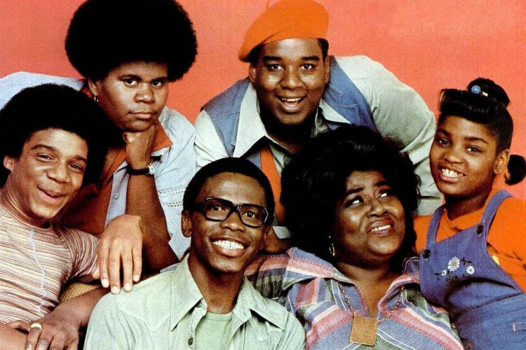

## Colonel Bogey March

Ajudando Rachel com o envio de seu currículo, os amigos assoviam a melodia
*Colonel Bogey March* (1914), composta pelo diretor de música da Marinha Real
de *Plymouth*, o tenente inglês *Frederick Joseph Ricketts* (1881-1945).

Ela também foi usada no filme *The Bridge on the River Kwai* (1957), e pode ser
ouvida em sua trilha sonora. O compositor *Malcolm Arnold* (1921-2006) ainda criaria uma
contra-marcha chamada *River Kwai March*, que faz o acompanhamento de uma banda
de música com o assovio.

### Referências

- [Minor British Institutions: Colonel Bogey - Independent (Inglês)](https://www.independent.co.uk/news/uk/this-britain/minor-british-institutions-colonel-bogey-2080160.html)
- [The Bridge On The River Kwai (Soundtrack) - YouTube](https://music.youtube.com/playlist?list=OLAK5uy_mfzGk0bXhekFyvLnYSMtJw-AX61a9dpHQ)

## Popular Mechanics

<cena>
  <monica
    original="- Do you really want a job with Popular Mechanics?"
    traducao="- Quer mesmo trabalhar com a Popular Mechanics?"
  />
  <chandler
    original="- Well, if you're gonna work for mechanics, those are the ones to work for."
    traducao="- Se quer trabalhar com mecânicos, é com esses que você deve trabalhar."
  />
</cena>

Monica se espanta que Rachel queira trabalhar com a *Popular Mechanics* (1902),
revista especializada em trazer as últimas novidades no mundo da tecnologia,
ciência e indústria automotiva.

Chandler brinca com a palavra *mechanics* e seu gênero indefinido. Assim
*Mecânicas Polulares* podem ser tornar *mecânicos populares* (atentem as iniciais
dos termos), e é para esses que ele acha que ela deve trabalhar.

### Referências

- [Site oficial (Inglês)](https://www.popularmechanics.com/about/a45/about-us/)

## Flintstones

<cena>
  <chandler
    original="- Is this still about her whole The 'Flintstones could have really happened' thing?"
    traducao="- Isso é porque ela disse 'A história dos Flintstones poderia ter acontecido'?"
  />
</cena>

Chandler menciona que um dos encontros de Ross havia dito que a história dos
*Flintstones* (1960-1966) poderia ter acontecido. Para um paleontólogo ouvir isso
deve ser realmente frustante, visto que a história, produzida pela *Hanna-Barbera*,
mostra a vida da família *Flintstone* que vive na idade da pedra, mas que convive
com dinosauros.

### Referências

- [Fandom Wiki (Inglês)](https://flintstones.fandom.com/wiki/The_Flintstones_(TV_series))

## Dee

<cena>
  <chandler
    original="- Could you want her more?"
    traducao="- Poderia estar mais apaixonado?"
  />
  <ross
    original="- Who?"
    traducao="- Por quem?"
  />
  <chandler
    original="- Who? Dee, the sarcastic sister from What's Happening!!"
    traducao="- Por quem? Dee, a irmã sarcástica de What's Happening!!"
  />
</cena>

Ross tenta disfarçar sua paixão por Rachel, mas Chandler logo se toca e tenta fazer
com que ele admita. Ele menciona *Dee*, personagem da *sitcom* americana
*What's Happening!!* (1976-1979). *Dee Thomas* é irmã mais nova de *Raj*,
protagonista da série.

### Referências

- [Wikipédia](https://en.wikipedia.org/wiki/What%27s_Happening!!)
