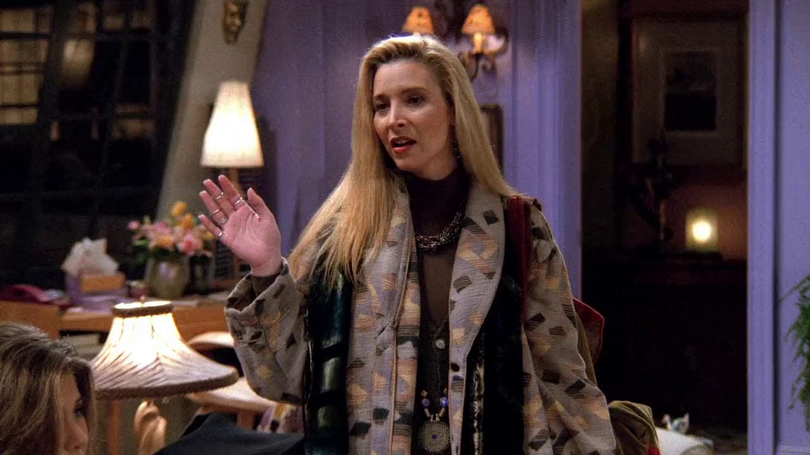
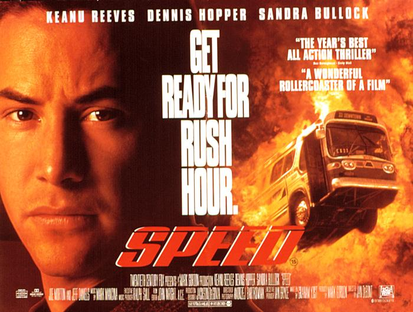
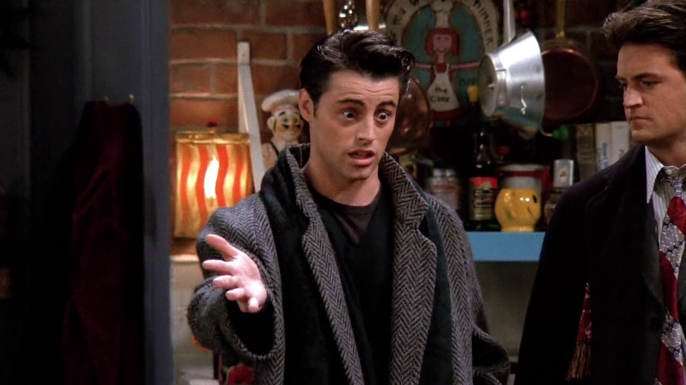
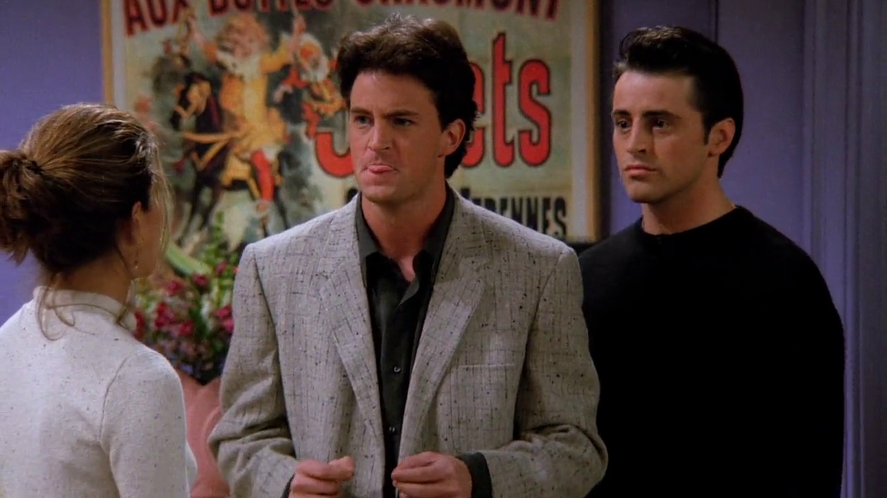
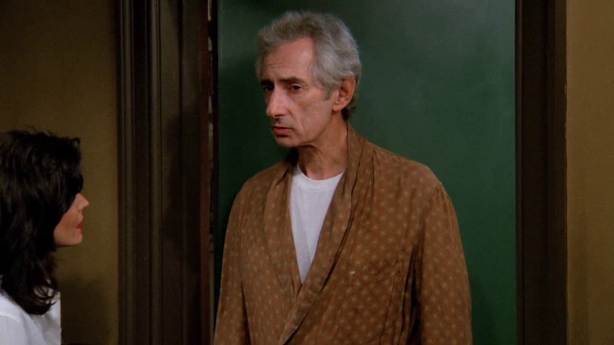
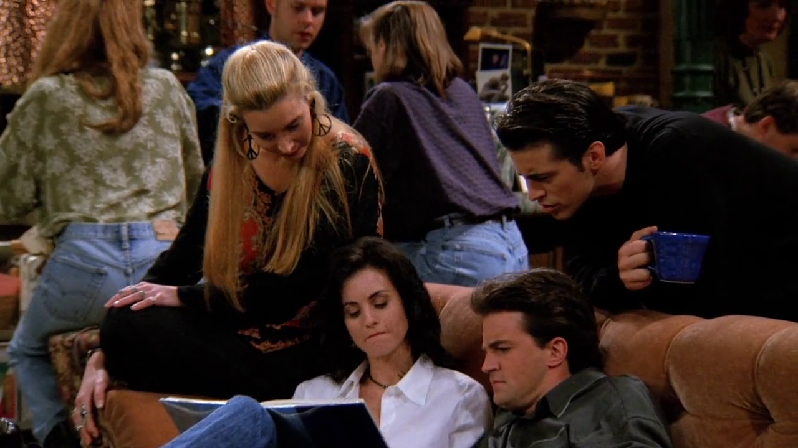

## Guns, bombs and buses going really fast

{ fullpage=true, clipt=1cm, clipb=7cm }

<cena>
  <phoebe
    original="- I'm sorry it wasn't one of those movies with guns and bombs and buses going really fast."
    traducao="- Desculpe se não foi um daqueles filmes com armas e bombas e ônibus em alta velocidade."
  />
</cena>

Na volta do cinema os rapazes estão insatisfeitos e Phoebe descreve o filme *Speed*
(1994), em que a premissa do filme é que uma bomba foi plantada num ônibus e ela
irá explodir caso o veículo ande abaixo de um limite de velocidade. No decorrer
do filme o motorista é baleado e uma passageira assume o volante. No Brasil o
filme ficou conhecido como *Velocidade Máxima*.[^speed-imdb]

{ bookwidth=55% }

[^speed-imdb]: [Speed - IMDB](https://www.imdb.com/title/tt0111257/?ref_=nv_sr_srsg_0)

## Lou Grant or Hugh Grant

{ fullpage=true, clipt=2cm, clipb=6cm }

<cena no-breakable>
  <joey
    original="- All right, I don't need to see Lou Grant frolicking."
    traducao="- Tá certo, mas não quero ver Lou Grant saltitando."
  />
  <monica
    original="- Hugh. Hugh Grant."
    traducao="- Hugh. Hugh Grant."
  />
</cena>

Ainda reclamando sobre o filme, Joey confunde *Lou Grant* (1977-1982)[^lou-grant] com
*Hugh Grant* (1960). *Lou Grant* na verdade é uma série de TV estrelada por
*Ed Asner* (1929)[^asner-britannica], *spin-off* da *sitcom*
*The Mary Tyler Moore Show* (1970-1977).
Já *Hugh Grant* é um ator inglês conhecido por estrelar comédias
românticas.[^hugh-grant-britannica] Na época do episódio estrelou 2 filmes:
*Sirens* (1994)[^sirens-imdb] e *Four Weddings and a Funeral* (1994).[^weddings-imdb]
Certamente os amigos foram assistir a este último, visto que Joey esperava um pouco de
nudez feminina. Em *Sirens* ele teria visto o que queria, já que o filme mostra
várias cenas de nudez explícita, inclusive de *Elle Macpherson* (1964) que aparece
na [temporada 6](/temporada/6/) no papel de *Janine Lecroix*.[^macpherson-imdb]

[^lou-grant]: [Lou Grant - Adoro Cinema](http://www.adorocinema.com/series/serie-371/)
[^hugh-grant-britannica]: [Hugh Grant - Encyclopædia Britannica](https://www.britannica.com/biography/Hugh-Grant)
[^asner-britannica]: [Edward Asner - Encyclopædia Britannica](https://www.britannica.com/biography/Edward-Asner)
[^sirens-imdb]: [Sirens - IMDB](https://www.imdb.com/title/tt0111201/)
[^weddings-imdb]: [Four Weddings and a Funeral - IMDB](https://www.imdb.com/title/tt0109831/)
[^macpherson-imdb]: [Elle Macpherson - IMDB](https://www.imdb.com/name/nm0000512/)

## Cats and Russian Tea Room

{ fullpage=true, clipt=1cm, clipb=11cm }

<cena>
  <joey
    original="- You're a monkey, you're loose in the city. Where do you go?"
    traducao="- Você é um macaco, que está perdido na cidade. Pra onde você vai?"
  />
  <chandler
    original="- Okay, it's his first time out, so he's probably gonna want to do some of the touristy things. I'll go to Cats. You go to the Russian Tea Room."
    traducao="- Tá, é a primeira vez dele fora, ele provavelmente vai pra pontos turísticos. Eu vou ao Cats. Vocês vão ao Russian Tea Room."
  />
</cena>

Marcel fugiu e Joey tenta sugerir uma forma de encontrá-lo. Chandler faz pouco e
menciona que ele pode ir a dois locais turísticos: *Cats* e o *Russian Tea Room*.
*Cats* (1981) é um musical que estreou em Londres e que, logo no ano seguinte,
se tornou o evento do ano da *Broadway*.[^broadway-vulture]
*Russian Tea Room* (1927) é um restaurante de arquiterura no estilo Russo fundado
por membros do *Balé Imperial Russo*.[^russiantearoomnyc]

[^broadway-vulture]: [An oral history of Cats on Broadway - Vulture (Inglês)](https://bit.ly/3lvM3rk)
[^russiantearoomnyc]: [Russian Tea Room - Site oficial](https://russiantearoomnyc.com/about/)

## Regis Philbin

{ fullpage=true, clipt=0cm, clipb=7cm }

<cena>
  <monica
    original="- The monkey, have you seen a monkey?"
    traducao="- O macaco, você viu um macaco?"
  />
  <heckles
    original="- I saw Regis Philbin once."
    traducao="- Eu vi Regis Philbin uma vez."
  />
</cena>

Ao ser questionado sobre o paradeiro de Marcel, Mr. Heckles faz referência ao
apresentador *Regis Philbin* (1931-2020), conhecido principalmente por apresentar
o programa *Who Wants to Be a Millionaire* (1998), *game show* em que o participante
deve responder uma série de perguntas de múltipla escolha. Uma versão do programa
foi desenvolvida por *Silvio Santos*, chamada *Show do Milhão* (1999-2003).[^philbin-bio]

[^philbin-bio]: [Regis Philbin - Biography (Inglês)](https://www.biography.com/personality/regis-philbin)

## Von Trapp Kids

{ fullpage=true, clipt=3cm, clipb=0cm }

<cena>
  <monica
    original="- This is me in The Sound of Music. You see the von Trapp kids?"
    traducao="- Esta sou eu no The Sound of Music. Conseguem ver as crianças von Trapp?"
  />
  <phoebe
    original="- No."
    traducao="- Não."
  />
  <monica
    original="- That's because I'm in front of them."
    traducao="- É porque estou na frente delas."
  />
</cena>

Mostrando fotos de seu anuário, Monica descreve o que parece ser uma encenação
teatral do musical *The Sound of Music* (1959), e faz referência a *Von Trapp kids*.
Na história &#8212; baseada no livro *The Story of the Trapp Family Singers* (1949) &#8212;
Maria se apaixona por Georg, que era viúvo e tinha sete crianças.[^trapp-bio]

O musical *The Sound of Music* já foi citado em
[S01E01 - Aquele onde Tudo começou](/temporada/1/episodio/1/).

[^trapp-bio]: [The von Trapps - Biography (Inglês)](https://www.biography.com/news/real-von-trapp-family-sound-of-music)
