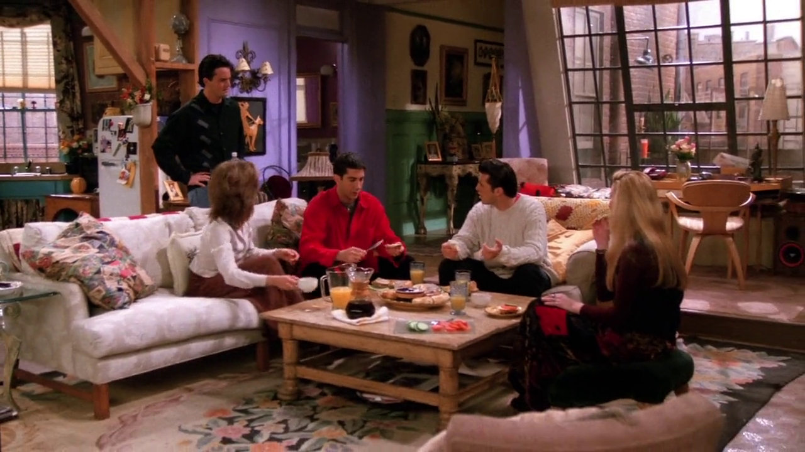
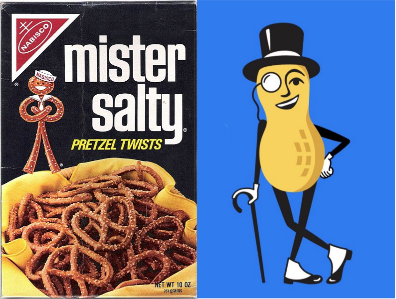
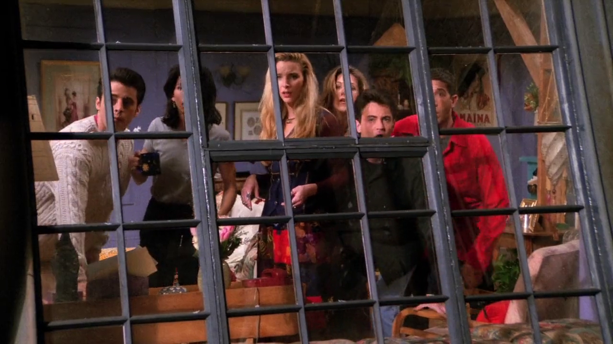
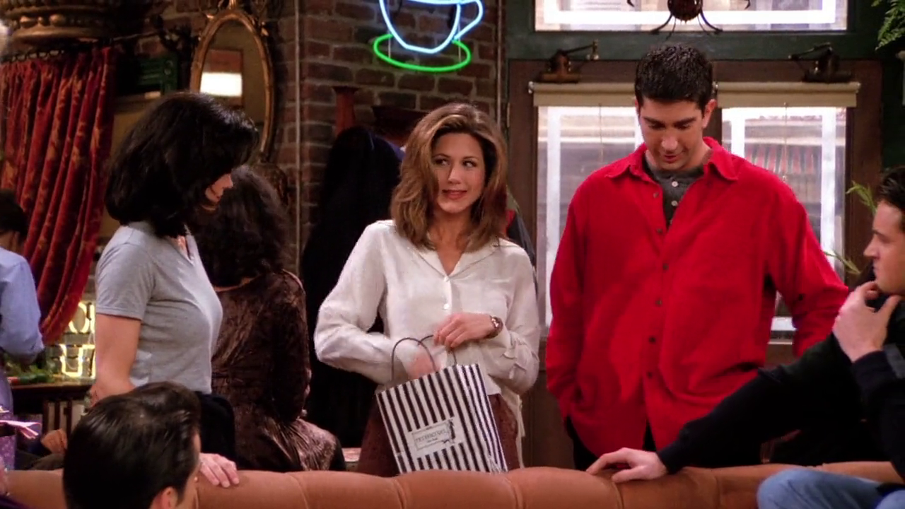
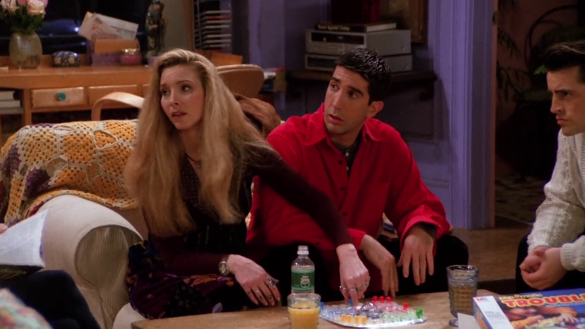
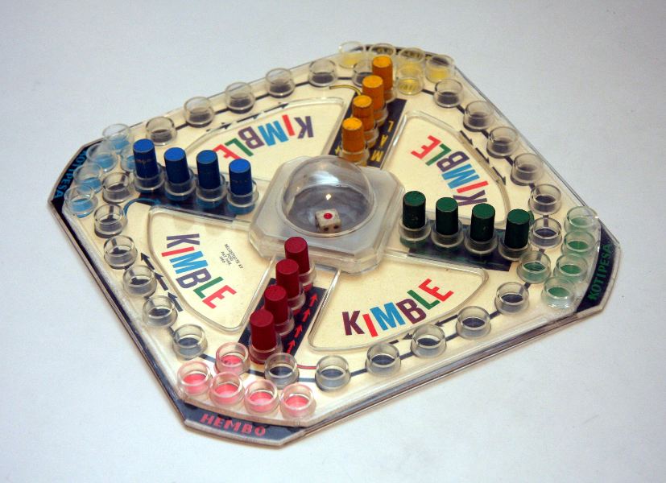
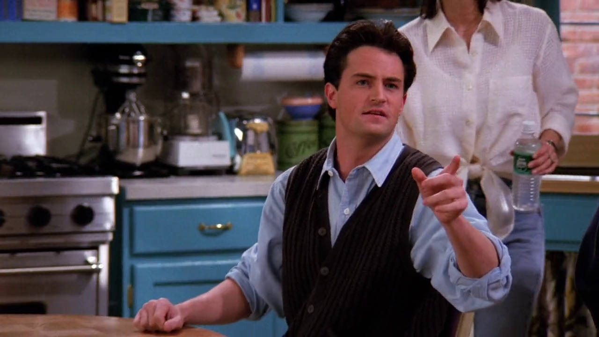
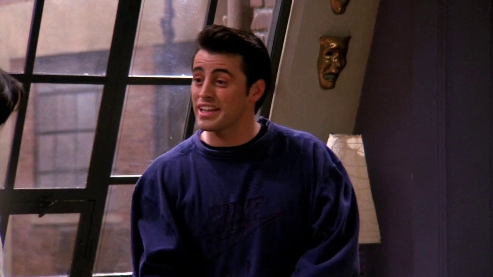

## Mr. Peanut and Mr. Salty

{ fullpage=true, clipt=2cm, clipb=5cm }

<cena>
  <chandler
    original="- I would much rather be Mr. Peanut than Mr. Salty."
    traducao="- Prefiro ser o Sr. Peanut ao ser o Sr. Salty."
  />
</cena>

<!-- {"latex":[{"begin":{"tag":"col-1","width":0.5}}]} -->

Joey e Chandler discutem sobre quem é melhor *Mr. Peanut* ou *Mr. Salty*. Ambos
são aperitivos e possuem formas antropomórficas.[^mrpeanut-fandom]

<!--{"latex":[{"end":{"tag":"col-1"}},{"begin":{"tag":"col-2","width":0.5}}]}-->

<!--{"latex":[{"end":{"tag":"col-2"}}]}-->

[^mrpeanut-fandom]: [Mr. Peanut - Fandom Wiki](https://mrpeanut.fandom.com/wiki/Mr._Peanut)

## Gravity Boots

{ fullpage=true, clipt=2cm, clipb=5cm }

<cena>
  <phoebe
    original="- Oh, you guys, look. Ugly Naked Guy got gravity boots."
    traducao="- Olha pessoal. O Peladão feio tem Botas Inversoras."
  />
</cena>

<!-- {"latex":[{"begin":{"tag":"col-1","width":0.5}}]} -->

Phoebe espia o *Peladão feio* e chama os outros para ver que ele comprou
*gravity boots*, que são botas de exercício de abdominal invertido, ou seja,
de cabeça para baixo. Elas possuem ganchos que são colocados em uma barra
fixada.[^inversion-tables]

<!--{"latex":[{"end":{"tag":"col-1"}},{"begin":{"tag":"col-2","width":0.5}}]}-->

<!--{"latex":[{"end":{"tag":"col-2"}}]}-->

[^inversion-tables]: [Inversion Table - WebMD (Inglês)](https://www.webmd.com/back-pain/what-are-inversion-tables#3)

## Bendel and Chanel

{ fullpage=true, clipt=4cm, clipb=3cm }

<cena>
  <rachel
    original="- And then we took a walk to Bendel's. And I told him not to, but he got me a little bottle of Chanel."
    traducao="- Fomos até a Bendel's. Falei que não precisava, mas ele me comprou um perfume Chanel."
  />
</cena>

Na volta de um encontro com seu ex-noivo Barry, Rachel menciona *Bendel's* (1895-2019)
e *Chanel* (1909-). O primeiro era uma loja localizada na Quinta Avenida, e que existiu
por 123 anos até ser fechada no começo de 2019. Uma de suas características marcantes
era a sacola de compras, que pode ser vista na mão de Rachel.[^bendel-exame]
A segunda refere-se a marca de perfumes e alta-costura fundada pela estilista
francesa *Coco Chanel* (1883-1971).[^chanel-britannica]
*Henri Bendel* foi o primeiro varejista a vender produtos *Chanel* nos EUA.

[^bendel-exame]: [Henri Bendel - Exame](https://exame.com/casual/iconica-marca-henri-bendel-fecha-as-portas-apos-123-anos/)
[^chanel-britannica]: [Coco Chanel- Encyclopædia Britannica](https://www.britannica.com/biography/Coco-Chanel)

## Trouble

{ fullpage=true, clipt=4cm, clipb=0cm }

Os amigos jogam uma partida de *Trouble*, conhecido no Brasil como Ludo. Jogo de
tabuleiro em que cada jogador possui um conjunto de peças, que devem se mover
uma por rodada com base no lançamento de um dado. O jogador que mover todas as
peças até uma parte central vence o jogo. Se uma peça cair no mesmo local de uma
peça adversária, a mesma é retornada para o início.[^trouble-board]

{ bookwidth=60% }

[^trouble-board]: [Trouble - Board Game Geek (Inglês)](https://www.boardgamegeek.com/boardgame/1410/trouble)

## Get down and boogie

{ fullpage=true, clipt=1cm, clipb=6cm }

<cena>
  <joey
    original="- Get down!"
    traducao="- Se abaixa!"
  />
  <rachel
    original="- Get down?"
    traducao="- Se abaixa?"
  />
  <chandler
    original="- And boogie!"
    traducao="- Até o chão!"
  />
</cena>

Chandler refere-se a um termo proviniente de um estilo popular de *blues* dos anos
30, mas que foi mais difundido para descrever os estilos *rock* sulista e
*disco music*.[^boogie-discogs] [^boogie-genre-term]
Em 1976 foi lançada a coletânea *Get Down And Boogie*, que incluía
a música *Love To Love You Baby* de *Donna Summer*, que aparece no episódio
[S05E23 - Aquele em Vegas: Parte 1](/temporada/5/episodio/23/).

[^boogie-discogs]: [Various ‎- Get Down And Boogie - Discogs](https://www.discogs.com/pt_BR/Various-Get-Down-And-Boogie/release/98158)
[^boogie-genre-term]: [Name it on the 'boogie' - the genre tag that won't sit still - The Guardian (Inglês)](https://www.theguardian.com/music/musicblog/2011/may/03/simon-reynolds-boogie-genre-term)

## Ingrid Bergman

{ fullpage=true, clipt=2cm, clipb=5cm }

<cena>
  <joey
    original="- Yeah, my neighbor... Yeah, the brunette... She says you looked very pretty the other day in the green dress."
    traducao="- Sim, minha vizinha... Sim, a morena... Ela diz que você estava muito bonita outro dia com aquele vestido verde."
  />
  <monica
    original="- The green dress? Really?"
    traducao="- O vestido verde? Sério?"
  />
  <joey
    original="- Yeah, she said you looked like Ingrid Bergman that day."
    traducao="- Sim, ela disse que você parecia a Ingrid Bergman."
  />
  <monica
    original="- Nooo!"
    traducao="- Nãoo!"
  />
</cena>

Joey reclama pelo telefone com a vizinha da frente, Sidney, que estava bisbilhotando
os amigos com um telescópio. Entretanto ela reverte a situação fazendo elogios a
Monica, e a compara com *Ingrid Bergman* (1915-1982), atriz sueca que estrelou,
entre outros, o filme *Casablanca* (1942).[^bergman-imdb] [^bergman-britannica]

[^bergman-imdb]: [Ingrid Bergman - IMDB](https://www.imdb.com/name/nm0000006/)
[^bergman-britannica]: [Ingrid Bergman - Encyclopædia Britannica](https://www.britannica.com/biography/Ingrid-Bergman)
