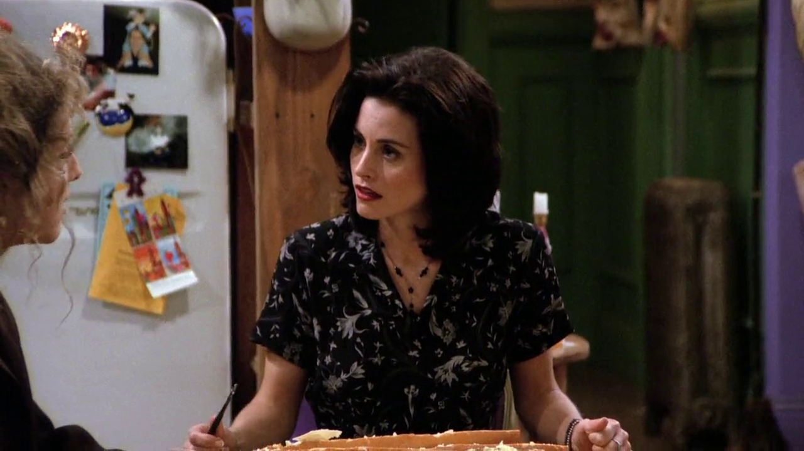
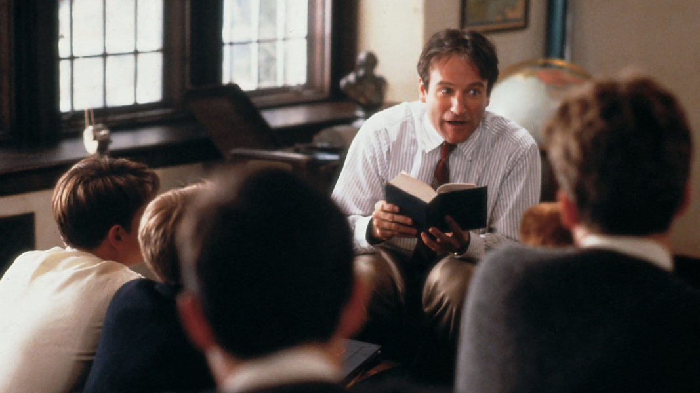
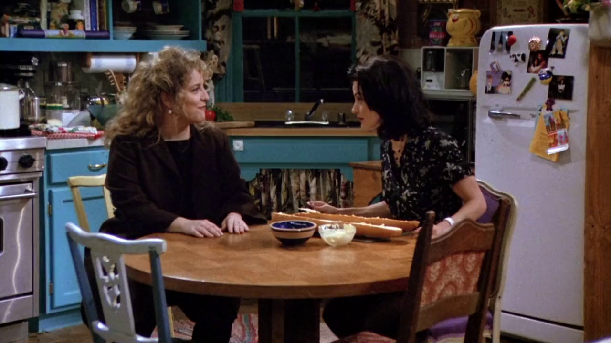
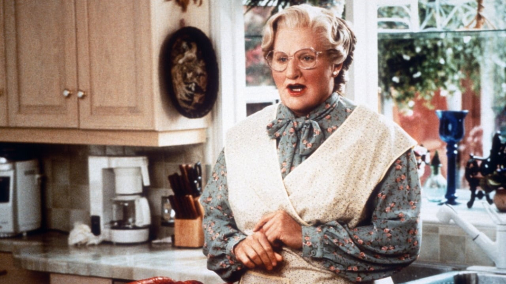
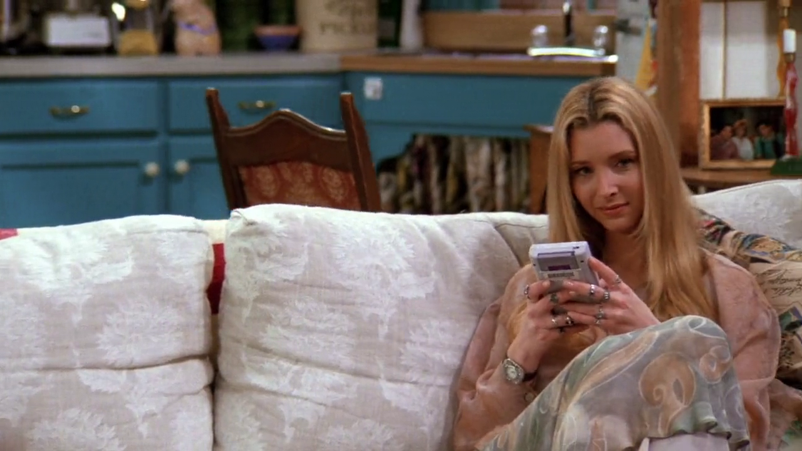
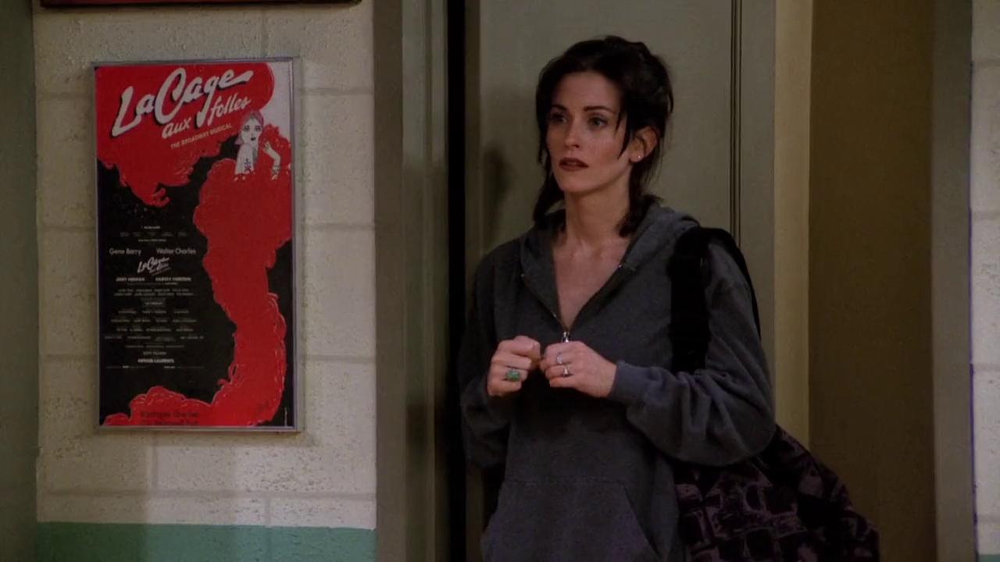
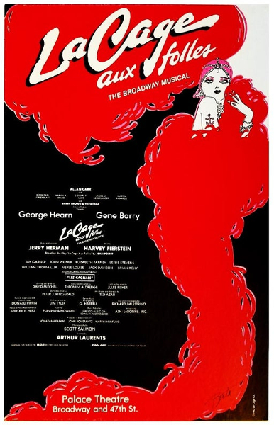
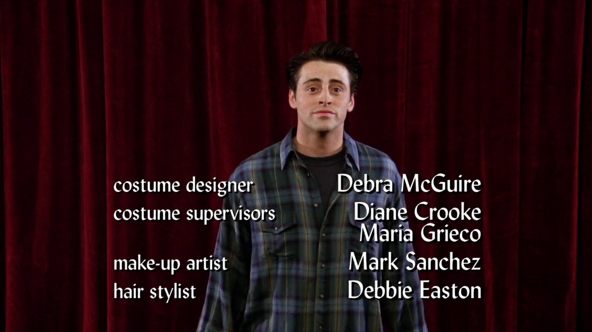

## Curious George doll

<cena>
  <rachel
    original="- Marcel, stop it! Marcel! Bad monkey!"
    traducao="- Marcel, para! Marcel! Macaco malvado!"
  />
  <ross
    original="- What?"
    traducao="- Que foi?"
  />
  <rachel
    original="- Let's just say my Curious George doll is no longer curious."
    traducao="- Meu boneco George Curioso não está mais curioso."
  />
</cena>

Em sua fase de cio Marcel "se diverte" com um boneco da Rachel,
*Curious George* (1941), personagem criado pelo casal *Hans Augusto Rey* (1898-1977)
e *Margret Rey* (1906-1996) em livro homônimo. O macaquinho ainda estrolou uma
série de 6 livros, um longa-metragem, vídeo *games* e uma série de TV, além,
é claro, dos bonecos de pelúcia.

### Referências

- [Curious George - Site oficial (Inglês)](https://www.curiousgeorge.com/about%20us)

## Fiddler on the Roof

<cena>
  <chandler
    original="- Joseph Stalin is the Fiddler on the Roof."
    traducao="- Joseph Stalin é Um Violinista no Telhado."
  />
</cena>

Joey busca um nome artístico, a pedido de sua agente. Chandler sugere
*Joseph Stalin* (1878-1953), e demonstra como seria a chamada do musical
*Fiddler on the Roof* (1964), uma produção original da *Broadway*, o famoso
teatro localizado no centro de *Manhattan*. O musical, mais tarde, foi
adaptado para um filme de mesmo nome (1971) e conta a história de um camponês
judeu que vive na Rússia pré-revolucionária, e luta contra o casamento de
três de suas filhas, ao mesmo tempo que um sentimento anti-semita ameaça
a vila onde mora.

Na mesma cena Chandler menciona *Bye Bye Birdie*, que já foi citado no episódio
[S01E18 - Aquele com o Pôquer](/temporada/1/episodio/18/#bye-bye-birdie).

*Joseph Stalin* é explicado mais tarde no próprio episódio por Joey.

<cena>
  <joey
    original="- You know there already is a Joseph Stalin?"
    traducao="- Sabiam que já existe um Joseph Stalin?"
  />
  <chandler
    original="- You're kidding!"
    traducao="- Tá brincando?"
  />
  <joey
    original="- Apparently, he was this Russian dictator who slaughtered all these people!"
    traducao="- Aparentemente, era um ditador russo que matou um monte de gente."
  />
</cena>

### Referências

- [IMDB](https://www.imdb.com/title/tt0067093/?ref_=nv_sr_srsg_0)

## Three wise monkeys

Ross descobre que o cio de Marcel não é apenas uma fase e deverá doar o macaco.
Na cena há uma alusão ao provérbio japonês *see no evil, hear no evil, speak no evil*,
que pode ser traduzido como *não veja o mal, não ouça o mal e não fale o mal*.

### Referências

- [Wikipédia](https://pt.wikipedia.org/wiki/Tr%C3%AAs_Macacos_S%C3%A1bios)

## Dead Poets Society

<cena>
  <fake-monica
    original="- Did you ever see Dead Poets Society?"
    traducao="- Viu A Sociedade dos Poetas Mortos?"
  />
  <monica
    original="- Uh-huh."
    traducao="- Não."
  />
  <fake-monica
    original="- I thought that movie was so incredibly... boring!"
    traducao="- Achei aquele filme incrivelmente... chato!"
  />
</cena>

A Monica Falsa descreve como um filme mudou a vida dela, e menciona *Dead Poets Society*
(1989), que conta a história de um ex-aluno de uma escola ortodoxa que se torna
professor de literatura e utiliza métodos para fazer com que os alunos pensem por si
próprios. No Brasil o filme é conhecido como *Sociedade dos Poetas Mortos*.

### Referências

- [TMDB](https://www.themoviedb.org/movie/207-dead-poets-society?language=pt-BR)

## Mrs. Doubtfire

<cena>
  <monica
    original="- Then I would definitely not recommend Mrs. Doubtfire."
    traducao="- Então, não veja Uma Babá Quase Perfeita."
  />
</cena>

A Monica Falsa reclama como perdeu tempo de sua vida assistindo ao filme
*Dead Poets Society* e a *Monana* recomenda que ela não veja *Mrs. Doubtfire*
(1993), comédia que também é estrelada por *Robin Williams*. A trama envolve
um sujeito que se separou e arranja um emprego de babá em sua antiga casa
disfarçado de uma senhora.

### Referências

- [TMDB](https://www.themoviedb.org/movie/788-mrs-doubtfire)

## Game Boy

Phoebe é vista em cena com um *Game Boy* (1989), console portátil da Nintendo,
muito popular nos anos 90. Possui uma tela LCD com 4 tons de cinza e sistema
de cartuchos. Em seu lançamento nos EUA o console vinha com o jogo *Tetris*.

O fato dela estar com um *Game Boy* pode ter relação com sua resposta quando
Joey pergunta que nome artístico seria legal, e ela responde: *"Flame Boy!"*.

### Referências

- [Site oficial da Nintendo (Inglês)](https://www.nintendo.co.uk/Corporate/Nintendo-History/Game-Boy/Game-Boy-627031.html)

## La Cage Aux Folles

Monica volta a visitar a classe de dança e na entrada é possível ver o poster de
*La Cage Aux Folles* (1983), musical da *Broadway* baseado numa peça teatral
francesa de mesmo nome. Em 1978 é lançado um filme e fica conhecido no Brasil
como *A Gaiola das Loucas*, e conta a história de um pai que se descobre gay
e é gerente de uma casa noturna, e que irá conhecer os pais ultra conservadores
da noiva de seu filho.

### Referências

- [IBDB - Internet Broadway Database (Inglês)](https://www.ibdb.com/broadway-show/la-cage-aux-folles-5126)
- [Wikipédia](https://pt.wikipedia.org/wiki/La_cage_aux_folles_(musical))

## Mercutio

Joey vai a uma audição para tentar o papel de *Mercutio*, personagem, originalmente,
do livro *Romeo and Juliet* (1597) de *William Shakespeare* (1564-1616), o melhor
amigo de *Romeo* na história.

### Referências

- [Wikipédia (Inglês)](https://en.wikipedia.org/wiki/Mercutio)
