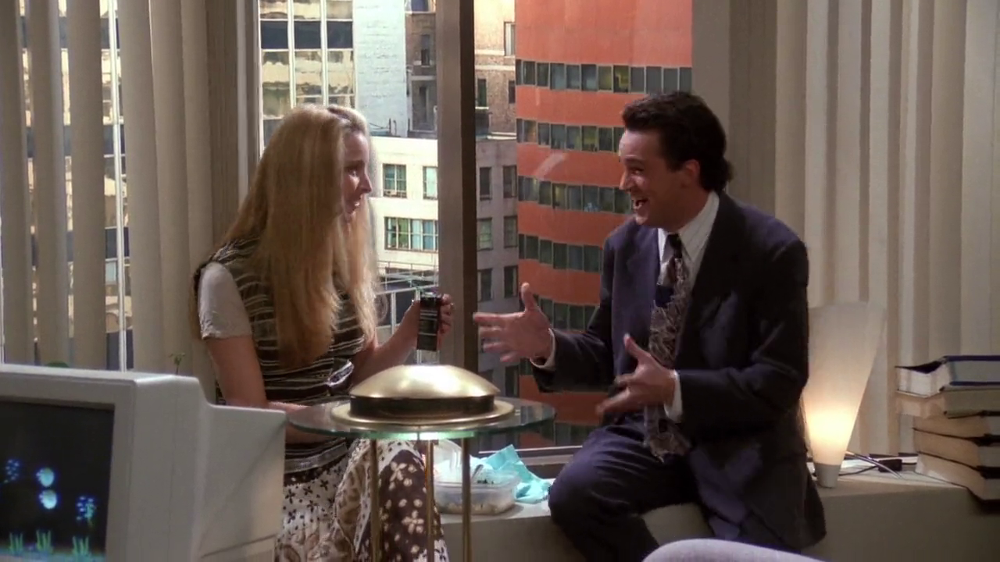

## The hills are alive with the sound...

***...of music***. A galera está tirando sarro da maneira que Chandler fala,
enfatizando certas palavras, e Ross faz referência a canção *The Hills Are Alive*
do filme *The Sound of Music* (1965) (já citado no episódio
[Aquele onde Tudo começou](/temporada/1/episodio/1#my-favorite-things)).[^hills-alive-yt]

[^hills-alive-yt]: [The Sound of Music | "The Hills Are Alive" Lyric Video | Fox Family Entertainment](https://www.youtube.com/watch?v=yvQ4t-Nk128)

## Joan Collins

<cena>
  <monica
    original="- I'm Joan Collins."
    traducao="- Eu sou Joan Collins."
  />
</cena>

Monica se envolve com um rapaz bem mais novo, Ethan, e menciona *Joan Collins* (1933-),
atriz inglesa famosa pelo seu papel como *Alexis Carrington* na série de TV
*Dynasty* (1981-1989).[^collins-britannica] Na trama ela se casa com um rapaz mais
novo, como parte de um esquema para se vingar do ex-marido.

[^collins-britannica]: [Joan Collins - Encyclopædia Britannica](https://www.britannica.com/biography/Joan-Collins)

## Power Rangers

<cena>
  <joey
    original="- ...could you ask him which one the strongest Power Ranger is?"
    traducao="- ...pergunta a ele qual o Power Ranger mais forte?"
  />
</cena>

A galera descobre que Ethan é menor de idade e provocam Monica. Joey faz menção
a série de TV *Power Rangers* (1993-). Na época do episódio de Friends a série
estava em sua segunda temporada. Na história, seis estudantes do ensino médio,
assim como Ethan, são escolhidos pelo ser intergalático *Zordon* e ganham super
poderes para combater *Lord Zedd* e salvar o planeta Terra.[^power-rangers-site]

Um detalhe interessante é que *na hora de morfar*, Joey menciona *Stegosaurus*,
que não faz parte dos seis animais que representam cada personagem.

[^power-rangers-site]: [Mighty Morphin Power Rangers - Website](https://powerrangers.hasbro.com/pt-br/tv-shows)

## Aux Buttes Chaumont

O apartamento de Monica possui pôsteres emblemáticos, entre eles está o
*Aux Buttes Chaumont: jouets et objets pour étrennes* (1885) do ilustrador
francês *Jules Chéret* (1836-1932). Ele anunciava uma famosa loja de brinquedos
Parisiense.[^aux-gallica] O texto traduzido seria *Aux Buttes Chaumont: Brinquedos
e presentes para o Ano Novo*.

[^aux-gallica]: [Aux Buttes Chaumont - Gallica (Francês)](https://gallica.bnf.fr/ark:/12148/btv1b90105877)

## Ebony and Ivory

<cena>
  <chandler
    original="- You know, the karaoke thing? Tracy and I doing Ebony and Ivory?"
    traducao="- O karaokê foi legal, não é? Tracy e eu cantando Ebony and Ivory?"
  />
</cena>

Chandler tentava se enturmar na festa do escritório agora que tinha virado o chefe,
e menciona ter cantado a música *Ebony and Ivory* (1982), um *single* de
*Paul McCartney* (1942-) e *Stevie Wonder* (1950-). A canção é uma alegoria, fazendo
paralelo entre as teclas do piano &#8212; o preto do ébano e o branco do marfim
&#8212; e a integração e harmonia racial. A música aparece no álbum *Tug Of War* (1982)
de *McCartney*.[^tug-of-war]

[^tug-of-war]: [Paul McCartney - Tug Of War](https://www.paulmccartney.com/albums/tug-of-war)
