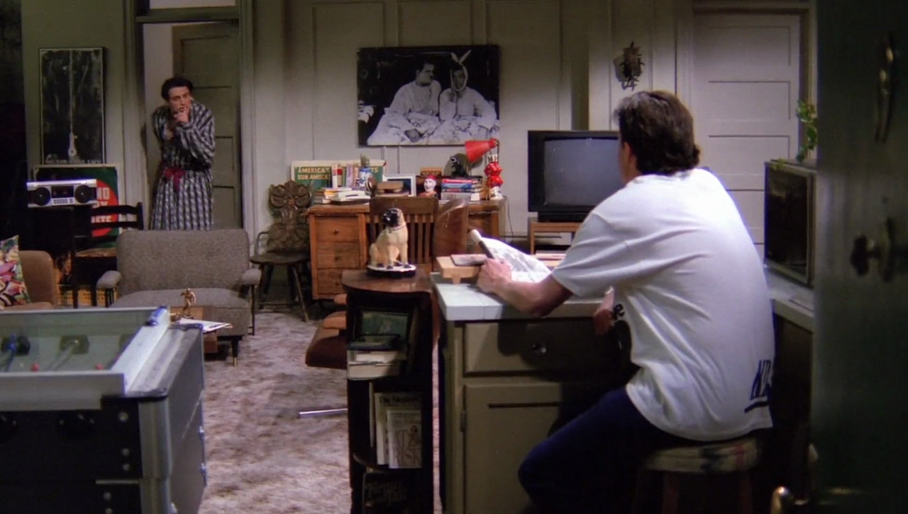

## Alvin, Simon, Theodore

{ fullpage=true, clipt=2cm, clipb=9cm }

<cena>
  <ross
    original="- Do you guys know who Carl is?"
    traducao="- Alguém sabe quem é esse tal de Carl?"
  />
  <chandler
    original="- Let's see. Alvin, Simon, Theodore... No."
    traducao="- Deixa eu ver. Alvin, Simon, Theodore... Não."
  />
</cena>

<!-- {"latex":[{"begin":{"tag":"col-1","width":0.4}}]} -->

Ross descobre que Rachel saiu para beber com um tal de Carl, e quando
pergunta aos amigos se eles o conhecem, Chandler faz referência aos
personagens de *Alvin & the Chipmunks* (1983-1990), série animada americana
estrelada por esquilos. A série é um pouco mais antiga mas começou a passar
na NBC, mesma rede de TV de Friends, em 83.[^alvin-imdb]

<!--{"latex":[{"end":{"tag":"col-1"}},{"begin":{"tag":"col-2","width":0.6}}]}-->

<!--{"latex":[{"end":{"tag":"col-2"}}]}-->

[^alvin-imdb]: [Alvin & the Chipmunks - IMDB](https://www.imdb.com/title/tt0084972/)

## The Three Musketeers

{ fullpage=true, clipt=5cm, clipb=8cm }

<cena>
    <joey
        original="- Like &quot;The Three Musketeers&quot;, only with fruit."
        traducao="- Igual aos &quot;Três Mosqueteiros&quot;, mas com frutas."
    />
</cena>

Melanie, namorada de Joey, fala sobre como abriu o próprio negócio vendendo
cestas de frutas, e faz um trocadilho com *The Three Musketeers* (1844), um
romance de *Alexandre Dumas* (1802-1870) publicado originalmente em francês,
*Les Trois Mousquetaires*. O livro conta a história de um jovem chamado *D'Artagnan*
em busca de fazer parte da guarda real do rei da França ao lado de
*Athos*, *Porthos* e *Aramis*.[^musketeers-britannica]

Uma versão longa-metragem foi feita em 1993 e outra em 2011.

[^musketeers-britannica]: [The Three Musketeers - Encyclopædia Britannica](https://www.britannica.com/topic/The-Three-Musketeers)

## Travel Scrabble

{ fullpage=true, clipt=3cm, clipb=6cm }

<cena no-breakable>
    <rachel
        original="- It rattles. It's... Travel Scrabble."
        traducao="- Faz barulho. É... Palavras Cruzadas para viagem."
    />
</cena>

Versão de viagem do jogo *Scrabble*, já citado em [S01E17 - Aquele com Duas Partes (Parte 2)](/temporada/1/episodio/17/#scrabble), onde as peças
fixam-se no tabuleiro.

## Dr. Seuss

{ fullpage=true, clipt=4cm, clipb=2cm }

<cena>
  <rachel
    original="- Feels like a book. And it's a book!"
    traducao="- Parece um livro. É um livro!"
  />
  <phoebe
    original="- It's Dr. Seuss!"
    traducao="- É Dr. Seuss!"
  />
</cena>

<!-- {"latex":[{"begin":{"tag":"col-1","width":0.5}}]} -->

Rachel ganha o livro *Oh, the Places You'll Go!* (1990) de Joey. Foi o
último livro publicado de *Dr. Seuss* (já citado no episódio
[S01E09 - Aquele em que o Underdog Escapa](/temporada/1/episodio/9/#yertle-the-turtle)) e fala sobre a jornada da vida e seus desafios.[^places-book]

<!--{"latex":[{"end":{"tag":"col-1"}},{"begin":{"tag":"col-2","width":0.5}}]}-->

{ bookwidth=70% }

<!--{"latex":[{"end":{"tag":"col-2"}}]}-->

Joey menciona que o livro o ajudou em momentos difíceis, mas na época de lançamento
ele teria uns 20 anos.

[^places-book]: [Oh, the Places You'll Go! - Dr. Seuss - Google Books](https://books.google.com.br/books/about/Oh_the_Places_You_ll_Go.html?id=_LettPDhwR0C&redir_esc=y)

## Hitchcock and Scarface

{ fullpage=true, clipt=2cm, clipb=7cm }

No quarto de Joey é possível ver pôsteres de *Alfred Hitchcock* (1899-1980) (à esquerda),
diretor Inglês famoso por filmes de suspense, entre eles *Psycho* (1960), *Psicose*
no Brasil[^hitchcock-britannica]; e um pôster do filme *Scarface* (1983) (à direita), filme
estrelado por *Al Pacino*, ator já citado no episódio
[S01E06 - Aquele com o Traseiro](/temporada/1/episodio/6/#al-pacino). Nele o personagem
de *Al*, *Tony Montana*, um criminoso cubano, é deportado para *Miami* e toma
controle de um grande cartel de drogas.[^scarface-imdb]

[^hitchcock-britannica]: [Alfred Hitchcock - Encyclopædia Britannica](https://www.britannica.com/biography/Alfred-Hitchcock)
[^scarface-imdb]: [Scarface - IMDB](https://www.imdb.com/title/tt0086250/)

## Hey big... spender

{ fullpage=true, clipt=3cm, clipb=10cm }

<cena>
  <chandler
    original="- Hey, big..."
    traducao="- Ei, grande..."
  />
  <joey
    original="- Shh!"
    traducao="- Shh!"
  />
  <chandler
    original="- Spender."
    traducao="- Gastador."
  />
</cena>

Joey levanta-se antes de Melanie e Chandler faz uma referência ao musical
*Sweet Charity* (1966) &#8212; que também virou filme em 1969 &#8212;, que conta a história
de uma dançarina de cabaré que não perde a esperança de encontrar um grande amor.
A canção *Big Spender* é um dos pontos altos do musical.[^sweet-charity-ibdb]

<musica>
  <letra slot="original">
    Hey, big spender!
    Spend...a little time with ...me!
  </letra>
  <letra slot="traducao">
    Ei, grande gastador!
    Gaste... um pouco de tempo... comigo!
  </letra>
</musica>

[^sweet-charity-ibdb]: [Sweet Charity - IBDB](https://www.ibdb.com/broadway-production/sweet-charity-3281)

## Crunch Berries

{ fullpage=true, clipt=5cm, clipb=1cm }

Conversando com Joey sobre como foi a noite com Melanie, Chandler é visto comendo
o cereal *Cap'n Crunch - Crunch Berries* (1967), um dos cereais matinais mais populares
na época.[^berries-mashed]

[^berries-mashed]: [The untold truth of Cap'n Crunch - Mashed (Inglês)](https://www.mashed.com/206601/the-untold-truth-of-capn-crunch/)

## Ed Begley Jr.

{ fullpage=true, clipt=0cm, clipb=9cm }

<cena>
  <carl
    original="- If I see one more picture of Ed Begley Jr. in that stupid electric car..."
    traducao="- Se eu vir mais uma foto de Ed Begley Jr. naquele estúpido carro elétrico..."
  />
</cena>

Rachel volta ao apartamento de seu encontro com Carl, e ele menciona *Ed Begley Jr.*
(1949-), ator americano e ativista do meio ambiente. Em 1970 *Ed* comprou seu primeiro
carro elétrico, um *Taylor-Dunn*, que na verdade estava mais para um carrinho de
golfe com um para-brisa e uma buzina. Ele foi pioneiro no uso de carros elétricos
e financiou vários projetos.[^begley-wheels]

[^begley-wheels]: [Actor Ed Begley electric car pioneer - Wheels.ca (Inglês)](https://www.wheels.ca/news/actor-ed-begley-electric-car-pioneer/)
