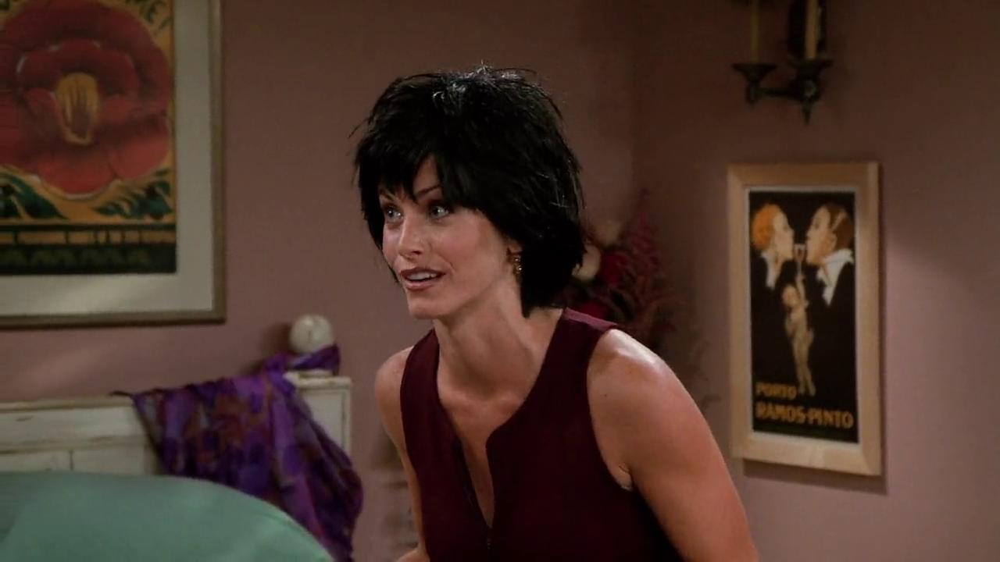
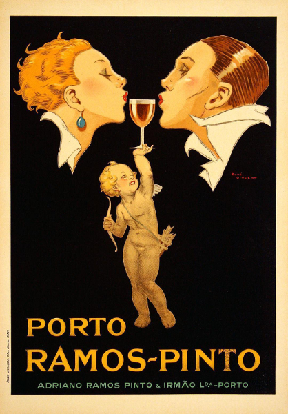
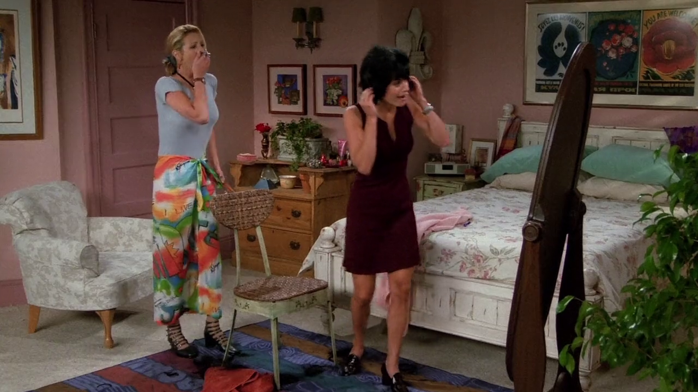
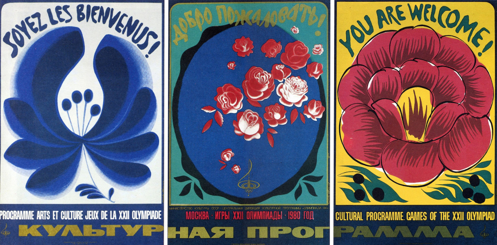
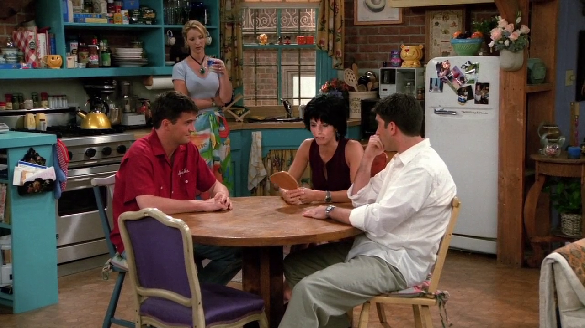
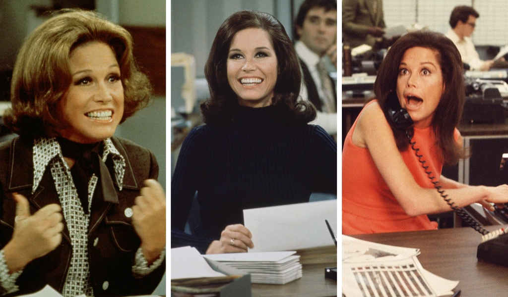

## Vidal Buffay

<cena>
  <monica
    original="- Guys, you got new haircuts."
    traducao="- Pessoal, vocês cortaram o cabelo."
  ></monica>
   <chandler
    original="- Yes, yes, we did. Thanks to Vidal Buffay."
    traducao="- Sim, sim, cortamos. Graças a Vidal Buffay."
  ></chandler>
   <phoebe
    original="- Cause, you know, If you don’t look good, we don’t look good."
    traducao="- Se vocês não ficam bem, nós não ficamos bem."
  ></phoebe>
</cena>

Após Monica comentar sobre os novos cortes de cabelo de Chandler e Joey, Chandler
brinca dizendo que foi graças a Vidal Buffay, fazendo a junção dos nomes de
*Vidal Sassoon*, um renomado cabeleireiro, considerado um dos mais importantes do
mundo e responsável pelo corte de Mia Farrow no filme *O Bebê de Rosemary* (1968)[^vidal-wiki]
e do sobrenome de Phoebe, que foi quem realizou o corte nos amigos. A frase dita
por Phoebe é um famoso bordão do *hairstylist* e também fazia parte de um comercial
de TV de shampoo da marca *Vidal Sassoon*.[^vidal-yt]

[^vidal-wiki]: [Wikipédia](https://pt.wikipedia.org/wiki/Vidal_Sassoon)
[^vidal-yt]: [Comercial de TV - YouTube](https://www.youtube.com/watch?v=zIDMngZsFhY)

## Q-Tip

<cena>
  <chandler
    original="- Okay, you have to stop the Q-Tip when there's resistance."
    traducao="- Retire o cotonete quando houver alguma resistência."
  ></chandler>
</cena>

*Q-Tip* é uma marca de *cotonetes* vendida nos Estados Unidos.[^qtips-website]
A frase significa que deve-se ter cuidado ao limpar o ouvido com hastes flexíveis,
pois, se empurrá-lo muito para dentro, pode causar danos ao ouvido. Na cena, Joey
está contando para Chandler com que idade conheceu seu alfaiate, não consegue lembrar e acaba fazendo uma pergunta estúpida: "Quando era 1990?". Chandler usa seu humor sarcástico
para responder, insinuando que o *Q-Tip* já está afetando o cérebro de Joey.

[^qtips-website]: [Q-Tip's - Site Oficial](https://www.qtips.com/)

## Demi Moore ou Dudley Moore?

<cena>
  <monica
    original="- Demi Moore is not a he."
    traducao="- Demi Moore não é ele."
  ></monica>
   <phoebe
    original="- Well, he was a he in Arthur and in 10."
    traducao="- Era em &quot;Arthur, o Milionário&quot; e &quot;Mulher Nota 10&quot;."
  ></phoebe>
   <monica
    original="- That's Dudley Moore!"
    traducao="- Esse é Dudley Moore!"
  ></monica>
</cena>

Satisfeita com o novo visual de Joey e Chandler, Monica insiste para que Phoebe
também corte seu cabelo inspirado em *Demi Moore*, atriz que trabalhou em
*Disclosure* (1994)[^disclosure-imdb], *Indecent Proposal* (1993)[^indecent-proposal-imdb]
e *Ghost* (1990)[^ghost-imdb], filmes citados no episódio e conhecidos no Brasil como
*Assédio Sexual*, *Proposta Indecente* e *Ghost: Do Outro Lado da Vida*, respectivamente.
No entanto, Phoebe se atrapalha e corta o cabelo de Monica inspirado em *Dudley Moore*,
protagonista de *Arthur, O Milionário Sedutor* (1981)[^arthur-imdb] e
*Mulher Nota 10* (1979).[^10-imdb]

[^disclosure-imdb]: [Assédio Sexual (IMDB)](https://www.imdb.com/title/tt0109635/?ref_=fn_al_tt_1)
[^indecent-proposal-imdb]: [Proposta Indecente (IMDB)](https://www.imdb.com/title/tt0107211/?ref_=fn_al_tt_1)
[^ghost-imdb]: [Ghost (IMDB)](https://www.imdb.com/title/tt0099653/?ref_=fn_al_tt_1)
[^arthur-imdb]: [Arthur, O Milionário Sedutor (IMDB)](https://www.imdb.com/title/tt0082031/?ref_=nv_sr_srsg_0)
[^10-imdb]: [Mulher Nota 10 (IMDB)](https://www.imdb.com/title/tt0211876/)

## Porto Ramos-Pinto

Monica tem um gosto por quadros fraceses, já visto em outros episódios. Aqui vemos
uma obra de *René Vincent* (1879-1936) chamada *Porto Ramos-Pinto* (c. 1920), um pôster
para anunciar o famoso vinho do porto *Ramos-Pinto*.[^ramos-pinto-poster]

[^ramos-pinto-poster]: Vincent, René, Artist. *Porto Ramos-Pinto / René Vincent*. , ca. 1920. Photograph. <https://www.loc.gov/item/2004665792/>.

## You Are Welcome!

Na parede adjacente, acima da cabeceira da cama, podemos ver pôsteres referentes
aos Jogos Olímpicos de Moscou, realizados em 1980. Foram chamados de *You Are Welcome!*,
e cada um foi escrito em uma língua diferente, são elas: Francês, Russo e Inglês.
As obras foram criadas por *Olga Volkova* (1943-1993) e *Mikhail Avvakumov*
(1938-).[^olga-bio]

[^olga-bio]: [Olga Volkova - Biografia (Russo)](https://peoplepill.com/people/olga-aleksandrovna-volkova)

## Mary Tyler Moore

<cena>
  <monica
    original="- Even Mary Tyler Moore would've been better."
    traducao="- Até o corte de cabelo de Mary Tyler Moore seria melhor."
  />
</cena>

Ainda triste com o resultado do corte de cabelo, Monica menciona a atriz americana
*Mary Tyler Moore* (1936-2017). É difícil saber ao certo qual corte de cabelo
ela se refere, já que a atriz o modificou várias vezes ao longo do tempo.[^moore-britannica]

[^moore-britannica]: [Mary Tyler Moore - Encyclopædia Britannica](https://www.britannica.com/biography/Mary-Tyler-Moore)

## It's a 10!

<cena>
  <ross
    original="- I like it. Yeah, I do. I think it's a 10!"
    traducao="- Eu gostei. Sério. Eu acho que é um 10!"
  ></ross>
   <monica
    original="- Thank you. My hair is very amused."
    traducao="- Obrigada. Meu cabelo está bem divertido."
  ></monica>
   <chandler
    original="- Oh, come on, things could be worse. I mean, You could get caught between the moon and New York City. I know it's crazy, but it's true."
    traducao="- As coisas poderiam ser bem pior. Você poderia ficar presa entre a lua e Nova York. Se que parece loucura, mas é verdade."
  ></chandler>
</cena>

Mais piadas sobre o cabelo de Monica. A fala do Ross faz menção ao filme
*Mulher Nota 10 (1979)*[^ten-imdb], e Chandler cita a música *Best You Can Do*
(1979)[^arthur-theme-yt], tema do filme *Arthur, O Milionário Sedutor* (1981).
Ambos referenciando *Dudley Moore*, ator que inspirou, erroneamente, o corte de
cabelo de Monica.

Trecho da música:

<musica>
  <letra slot="original">
    When you get caught between the moon and New York City
    I know it's crazy, but it's true
    If you get caught between the moon and New York City
    The best that you can do
    The best that you can do is fall in love
  </letra>
  <letra slot="traducao">
    Quando você se vê entre a lua e a cidade de Nova York
    Eu sei que pode parecer loucura, mas é verdade
    Se você se vê entre a lua e a cidade de Nova York
    O melhor que você pode fazer
    O melhor que você pode fazer é se apaixonar
  </letra>
</musica>

[^ten-imdb]: [Mulher Nota 10 (IMDB)](https://www.imdb.com/title/tt0211876/)
[^arthur-theme-yt]: [Música tema do Arthur (Youtube)](https://www.youtube.com/watch?v=ljt5-wY1cOU)

## Andie MacDowell ou Roddy McDowall?

<cena>
  <phoebe
    original="- Okay, I just wanna make really sure this time. Andie McDowell is the girl from Four Weddings and a Funeral, right?"
    traducao="- Só quero ter certeza, desta vez. Andie McDowell fez Quatro Casamentos e Um Funeral?"
  ></phoebe>
   <rachel
    original="- No, no, no, no, no. That's Roddy McDowall. Andie MacDowell is the guy from Planet of the Apes."
    traducao="- Não, esse é Roddy McDowall. Andie McDowell é o cara que fez Planeta dos Macacos."
  ></rachel>
</cena>

Julie pede para Phoebe cortar seu cabelo inspirado em *Andie McDowell*, estrela
do filme *Quatro Casamentos e Um Funeral* (1994)[^weddings-imdb], Phoebe vai tirar a dúvida com
a Rachel para evitar que se atrapalhe novamente. Rachel, perversamente, confunde
Phoebe e faz com que a amiga corte o cabelo de Julie inspirado no ator
*Roddy McDowell*, ator que interpreta *Cornelius* em *Planeta dos Macacos* (1968).[^apes-imdb]

[^weddings-imdb]: [Quatro casamentos e um funeral(IMDB)](https://www.imdb.com/title/tt0109831/)
[^apes-imdb]: [Planeta Dos Macacos (IMDB)](https://www.imdb.com/title/tt0063442/)
