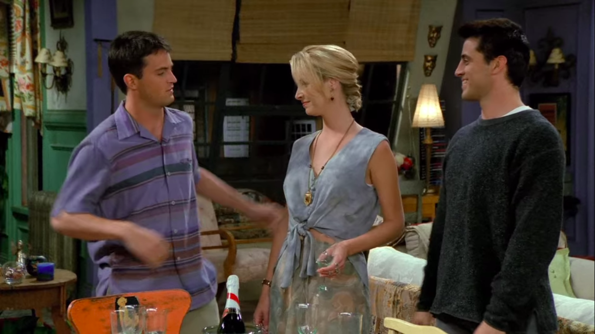
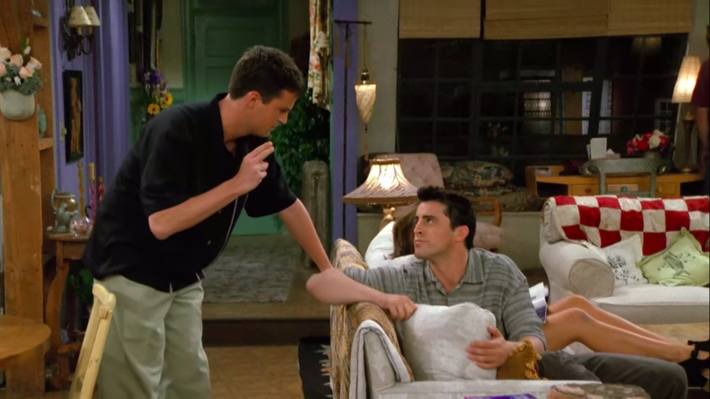
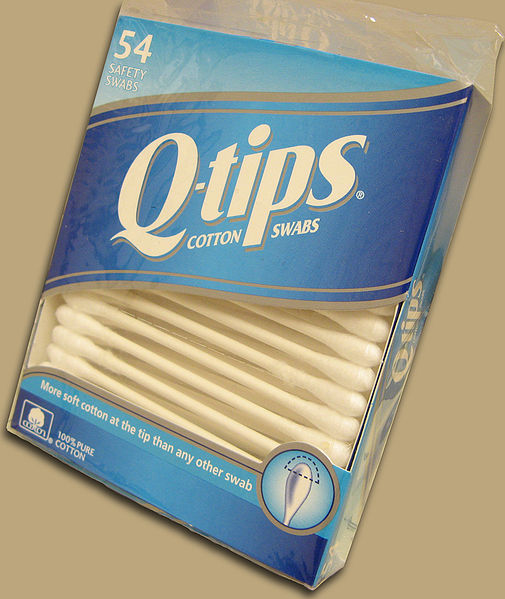
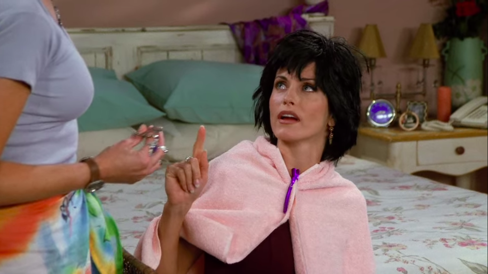
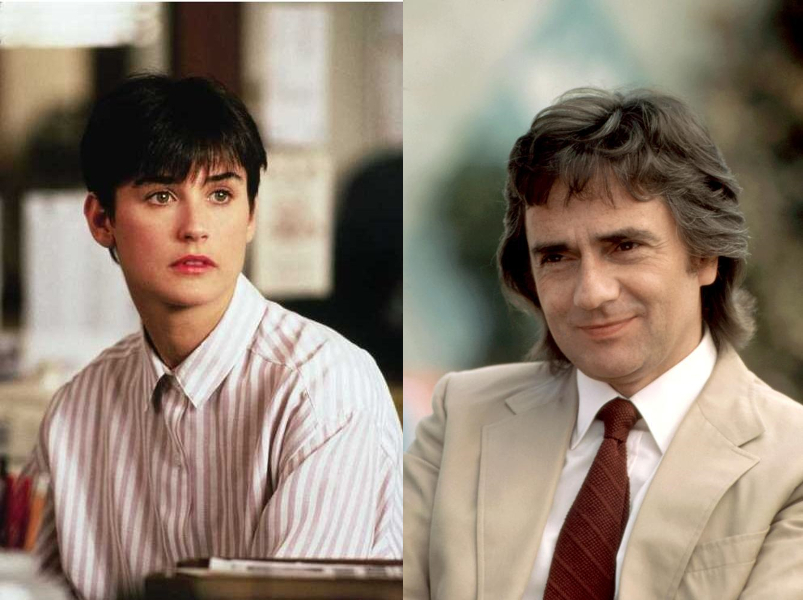
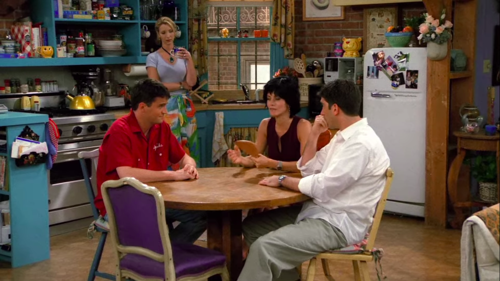
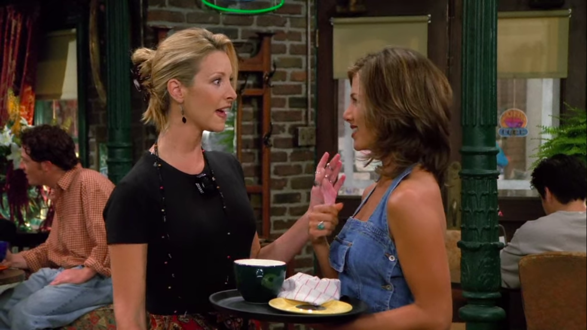
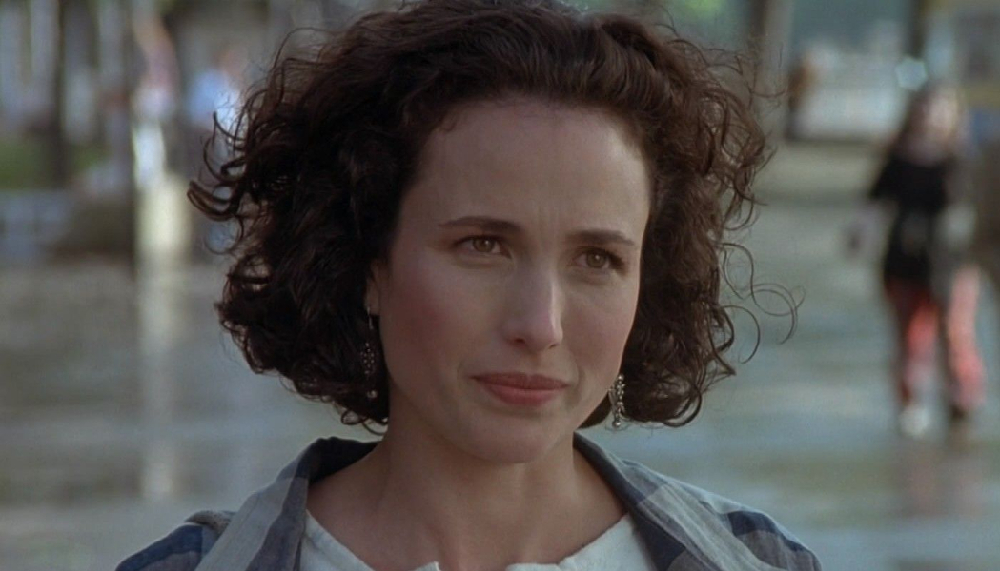
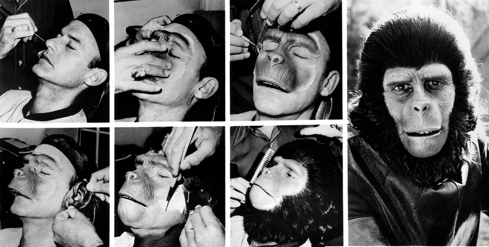

## Vidal Buffay

<cena>
  <monica
    original="- Guys, you got new haircuts."
    traducao="- Pessoal, vocês cortaram o cabelo."
  ></monica>
   <chandler
    original="- Yes, yes, we did. Thanks to Vidal Buffay."
    traducao="- Sim, sim, cortamos. Graças a Vidal Buffay."
  ></chandler>
   <phoebe
    original="- Cause, you know, If you don’t look good, we don’t look good."
    traducao="- Se vocês não ficam bem, nós não ficamos bem."
  ></phoebe>
</cena>

Após Monica comentar sobre os novos cortes de cabelo de Chandler e Joey, Chandler
brinca dizendo que foi graças a Vidal Buffay, fazendo a junção dos nomes de
*Vidal Sassoon*, um renomado cabeleireiro, considerado um dos mais importantes do
mundo e responsável pelo corte de Mia Farrow no filme *O Bebê de Rosemary* (1968)
e do sobrenome de Phoebe, que foi quem realizou o corte nos amigos. A frase dita
por Phoebe, é um famoso bordão do *hairstylist* e também fazia parte de um comercial
de TV de shampoo da marca *Vidal Sassoon*.

### Referências

- [Wikipédia](https://pt.wikipedia.org/wiki/Vidal_Sassoon)
- [Comercial de TV - YouTube](https://www.youtube.com/watch?v=zIDMngZsFhY)

## Q-Tip

<cena>
  <chandler
    original="- Okay, you have to stop the Q-Tip when there's resistance."
    traducao="- Retire o cotonete quando houver alguma resistência."
  ></chandler>
</cena>

*Q-Tip* é uma marca de *cotonetes* vendida nos Estados Unidos. A frase significa
que deve-se ter cuidado ao limpar o ouvido com hastes flexíveis, pois, se empurrá-lo
muito para dentro, pode causar danos ao ouvido. Na cena, Joey está contando para
Chandler com que idade conheceu seu alfaiate, não consegue lembrar e acaba fazendo
uma pergunta estúpida: “Quando era 1990?”. Chandler usa seu humor sarcástico
para responder “Retire o cotonete quando houver alguma resistência.”, insinuando
que o Q-Tip já está afetando o cérebro de Joey.

### Referências

- [Site](https://www.qtips.com/)

## Demi Moore ou Dudley Moore?

<cena>
  <monica
    original="- Demi Moore is not a he."
    traducao="- Demi Moore não é “ele”."
  ></monica>
   <phoebe
    original="- Well, he was a he in Arthur and in 10."
    traducao="- Era em Arthur o Milionário e Mulher Nota 10"
  ></phoebe>
   <monica
    original="- That's Dudley Moore!"
    traducao="- Esse é Dudley Moore!"
  ></monica>
</cena>

Satisfeita com o novo visual de Joey e Chandler, Monica insiste para que Phoebe
também corte seu cabelo inspirado em *Demi Moore*, atriz que trabalhou em
*Disclosure* (1994), *Indecent Proposal* (1993) e *Ghost* (1990), filmes
citados no episódio e conhecidos no Brasil como *Assédio Sexual*, *Proposta Indecente*
e *Ghost: Do Outro Lado da Vida*, respectivamente. No entanto, Phoebe se atrapalha
e corta o cabelo de Monica inspirado em *Dudley Moore*, protagonista de
*Arthur, O Milionário Sedutor* (1981) e *Mulher Nota 10* (1979).

### Referências

- [Assédio Sexual (IMDB)](https://www.imdb.com/title/tt0109635/?ref_=fn_al_tt_1)
- [Proposta Indecente (IMDB)](https://www.imdb.com/title/tt0107211/?ref_=fn_al_tt_1)
- [Ghost (IMDB)](https://www.imdb.com/title/tt0099653/?ref_=fn_al_tt_1)
- [Arthur, O Milionário Sedutor (IMDB)](https://www.imdb.com/title/tt0082031/?ref_=nv_sr_srsg_0)
- [Mulher Nota 10 (IMDB)](https://www.imdb.com/title/tt0211876/)

## Dudley Moore

<cena>
  <ross
    original="- I like it. Yeah, I do. I think it's a 10!"
    traducao="- Eu gostei. Sério. Eu acho que é um 10!"
  ></ross>
   <monica
    original="- Thank you. My hair is very amused."
    traducao="- Obrigada. Meu cabelo está bem divertido."
  ></monica>
   <chandler
    original="- Oh, come on, things could be worse. I mean, You could get caught between the moon and New York City. I know it's crazy, but it's true."
    traducao="- As coisas poderiam ser bem pior. Você poderia ficar presa entre a lua e Nova York. Se que parece loucura, mas é verdade."
  ></chandler>
</cena>

Mais piadas sobre o cabelo de Monica. A fala do Ross faz menção ao filme
*Mulher Nota 10 (1979)*, e Chandler cita a música *Best You Can Do* (1979),
tema do filme *Arthur, O Milionário Sedutor* (1981). Ambos referenciando
*Dudley Moore*, ator que inspirou, erroneamente, o corte de cabelo de Monica.

Trecho da música:

> When you get caught between the moon and New York City

> I know it's crazy, but it's true

> If you get caught between the moon and New York City

> The best that you can do (the best that you can do)

> The best that you can do is fall in love

### Referências

- [Mulher Nota 10 (IMDB)](https://www.imdb.com/title/tt0211876/)
- [Arthur, O Milionário Sedutor (IMDB)](https://www.imdb.com/title/tt0082031/?ref_=nv_sr_srsg_0)
- [Música tema do Arthur (Youtube)](https://www.youtube.com/watch?v=ljt5-wY1cOU)

## Andie MacDowell ou Roddy McDowall?

<cena>
  <phoebe
    original="- Okay, I just wanna make really sure this time. Andie McDowell is the girl from Four Weddings and a Funeral, right?"
    traducao="- Só quero ter certeza, desta vez. Andie McDowell fez Quatro Casamentos e Um Funeral?"
  ></phoebe>
   <rachel
    original="- No, no, no, no, no. That's Roddy McDowall. Andie MacDowell is the guy from Planet of the Apes."
    traducao="- Não, esse é Roddy McDowall. Andie McDowell é o cara que fez Planeta dos Macacos."
  ></rachel>
</cena>

Julie pede para Phoebe cortar seu cabelo inspirado em *Andie McDowell*, estrela
do filme  *Quatro Casamentos e Um Funeral* (1994), Phoebe vai tirar a dúvida com
a Rachel para evitar que se atrapalhe novamente. Rachel, perversamente, confunde
Phoebe e faz com que a amiga corte o cabelo de Julie inspirado no ator
*Roddy McDowell*, ator que interpreta *Cornelius* em *Planeta dos Macacos* (1968).

### Referências

- [Quatro casamentos e um funeral(IMDB)](https://www.imdb.com/title/tt0109831/?ref_=nv_sr_srsg_0)
- [Planeta Dos Macacos (IMDB)](https://www.imdb.com/title/tt0063442/?ref_=nv_sr_srsg_9)
