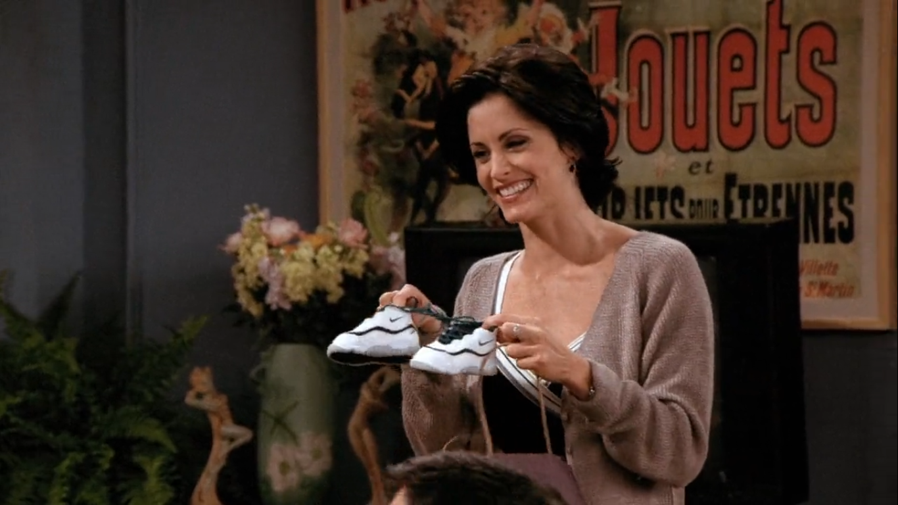
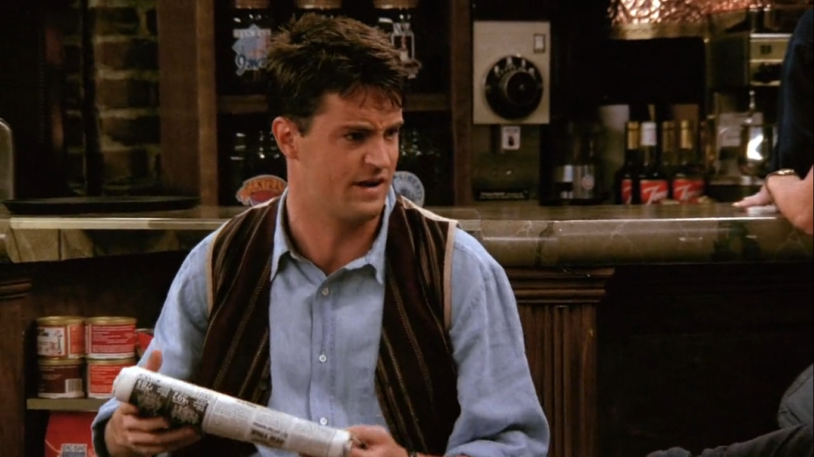
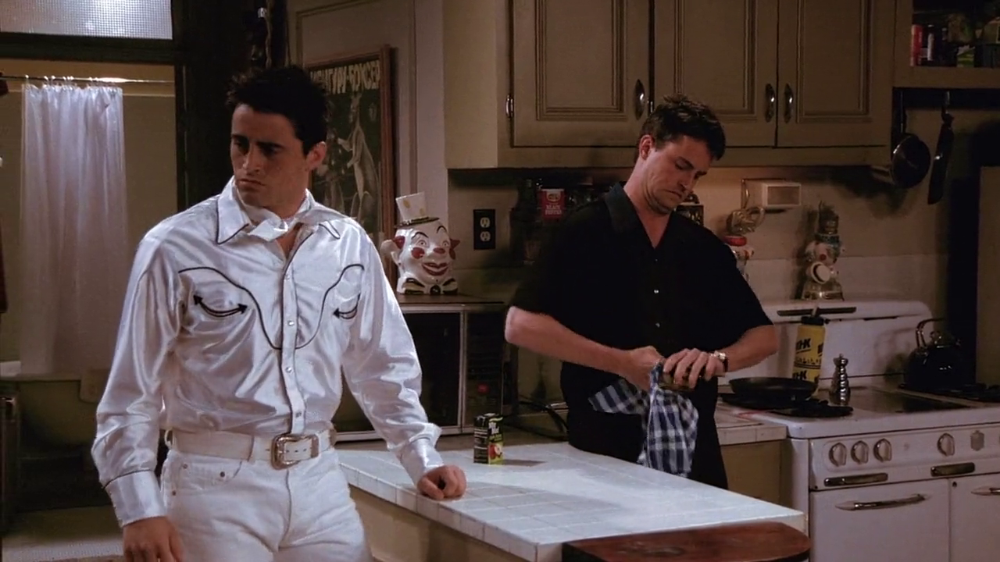
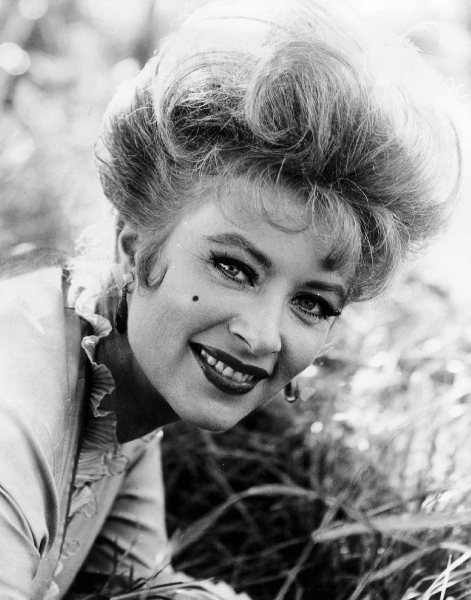

## Just Do It

<cena>
  <phoebe
    original="- Hey, Ben. Just do it!"
    traducao="- Ei, Ben. Just do it!"
  ></phoebe>
</cena>

Monica presenteia Ben com um par de sapatos da *Nike*, marca mundialmente conhecida
por seus materiais esportivos, principalmente calçados. A fala da Phoebe refere-se
ao slogan da marca, que é *Just do It*. Em português, *Apenas faça*.[^nike-website]

[^nike-website]: [Nike - Site oficial](https://www.nike.com/)

## Bloomingdale’s

<cena>
  <chandler
    original="- Come on, you're going to Bloomingdale's with Julie? That's like
    cheating on Rachel in her house of worship."
    traducao="- Vai a Bloomingdale's com Julie? É como trair a Rachel em sua própria casa."
  ></chandler>
</cena>

A fala de Chandler é logo após Mônica aceitar o convite de Julie de ir fazer compras
na *Bloomingdale's*. A traição se dá por ser a loja preferida de sua amiga Rachel.

*Bloomingdale's* é uma das melhores e mais famosas lojas de departamento dos Estados
Unidos, pertencente ao grupo *Macys’s Inc*.[^bloomingdales-website]
Rachel, eventualmente, acaba trabalhando na *Bloomingdale's* no episódio
[S03E11 - Aquele em que Chandler não lembra qual irmã](/temporada/3/episodio/11/).
O grupo *Macys’s Inc* também é dono da *Macy's* citada
no episódio [S01E09 - Aquele em que o Oprimido Escapa](/temporada/1/episodio/9/#macys).

[^bloomingdales-website]: [Bloomingdale's - Site oficial](https://www.bloomingdales.com/)

## Miss Kitty

<cena>
  <chandler
    original="- Now, go see Miss Kitty and she'll fix you up with a nice hooker."
    traducao="- Agora, vá falar com a Srta. Kitty e ela lhe arranjará uma boa prostituta."
  />
</cena>

Joey, em seu emprego de oferecer amostras de perfume, tem um forte concorrente
e chega em casa esgotado. Chandler se diverte fazendo de conta que é um *barman*
num velho *saloon* atendendo a um *cowboy* e menciona *Miss Kitty*, uma personagem
da série *Gunsmoke* (1955-1975), que comandava o bordel *Long Branch Saloon*.[^gunsmoke]

[^gunsmoke]: [Gunsmoke - IMDB](https://www.imdb.com/title/tt0047736/)
