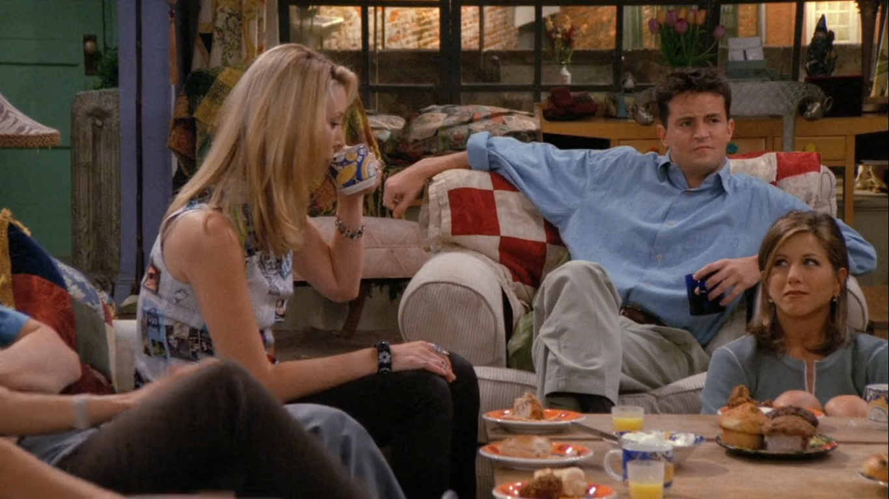

## Isaac Newton

<cena>
  <chandler
    original="- Uh-Oh. It's Isaac Newton, and he's pissed."
    traducao="- Puxa, Isaac Newton chegou e ele ele está bravo."
  ></chandler>
</cena>

Phoebe e Ross estavam discutindo sobre Evolução e Gravidade. Durante o diálogo,
Phoebe disse que não acreditava em ambas as teorias. Nesse momento, alguém bate
na porta e Chandler diz que é *Isaac Newton*, e que ele está bravo.

*Isaac Newton* (1643-1727) foi um cientista, filósofo, físico, matemático,
astrônomo, alquimista e teólogo inglês. Conhecido por descobrir a lei da
gravitação universal. Por isso, Chandler o menciona nesse instante da conversa.

### Referências

- [Wikipédia](https://pt.wikipedia.org/wiki/Isaac_Newton)
