## The Family Circus

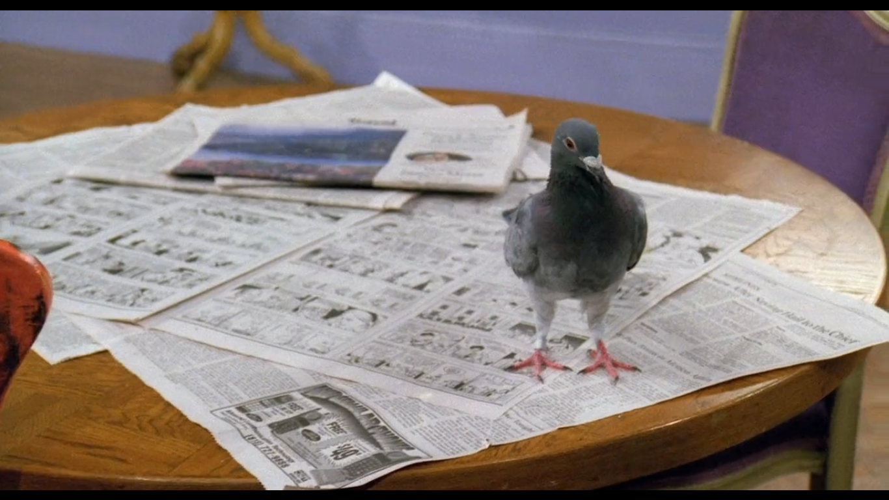

<cena>
  <rachel
    original="- OK, that's fine, read the Family Circus, enjoy the gentle comedy."
    traducao="- Certo, muito bem. Leia os quadrinhos Family Circus, dê bastante risada."
  ></rachel>
</cena>

*The Family Circus* é uma história em quadrinhos lançada em 1960, criada pelo cartunista
*Bil Keane* (1922-2011), e atualmente é escrita, pintada e colorida por seu filho, *Jeff Keane*.

A frase é dita por Rachel quando um pombo entra pela janela do apartamento e pousa
na mesa sobre um jornal, onde está a tirinha de *Family Circus*. Para capturá-lo, ela
pega uma panela e fica conversando com o animal para tentar distrai-lo.

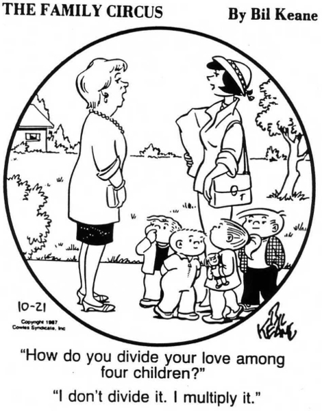

> Tradução:

> "Como você divide seu amor entre seus filhos?"

> "Não se divide. Se multiplica."

### Referências

- [Wikipedia](https://en.wikipedia.org/wiki/The_Family_Circus)

## Narnia

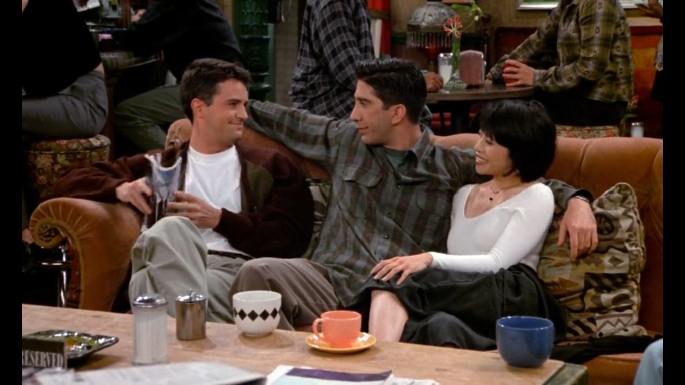

<cena>
  <ross
    original="- So, uh, does it do anything, you know, special?"
    traducao="- Então, o terceiro mamilo faz alguma coisa especial?"
  ></ross>
  <chandler
    original="- Yes Ross, pressing my third nipple opens the delivery entrance to the magical land of Narnia."
    traducao="- Sim, se apertar meu terceiro mamilo, abrem-se as portas de entrada ao mundo Mágico de Narnia."
  ></chandler>
</cena>

A fala de Chandler é uma referência a *The Chronicles of Narnia*, em português, *As
Crônicas de Nárnia*, uma série de sete romances escrita por *C.S. Lewis* entre 1949
e 1954.

- [Wikipedia](https://pt.wikipedia.org/wiki/The_Chronicles_of_Narnia)

## The Garden

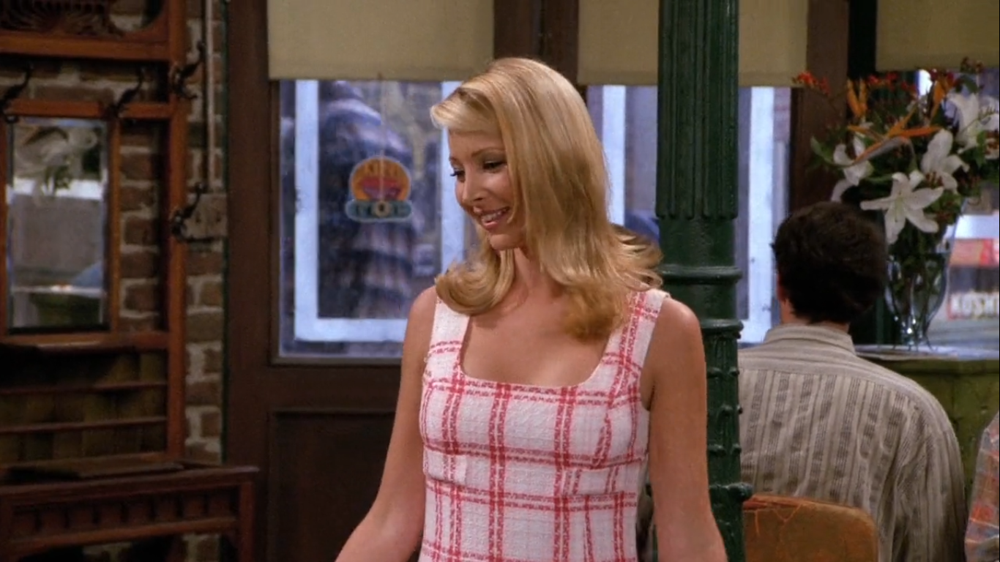

<cena>
  <phoebe
    original="- Um, I'm gonna go meet Duncan, he's skating tonight at the Garden, he's in the Capades."
    traducao="- Vou encontrar Duncan. Ele vai patinar, no Garden. É patinador profissional."
  ></phoebe>
</cena>

*Madison Square Garden* ou *The Garden* é conhecido como a arena mais famosa do mundo.
É sede de muitos shows e eventos esportivos em Nova Iorque.

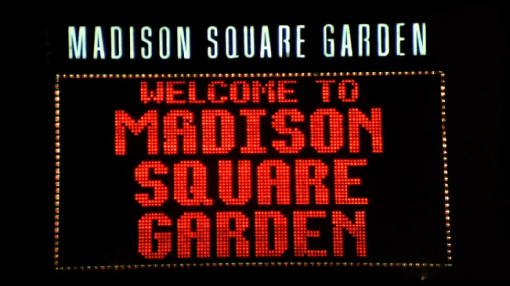

### Referências

- [Site oficial](https://www.msg.com/madison-square-garden)
- [Wikipedia](https://pt.wikipedia.org/wiki/Madison_Square_Garden)

## Snoopy

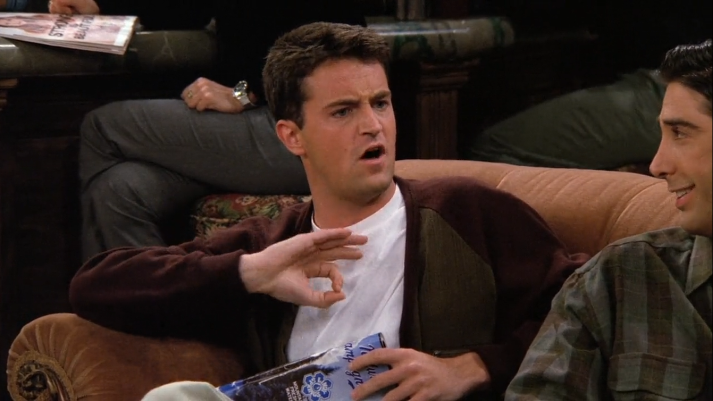

<cena>
  <phoebe
    original="He's in the Capades."
    traducao="É patinador profissional."
  />
  <joey
    original="- The Ice Capades?"
    traducao="- Ele patina no gelo?"
  />
  <chandler
    original="- No, no the gravel capades. Yeah, the turns aren't as fast but when Snoopy falls... funny."
    traducao="- Não, em pedregulhos. As piruetas são mais lentas, mas quando Snoopy cai... é engraçado."
  ></chandler>
</cena>

*Snoopy* é um cãozinho de estimação de *Charlie Brown*, da raça beagle, ambos personagens
da história em quadrinhos *Peanuts* (1950-2000), uma tira de jornal escrita e desenhada
pelo cartunista *Charles Schulz* (1922-2000).

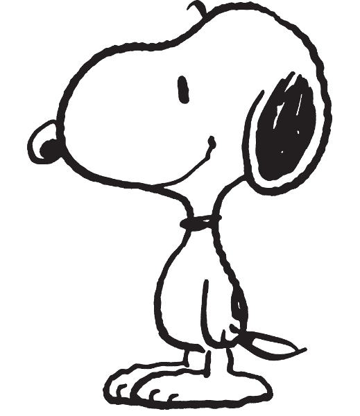

- [Fandom Wiki](https://peanuts.fandom.com/wiki/Snoopy)
- [Wikipedia](https://pt.wikipedia.org/wiki/Snoopy)

## Mr. Rogers

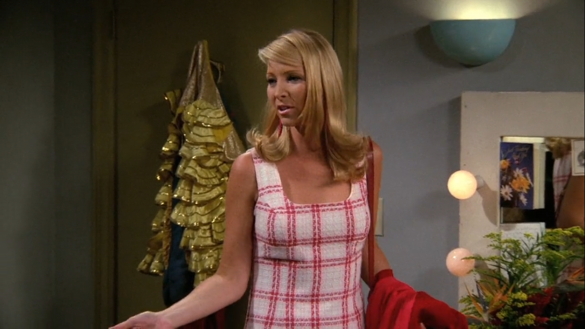

<cena>
  <phoebe
    original="- (...) I remember when you were just, like, King Friday in Mr. Roger's
    Ice is Nice."
    traducao="- (...) Lembro quando fazia o reizinho no show do Sr. Rogers"
  ></phoebe>
</cena>

*Mr. Rogers (Fred Rogers)* (1928-2003) foi o criador, apresentador e animador do
programa televisivo *Mister Rogers' Neighborhood* (1968-2001), uma série infantil
produzida nos Estados Unidos. *King Friday*, o reizinho, era um dos fantoches do
programa, dublado por *Rogers*.

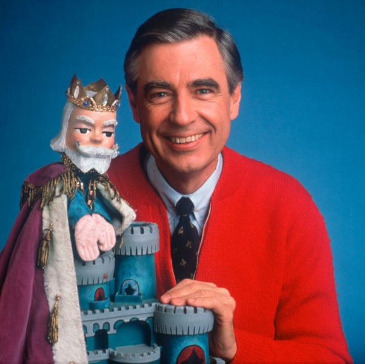

### Referências

- [Wikipedia (Fred Rogers)](https://pt.wikipedia.org/wiki/Fred_Rogers)
- [Wikipedia (Mister Rogers’ Neighborhood)](https://pt.wikipedia.org/wiki/Mister_Rogers%27_Neighborhood)
- [IMDB](https://pt.wikipedia.org/wiki/Mister_Rogers%27_Neighborhood)
- [TV.com](http://www.tv.com/shows/friends/the-one-with-phoebes-husband-372/trivia/item-2744219)

## Nabokov

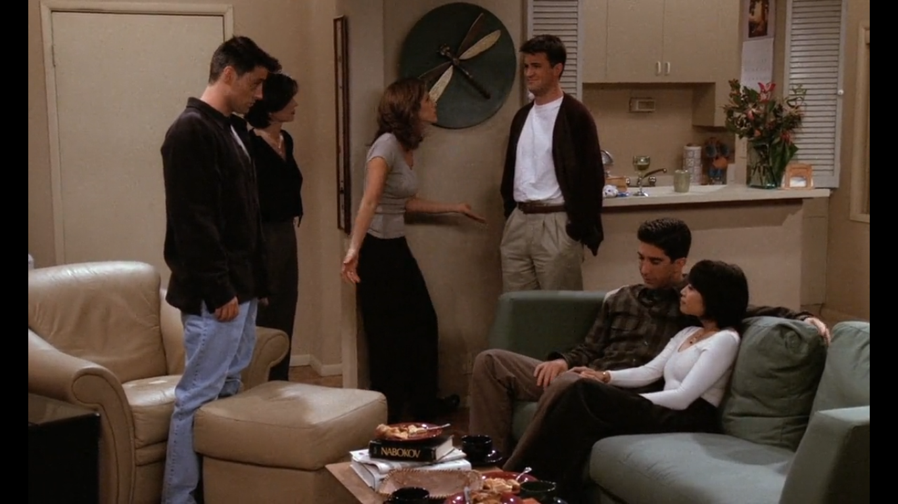

Enquanto amigos estão reunidos no apartamento do Ross, é possível ver sobre a mesa
o livro *Ada, or Ardour: A Family Chronicle*, um romance de *Vladmir Nabovok*,
publicado em 1969.

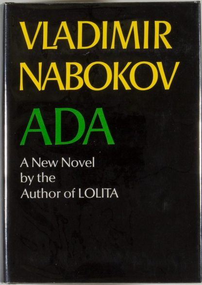

### Referências

- [Wikipedia](https://pt.wikipedia.org/wiki/Ada_or_Ardor:_A_Family_Chronicle)

## Singin' In The Rain

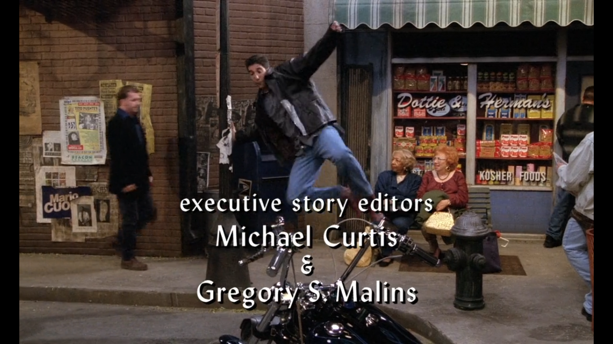

No final do episódio, é possível ouvir *Singin' In The Rain*, uma canção com letra
de *Arthur Freed* e música de *Nacio Herb Brown*, lançada em 1929. A música é conhecida
por ter sido a peça central do filme *Singin' In The Rain* (1952), no Brasil *Cantando na Chuva*.
Ross também faz referência ao filme quando tenta reproduzir a inesquecível cena em
que *Gene Kelly* dança e canta a música enquanto pula entre poças d'água em meio a chuva.

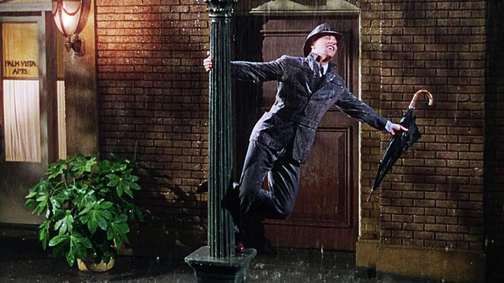

### Referências

- [Wikipedia (canção)](https://pt.wikipedia.org/wiki/Singin%27_in_the_Rain_(can%C3%A7%C3%A3o))
- [Wikipedia (filme)](https://pt.wikipedia.org/wiki/Singin%27_in_the_Rain)
- [IMDB](https://www.imdb.com/title/tt0045152/?ref_=nv_sr_srsg_0)
- [Youtube (cena do filme)](https://www.youtube.com/watch?v=D1ZYhVpdXbQ)
