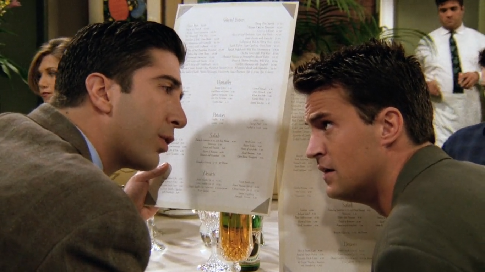
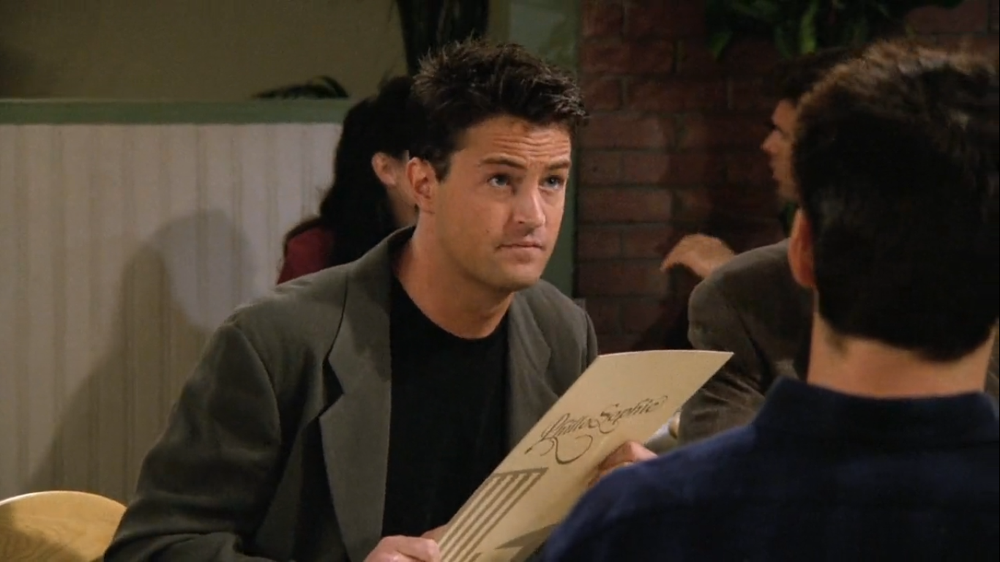
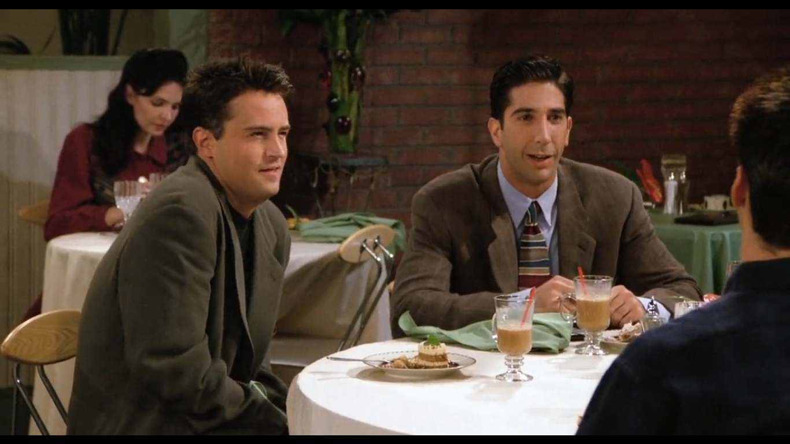

## Mr. Roper

<cena>
   <chandler
    original="- Oh, see, I had to tell her that my number was your number, because I couldn't tell her that my number was my number because she thinks that my number is Bob's number."
    traducao="- Disse que meu telefone era o seu, não pude dizer o meu, porque ela acha que o meu telefone é o de Bob."
  ></chandler>
  <ross
    original="- Hey, tell me again, what do I do when Mr. Roper calls?"
    traducao="- Diga novamente, o que faço quando o Sr. Roper ligar?"
  ></ross>
</cena>

Jade, que estava a procura de seu ex-namorado, Bob, liga pra Chandler por acidente,
número antigo de Bob. Como Chandler queria conhecê-la, fez Jade acreditar que ela
realmente estava entrando em contato com Bob, quando na verdade estava o tempo todo
falando com Chandler. Quando eles se encontram, Chandler passa o número de Ross como
se fosse o seu, para que a garota não descubra a verdade.  Ross o questiona sobre
a mensagem deixada por Jade na sua secretária eletrônica.

Ross faz menção a *Mr. Roper*, personagem da série *Three's Company*. Chandler
explica o caso semelhante à maneira que *Chrissy*, umas das personagens do programa,
explica situações, por isso a piada de Ross. A série foi referenciada em
[S01E02 - Aquele com o Ultrassom no Final](/temporada/1/episodio/2/#threes-company).

### Referências

- [Mr. Stanley Roper - Fandom Wiki](https://threescompany.fandom.com/wiki/Stanley_Roper)
- [Chrissy Snow - Fandom Wiki](https://threescompany.fandom.com/wiki/Chrissy_Snow)

## Killing Me Softly

<cena>
  <chandler
    original="- Yes, how 'bout a verse of Killing Me Softly?"
    traducao="- Sim, que tal o refrão de Killing Me Softtly?"
  ></chandler>
</cena>

*Killing Me Softly with His Song* (1971) é uma canção de *Charles Fox* e *Norman Gimbel*,
que se tornou um grande sucesso em 1973, na voz de *Roberta Flack* . A música ganhou
algumas versões em português, inclusive por *Zezé Di Camargo*, que a gravou em 1986,
com o título *Faz Eu Perder O Juízo*.

Os amigos estão em um restaurante para comemorar a promoção de Monica no trabalho.
Quando Chandler faz o pedido, o garçom, de modo grosseiro, pergunta se ele vai querer
mais alguma coisa, e é quando Chandler diz que vai querer o refrão da música. Decerto,
é mais uma resposta sarcástica para o garçom que estava sendo rude.

### Referências

- [Wikipedia](https://pt.wikipedia.org/wiki/Killing_Me_Softly_with_His_Song)

## Hootie and the Blowfish

<cena>
  <chandler
    original="- No, the thing was, we were gonna go see Hootie and the Blowfish."
    traducao="- A coisa era o show do Hottie and the Blowfish"
  ></chandler>
</cena>

*Hootie and the Blowfish* (1986-atualidade) é uma banda estadunidense de pop-rock,
formada por *Darius Rucker*, *Dean Felber*, *Jim “Soni” Sonefeld* e *Mark Bryan*.

Os amigos estavam planejando irem para o show da banda juntos, como uma surpresa
para o aniversário de Ross.

### Referências

- [Wikipedia](https://pt.wikipedia.org/wiki/Hootie_%26_the_Blowfish)
