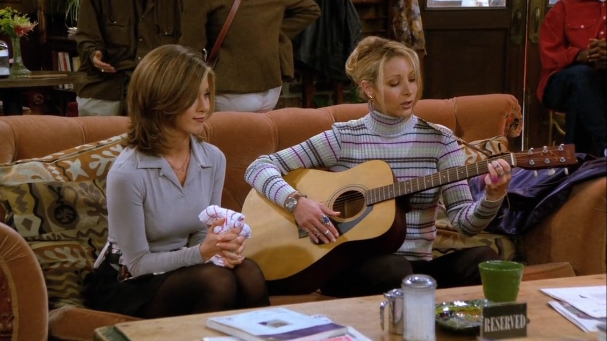
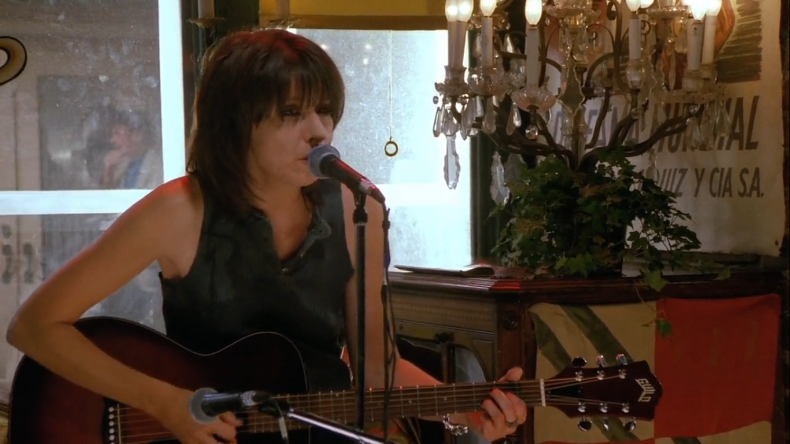
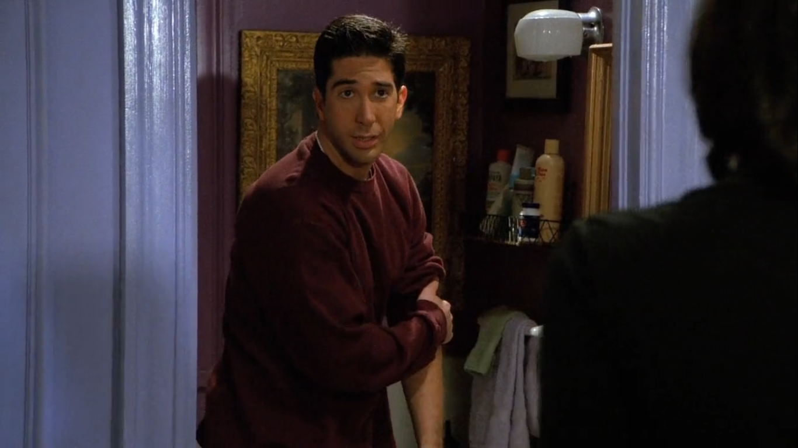
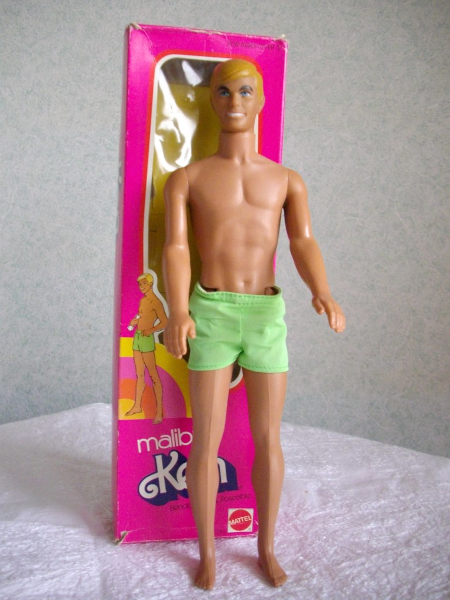

## Tegrin

*Tegrin* é uma marca de *shampoo*. Phoebe cita o produto quando canta para Rachel a música
que compôs enquanto tomava banho.

<musica>
  <letra slot="original">
    WI'm in the shower and I'm writing a song
    Stop me if you've heard it
    My skin is soapy and my hair is wet
    And Tegrin spelled backward is Nirget
  </letra>
  <letra slot="traducao">
    Eu estou no chuveiro e estou escrevendo uma canção
    Me pare se você já a ouviu
    Minha pele está ensaboada e meu cabelo molhado
    E Tegrin soletrado de trás pra frente dá Nirget
  </letra>
</musica>

### Referências

- [Drugs.com](https://www.drugs.com/drp/tegrin-dandruff-shampoo-extra-conditioning.html)

## Angel of Morning

Terry contrata uma cantora profissional para cantar no Central Perk, a música cantada
na cena é *Angel Of Morning*, canção composta por *Chip Taylor* em 1967.

### Referências

- [Wikipedia](https://en.wikipedia.org/wiki/Angel_of_the_Morning)

## Boneco Ken

<cena>
  <ross
    original="- Hey, how 'bout the time I cut the legs off your Malibu Ken?"
    traducao="- E quando cortei as pernas do seu boneco Ken?"
  ></ross>
</cena>

*Ken Carson* é um boneco fabricado pela empresa *Mattel*, conhecido por ser o namorado
da famosa boneca *Barbie*. Além de participar das linhas de brinquedos, o personagem
também aparece em filmes e séries da *Barbie*.

### Referências

- [Wikipedia](https://pt.wikipedia.org/wiki/Ken_(boneco))
