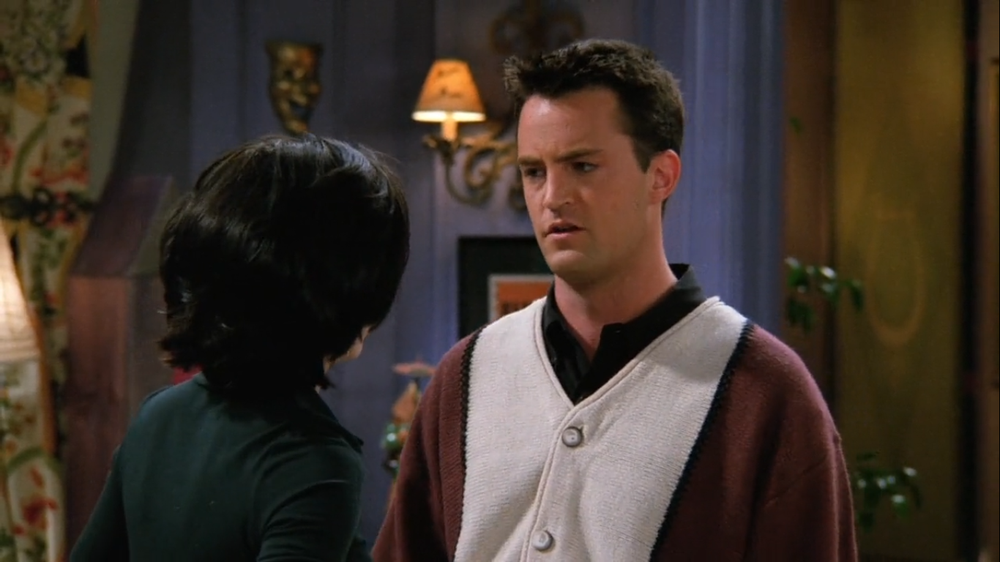

## Spandex

<cena>
  <chandler
    original="- Alright, OK, alright. But if we put on spandex and my boobs are bigger than yours, I'm goin' home."
    traducao="- Mas se tiver que usar spandex e meus peitos ficarem maior que os seus, eu paro."
  ></chandler>
</cena>

*Spandex*, também conhecido pelos brasileiros como licra ou laicra, é uma fibra sintética
conhecida por sua elasticidade, e é bastante utilizada na confecção de calças, maiôs,
sungas, cintas e biquínis. Chandler cita para fazer piada com Monica, que está tentando
o convencer a praticar esportes para emagrecer.

### Referências

- [Wikipedia](https://pt.wikipedia.org/wiki/Elastano)

## Macho Man

Enquanto Monica e Chandler treinam juntos, toca ao fundo a música *Macho Man*, um
grande hit do grupo musical Village People, lançada em 1978.

### Referências

- [Wikipedia](https://pt.wikipedia.org/wiki/Macho_Man_(can%C3%A7%C3%A3o))

