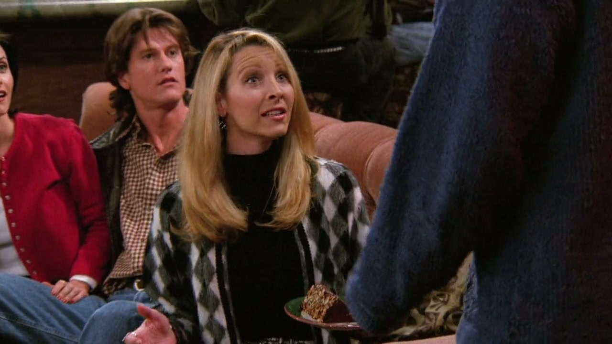
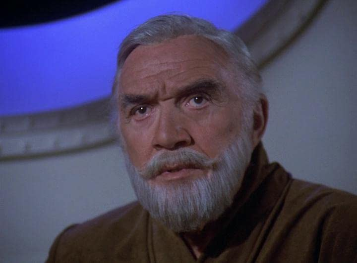
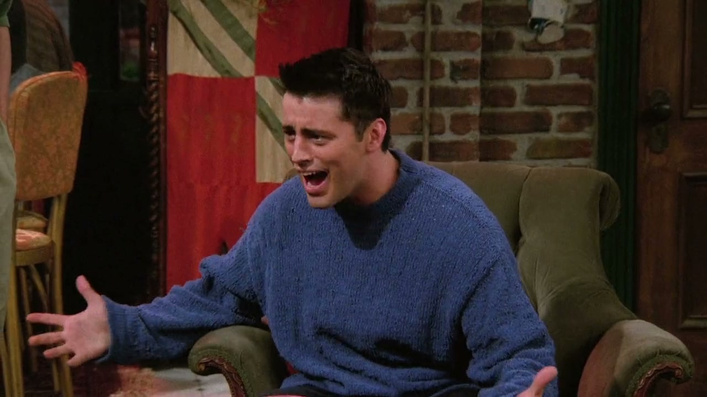
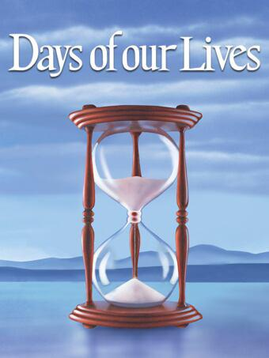
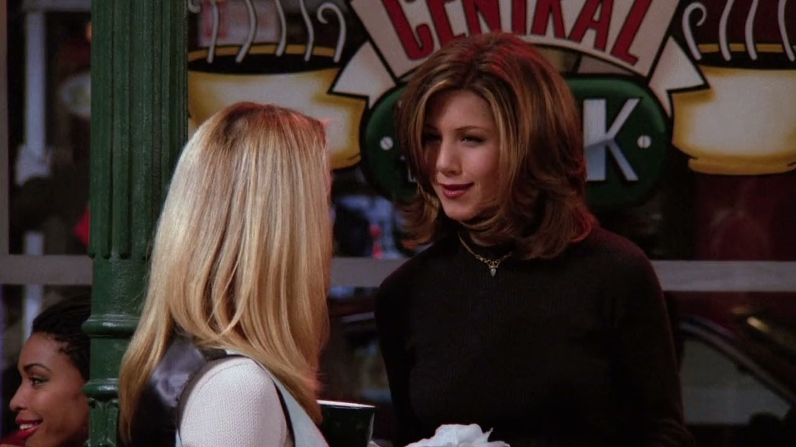
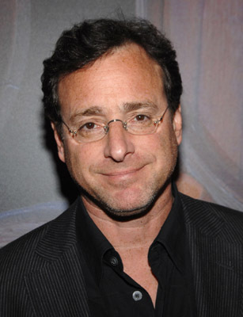

## Lorne Green

<cena>
    <chandler
        original="- Guess who's back in show business?"
        traducao="- Adivinhem quem voltou ao meio artístico?"
    />
    <phoebe
        original="- Ooh, ooh. Lorne Greene?"
        traducao="- Uh, Uh. Lorne Greene?"
    />
    <chandler
        original="- No, Pheebs. You know why? Because he's dead."
        traducao="- Não Pheebs. E sabe por quê? Porque ele já morreu."
    />
    <phoebe
        original="- Oh, no."
        traducao="- Oh, não."
    />
</cena>

Chandler chega com boas notícias sobre Joey, mas Phoebe intervem e menciona
*Lorne Greene* (1915-1987), ator canadense conhecido por seus papéis em séries de
televisão como *Bonanza* (1959-1973) e *Battlestar Galactica* (1978-1979).
Nascido em Ottawa, Canadá, Greene inicialmente trabalhou como locutor de rádio
antes de seguir uma carreira na atuação. Ele atuou em vários papéis no teatro,
no cinema e na televisão durante sua carreira.[^greene]

[^greene]: [Lorne Greene - IMDB](https://www.imdb.com/name/nm0001296)

## Days of Our Lives

<cena>
    <joey
        original="- My agent just called me with an audition for Days of our Lives."
        traducao="- Vou fazer um teste para a novela Days of Our Lives!"
    ></joey>
    <phoebe
        original="- We have to celebrate. We should do a soap opera theme."
        traducao="- Temos que comemorar. Vamos escolher um tema de novela."
    ></phoebe>
    <chandler
        original="- We could all sleep together, and then one of us could get amnesia."
        traducao="- Podemos dormir juntos e um de nós ficar com amnésia!"
    />
</cena>

Joey chega com uma boa notícia, sobre um teste para **Days of Our Lives** (1965-),
uma das novelas mais longas e populares da televisão norte-americana, com mais de 50 anos no
ar. Conhecida por suas tramas intensas, romances apaixonados, reviravoltas inesperadas e
personagens memoráveis, a novela se tornou um ícone da cultura pop.[^days-of-our-lives]

[^days-of-our-lives]: [days-of-our-lives](https://www.imdb.com/title/tt0058796/)

## Bob Saget

<cena>
    <phoebe
        original="- Doesn't Russ just remind you of someone?"
        traducao="- O Russ não lembra alguém?"
    ></phoebe>
    <rachel
        original="- Bob Saget?"
        traducao="- Bob Saget?"
    ></rachel>
    <phoebe
        original="- Oh, yeah. No, no, no."
        traducao="- É mesmo! Não, não, não!"
    ></phoebe>
</cena>

Phoebe tenta abrir os olhos da Rachel em relação as semelhanças de seu novo namorado
com o antigo, e Rachel menciona **Bob Saget** (1956-2022), ator, comediante de stand-up
e apresentador de televisão norte-americano, conhecido por sua versatilidade e humor
único. Ele se destacou por interpretar papéis contrastantes, entre eles o de pai
amoroso e protetor na série de comédia familiar *Full House* (1987-1995)[^full-house] (Três é Demais).[^saget]

[^saget]: [Bob Saget](https://www.imdb.com/name/nm0756114/)
[^full-house]: [Full House](https://www.imdb.com/title/tt0092359/)
