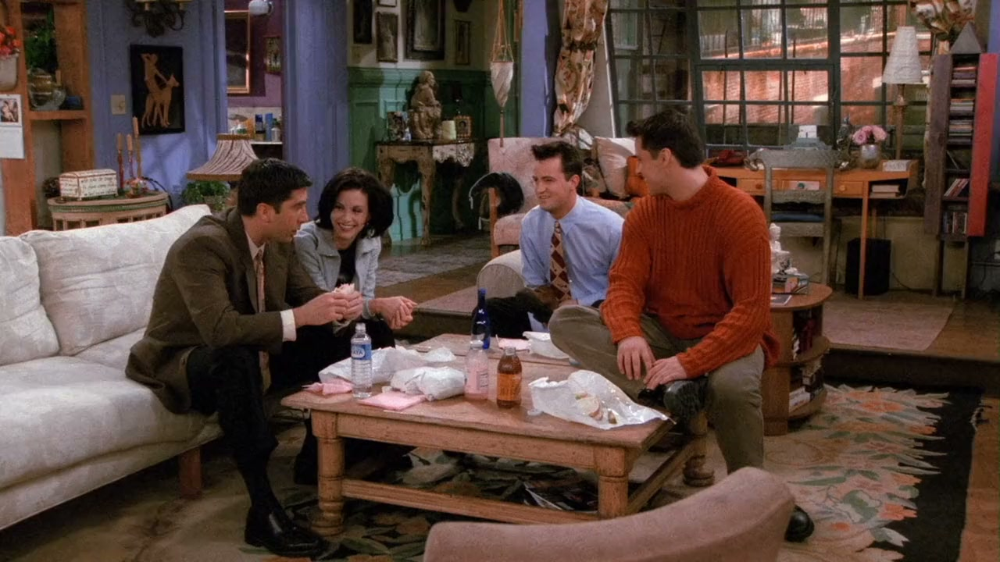
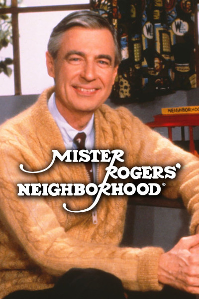

## The bitterest man in the living room

<cena>
    <chandler
        original="- Who's the bitterest man in the living room? The bitterest man in the living room?"
        traducao="- Quem é o cara mais amargo nesta sala? O cara mais amargo nesta sala?"
    />
    <ross
        original="- ..."
        traducao="- ..."
    />
    <chandler
        original="- Hi, neighbor."
        traducao="- Olá vizinho."
    />
</cena>

Mônica é contratada para preparar o bufê do casamento de Carol e Susan. Ross, ainda chateado,
questiona o motivo do casamento. Em seguida, Chandler faz canta uma paródia da música tema do
seriado *Mister Rogers' Neighborhood* (1968-2001), série infantil americana que foi criada e
estrelada por *Fred Rogers* (1928-2003). A série se passa na vizinhança de *Mister Rogers* e
aborda temas como amizade, gentileza, empatia e diversidade. *Mister Rogers* também canta
muitas canções e toca seu violão.[^mister-rogers-neighborhood]

[^mister-rogers-neighborhood]: [Mister Rogers' Neighborhood - IMDB](https://www.imdb.com/title/tt0062588/)
