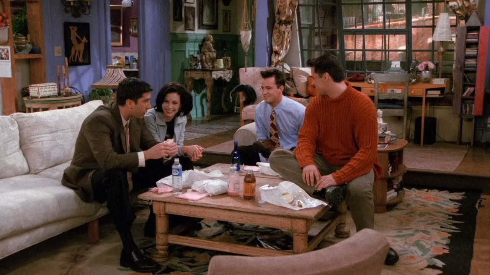
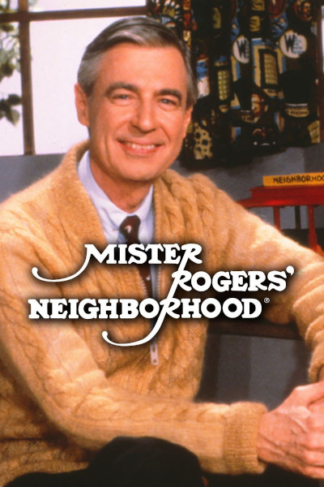
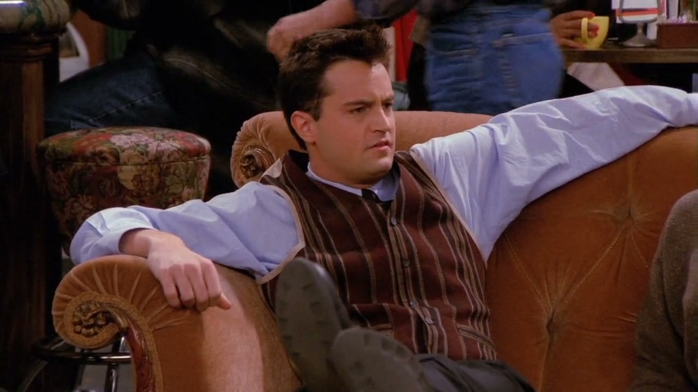
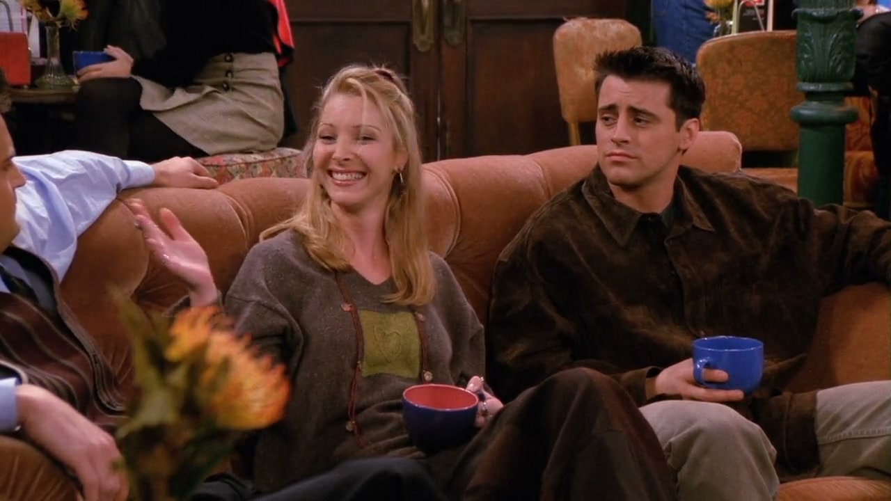
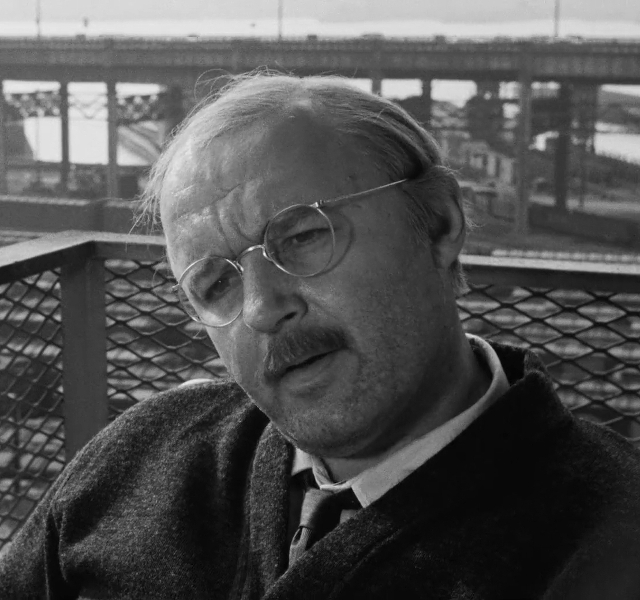
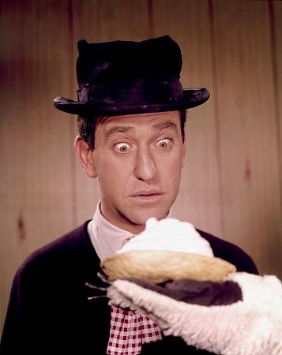

## The bitterest man in the living room

<cena>
    <chandler
        original="- Who's the bitterest man in the living room? The bitterest man in the living room?"
        traducao="- Quem é o cara mais amargo nesta sala? O cara mais amargo nesta sala?"
    />
    <ross
        original="- ..."
        traducao="- ..."
    />
    <chandler
        original="- Hi, neighbor."
        traducao="- Olá vizinho."
    />
</cena>

Mônica é contratada para preparar o bufê do casamento de Carol e Susan. Ross, ainda chateado,
questiona o motivo do casamento. Em seguida, Chandler faz canta uma paródia da música tema do
seriado *Mister Rogers' Neighborhood* (1968-2001), série infantil americana que foi criada e
estrelada por *Fred Rogers* (1928-2003). A série se passa na vizinhança de *Mister Rogers* e
aborda temas como amizade, gentileza, empatia e diversidade. *Mister Rogers* também canta
muitas canções e toca seu violão.[^mister-rogers-neighborhood]

[^mister-rogers-neighborhood]: [Mister Rogers' Neighborhood - IMDB](https://www.imdb.com/title/tt0062588/)

## Silence of the Ducks

<cena>
    <monica
        original="- This is so hard. I can't decide between lamb or duck."
        traducao="- É tão difícil. Não consigo decidir entre cordeiro ou pato."
    />
    <chandler
        original="- Well, lambs are scarier. Or the movie would've been called Silence of the Ducks."
        traducao="- Bem, cordeiros são ''mais inocentes''. Se não o filme seria Silêncio dos Patos."
    />
</cena>

Monica está indecisa sobre o que servir no casamento de Carol e Susan. Chandler, sempre
sarcástico, faz uma sugestão e parodia o filme **Silence of the Lambs** (1991), já citado
em [Aquele com George Stephanopoulus](/temporada/1/episodio/4/).

## Rod Steiger / Soupy Sales

<cena>
    <phoebe
        original="- Talk about crap, just listen to Stella Neidman tell her story about Rod Steiger for the hundredth time."
        traducao="- Falando em droga, ouça Stella Neidman contar a estória dela sobre Rod Steiger pela enésima vez."
    />
</cena>

Possuída pelo espírito da Senhora *Adelman*, Phoebe cita uma iteração com sua amiga *Stella Neidman* falando
sobre *Rod Steiger* (1925-2002), ator norte-americano de grande talento e intensidade, conhecido por suas
interpretações complexas e memoráveis. Alguns de seus papéis mais memoráveis incluem o xerife
*Bill Gillespie* em *In the Heat of the Night* (1967) [No Calor da Noite], que lhe rendeu o Oscar de Melhor
Ator, e o papel-título em *The Pawnbroker* (1964) [O Homem do Prego].[^rod-steiger]

[^rod-steiger]: [Rod Steiger - IMDB](https://www.imdb.com/name/nm0001768/)

<cena>
    <phoebe
        original="- I know who you remind me of. Evelyn Durmer. That's before the lousy face-lift. Now she looks like Soupy Sales."
        traducao="- Sei quem você me lembra. Evelyn Durmer. Antes de ela fazer plástica. Agora ela parece com Soupy Sales."
    />
</cena>

Ainda falando como Senhora *Adelman*, Phoebe compara a mãe da Rachel com 2 figuras. Uma é sua amiga pessoal
*Evelyn Durmer*, outra é *Soupy Sales* (1926-2009), comediante americano icônico, conhecido por seu humor
irreverente e, claro, pelas famosas tortas na cara que se tornaram sua marca registrada. Seu nome verdadeiro
era *Milton Supman*.[^soupy-sales]

[^soupy-sales]: [Soupy Sales - IMDB](https://www.imdb.com/name/nm0758130/)
