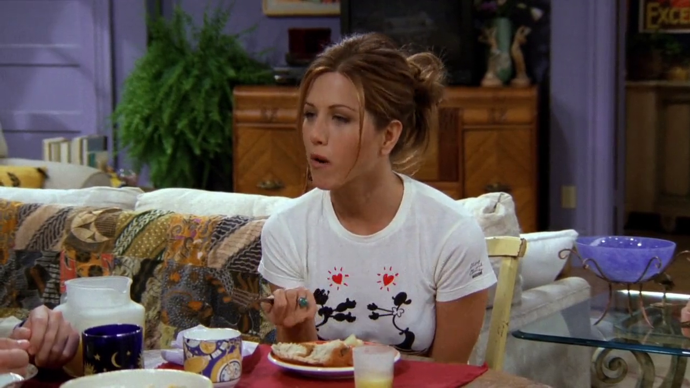
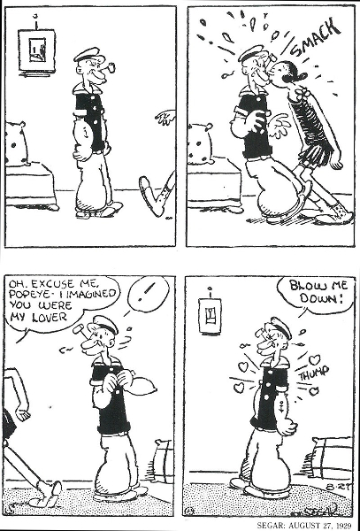
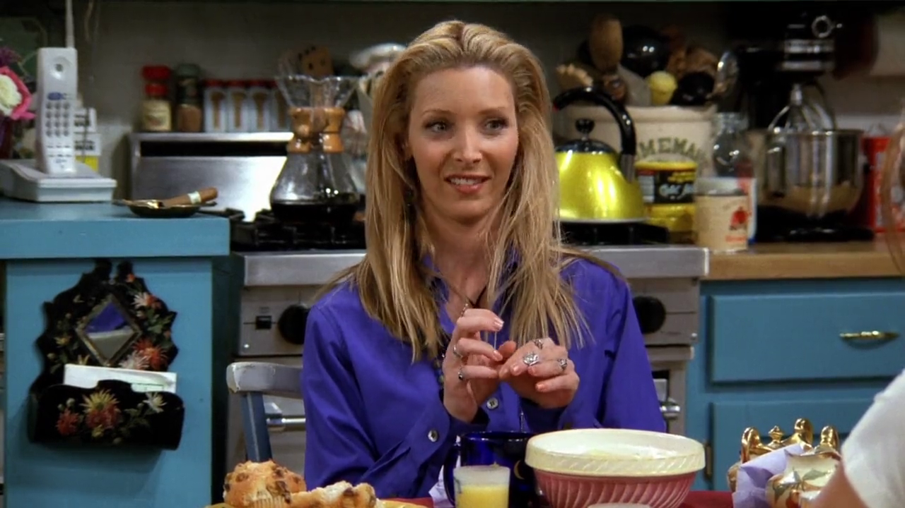

## Tupelo Honey

<cena>
  <ross
    original="- I have to say Tupelo Honey by Van Morrison."
    traducao="- Eu tenho que dizer Tupolo Honey de Van Morrison."
  />
</cena>

Rachel, Phoebe e Ross discutem sobre canções românticas, e Ross refere-se a
canção *Tupelo Honey* de *Van Morrison* (1945-), cantor e compositor Irlandês.
A música que Ross se refere foi lançada em 1971 num álbum homônimo.
*Tupelo* é uma espécie de árvore que cresce na margem de
rios e produz néctar em suas flores.[^morrison-britannica] [^smileyhoney]

[^morrison-britannica]: [Van Morrison - Encyclopædia Britannica](https://www.britannica.com/biography/Van-Morrison)
[^smileyhoney]: [Why is Tupelo Honey so special - Smileyhoney](https://www.smileyhoney.com/blogs/honey-school/best-tupelo-honey)

## The Way We Were

<cena>
  <rachel
    original="- No Way! The most romantic song ever is &quot;The Way We Were&quot;."
    traducao="- Sem chance! A música mais romântica é &quot;The Way We Were&quot;."
  />
</cena>

Rachel menciona que a música que ela considera mais romântica é *The Way We Were*,
lançada em 1975 no álbum homônimo de *Barbra Streisand* (1942-).[^way-we-were]
*Barbra* também estrela um filme de mesmo nome um ano antes. *The Way We Were*,
ou *Nosso Amor de Ontem*, conta a história de duas pessoas diferentes, que têm um
romance maravilhoso, mas suas opiniões e convicções políticas as separam.[^way-we-were-imdb]

[^way-we-were]: [The Way We Were por Barbra Streisand - Site oficial](https://www.barbrastreisand.com/music/way-we-were/)
[^way-we-were-imdb]: [The Way We Were - IMDB](https://www.imdb.com/title/tt0070903/)

## Popeye and Olive Oyl

A cena anterior também mostra uma referência aos personagens *Popeye* e *Olive Oyl*
(*Olívia Palito* no Brasil) na camiseta da Rachel, criações do cartunista
e escritor *Elzie Crisler Segar* (1894-1938). *Olívia* estreou em 1919 numa tira
do jornal *New York Journal*. Já *Popeye* faz sua primeira aparição em 1929.[^popeye-olive]

[^popeye-olive]: [Popeye - Site oficial](http://popeye.com/timeline/)

## Young Tony Danza

<cena>
  <phoebe
    original="- I think the one that Elton John wrote for that guy on &quot;Who's the Boss?&quot;."
    traducao="- Eu acho aquela que Elton John escreveu para o cara do &quot;Who’s The Boss?&quot;"
  />
  <rachel
    original="- What song was that, Pheebs?"
    traducao="- Que música é essa Pheebs?"
  />
  <phoebe
    original="- Hold me close, young Tony Danza..."
    traducao="- Hold me close, young Tony Danza..."
  />
</cena>

Aqui a Pheebs realmente confundiu tudo. A série *Who's the Boss?* (1984-1992) [^whos-the-boss]
é estrelada pelo ator americano *Tony Danza* (1951-). E a música de *Elton John*
(1947-) que ela se refere é *Tiny Dancer* do álbum *Madman Across The Water* (1971).
A confusão, provavelmente, vem do sotaque inglês do cantor.[^elton-britannica]

[^elton-britannica]: [Elton John - Encyclopædia Britannica](https://www.britannica.com/biography/Elton-John)
[^whos-the-boss]: [Who's the Boss? - CTV (Inglês)](https://www.ctv.ca/shows/whos-the-boss)
