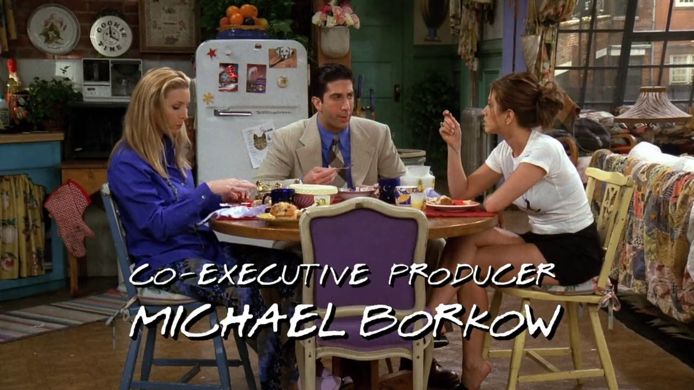

## Tupelo Honey

<cena>
  <ross
    original="- I have to say Tupelo Honey by Van Morrison."
    traducao="- Eu tenho que dizer Tupolo Honey de Van Morrison."
  />
</cena>

Rachel, Phoebe e Ross discutem sobre canções românticas, e Ross refere-se a
canção *Tupelo Honey* de *Van Morrison* (1945-), cantor e compositor Irlandês.
A música que Ross se refere foi lançada em 1971 num álbum homônimo.
*Tupelo* é uma espécie de árvore que cresce na margem de
rios e produz néctar em suas flores.[^morrison-britannica] [^smileyhoney]

[^morrison-britannica]: [Van Morrison - Encyclopædia Britannica](https://www.britannica.com/biography/Van-Morrison)
[^smileyhoney]: [Why is Tupelo Honey so special - Smileyhoney](https://www.smileyhoney.com/blogs/honey-school/best-tupelo-honey)
