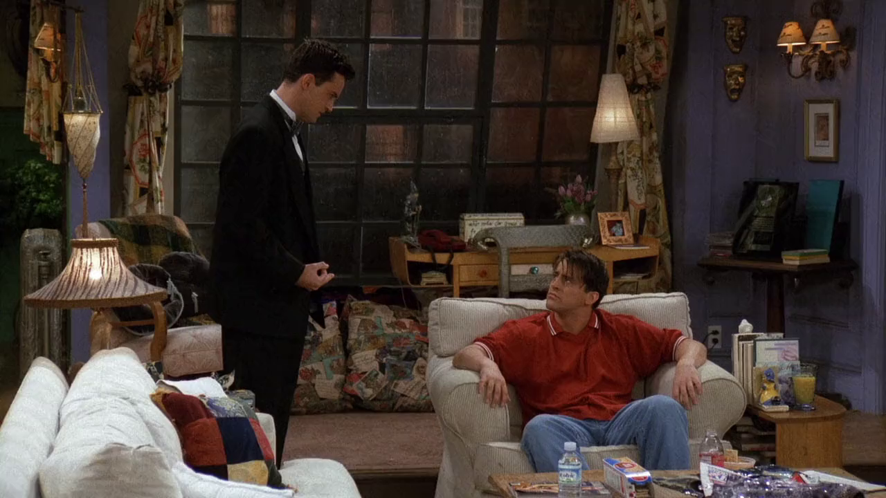

## A.A. Milne

<cena>
  <chandler
    original="- So in the words of A.A. Milne, &quot;Get out of my chair, dill-hole.&quot;"
    traducao="- Nas palavras de A.A. Milne, &quot;Saia da minha cadeira, sua anta!&quot;"
  />
</cena>

Chandler tenta desesperadamente recuperar seu lugar na poltrona que estava antes de
ir se arrumar. Ele cita o autor inglês *A.A. Milne* ou *Alan Alexander Milne* (1882-1956),
conhecido principalmente pela criação de histórias com o personagem *Winnie-the-Pooh*,
ou *Ursinho Puff* na versão brasileira. [^milne-britannica] O termo *dill-hole*, provavelmente, vem
da série de TV animada *Beavis and Butt-Head* &#8212; a qual os rapazes são fãs &#8212;,
e é usado como um eufemismo para um palavrão. *Beavis and Butt-Head* é citado no episódio
[S02E15 - Aquele quando o Ross e a Rachel... sabe como é](/temporada/2/episodio/15/).

[^milne-britannica]: [A.A. Milne - Encyclopædia Britannica](https://www.britannica.com/biography/A-A-Milne)
