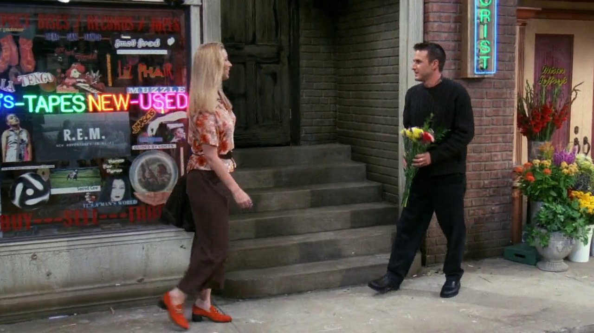
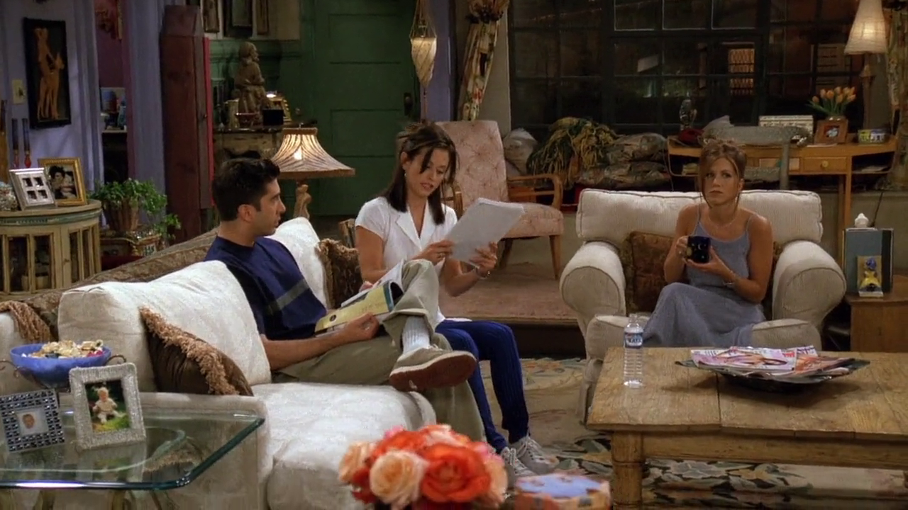
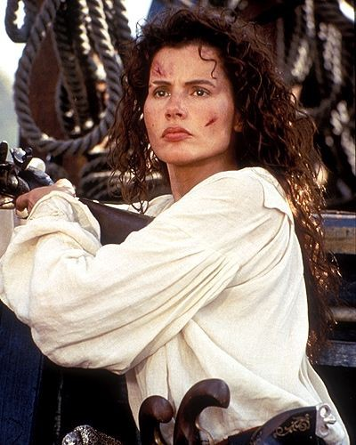

## Macworld

Enquanto escuta um barulho estranho vindo do quarto de Joey - que depois viríamos
a saber que era ele pulando na cama -, Chandler pode ser visto lendo um livro, e
logo a sua frente há uma cópia da revista *Macworld* (1984-2014), revista especializada
em produtos da *Apple*, publicada em Fevereiro de 96.[^macworld] [^macworld-first-issue]
Atualmente as publicações continuam em formato *online*.[^macworld-usatoday]

[^macworld]: [Vintage Macworld Magazine Library (Inglês)](https://vintageapple.org/macworld/)
[^macworld-first-issue]: [Cover story: Steve Jobs and the first issue of Macworld (Inglês)](https://www.macworld.com/article/222770/cover-story-steve-jobs-and-the-first-issue-of-macworld.html)
[^macworld-usatoday]: [Macworld shuts down print product, lays off staff (Inglês)](https://www.usatoday.com/story/money/business/2014/09/10/macworld-ends-magazine/15400981/)

## One Hot Minute

Enquanto Phoebe confronta Malcom por estar a seguindo por uma semana, podemos ver
uma loja de discos. Entre as capas da vitrine está o disco *One Hot Minute* (1995)
da banda estadunidense *Red Hot Chili Peppers*.[^one-hot-minute]

Também é possível ver um poster da banda *R.E.M.*, que teve uma de suas
músicas, *Shiny Happy People* (1991), considerada para ser o tema da série.

[^one-hot-minute]: [One Hot Minute - Website (Inglês)](https://redhotchilipeppers.com/audio/4755/)

## Geena Davis

<cena>
  <monica
    original="- He's 6'2&quot;, 170 pounds. And he describes himself as a male Geena Davis."
    traducao="- Tem 1,88m, 77kg. E diz que é uma versão masculina de Geena Davis."
  />
  <chandler
    original="- You mean there's more than one of us?"
    traducao="- Então, existe outro?"
  />
</cena>

Monica está decidida a ter um filho, mesmo tendo que ser através de um doador de
esperma. Ela lê a descrição do doador, que se diz uma versão masculina
de *Geena Davis* (1956-), atriz americana conhecida por papéis em comédias. Estreou
no cinema no filme *Tootsie* (1982) no papel de *April*. Seu papel mais recente,
até a data do episódio, foi a pirata *Morgan Adams* no filme *Cutthroat Island* (1995),
ou *A Ilha da Garganta Cortada* em português.[^davis]

[^davis]: [Geena Davis - Encyclopædia Britannica (Inglês)](https://www.britannica.com/biography/Geena-Davis)
