## Sergio Valente

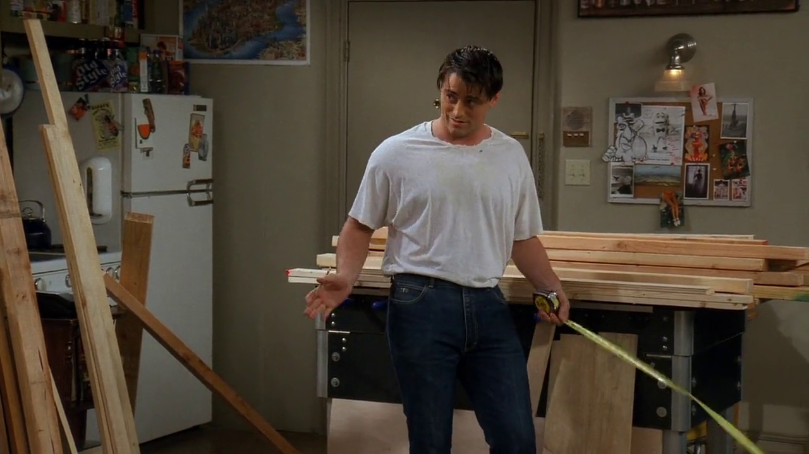

<cena>
  <chandler
    original="- My word, those are snug."
    traducao="- Minha nossa, que calças confortáveis."
  />
  <joey
    original="- Oh, yeah. These are my old work pants. Sergio Valente."
    traducao="- É. São minhas velhas calças de trabalho. Sergio Valente."
  />
</cena>

*Sergio Valente* (C. 1980) é uma conhecida marca de roupas, originalmente de calças *jeans*.
A marca foi criada por *Eli Kaplan*, presidente da *Englishtown Sportswear Ltd.* (1975),
na época.[^valente]

Em outro momento, Monica admira-se com as calças e também faz uma referência:

<cena>
  <monica
    original="- Hey. Where you heading in those pants? 1982?"
    traducao="- Ei. Aonde vai com essas calças? 1982?"
  />
</cena>

[^valente]: [ENGLISHTOWN SPORTSWEAR LTD. Trademarks (Inglês)](https://trademarks.justia.com/owners/englishtown-sportswear-ltd-160470/)

## David Copperfield

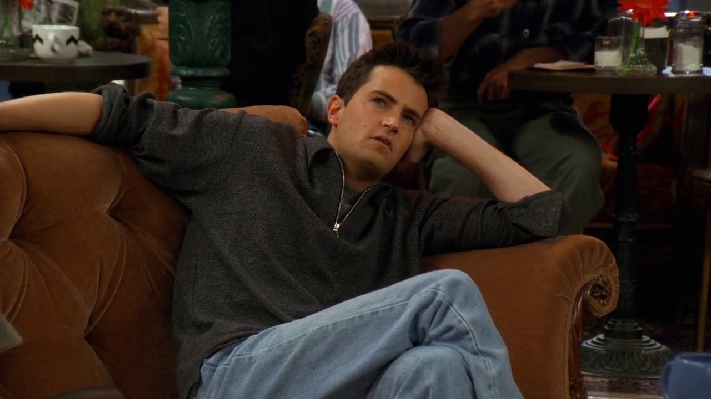

<cena>
  <chandler
    original="- Does anyone else think David Copperfield's cute?"
    traducao="- Alguém mais acha David Copperfield bonito?"
  />
  <monica
    original="- No, but he told me he thinks you're a fox."
    traducao="- Não, mas ele me disse que te acha uma graça."
  />
</cena>

Chandler revela que Janice criou uma lista de celebridades com as quais ela
poderiar dormir junto sem que ele ficasse bravo, que é conhecida como *freebie list*.
Entre as celebridades escolhidas por Janice está *David Copperfield* (1956-),
considerado um dos melhores ilusionistas do final do século 20 e início do
século 21.[^copperfield]

[^copperfield]: [David Copperfield - Encyclopædia Britannica (Inglês)](https://www.britannica.com/biography/David-Copperfield-American-entertainer)

## Chandler's Freebie List

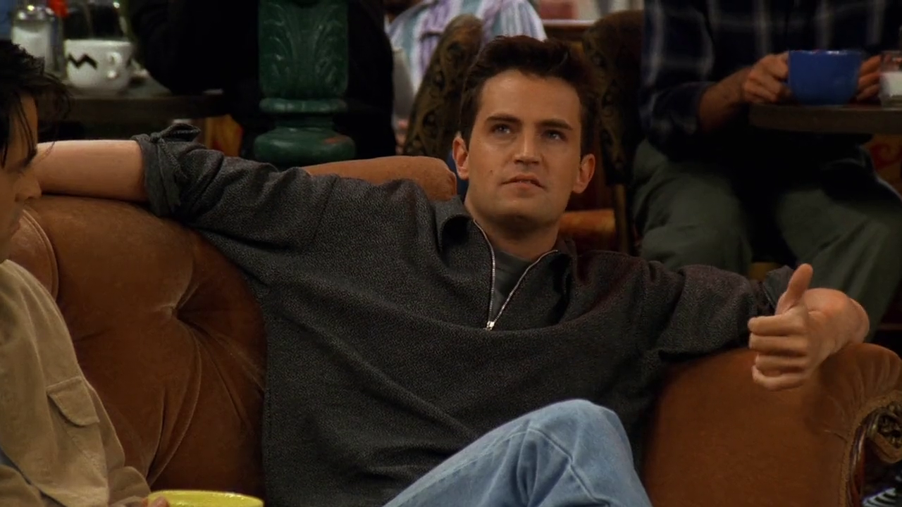

Monica se interessa e pergunta a Chandler sobre sua lista, que tem:

1. *Kim Basinger* (1953-), atriz e modelo americana. Teve sua carreira alavancada no
papel de *Vicki Vale* no *blockbuster Batman* (1989).[^basinger]
1. *Cindy Crawford* (1966-), atriz e modelo americana, que ganhou fama nos anos 80 e
estava entra as primeiras supermodelos. Sua estréia no cinema foi no papel de
*Kate McQuean* no filme *Fair Game* (1995), *Atração Explosiva* como ficou conhecido
no Brasil.[^crawford]
1. *Halle Berry* (1966-), atriz americana que iniciou sua carreira em concursos de beleza.
Sua primeira aparição na tela grande foi no filme *Jungle Fever* (1991).[^berry]
1. *Yasmine Bleeth* (1968-), atriz americana, que tem um lugar especial no coração de Chandler,
por estrelar a série favorita dele, *Baywatch* (1993-1997), no papel de *Caroline Holden*.
A série foi exibida no Brasil com o nome *S.O.S. Malibu*.[^bleeth]
1. *Jessica Rabbit*, na verdade uma personagem de desenho animada criada por
*Robert Zemeckis* (1951-). Apareceu pela primeira vez no filme *Who Framed Roger Rabbit* (1988),
filme que mistura desenho com personagens reais, conhecido como *Uma Cilada para Roger Rabbit*.[^rabbit]

[^basinger]: [Kim Basinger - IMDB](https://www.imdb.com/name/nm0000107/)
[^crawford]: [Cindy Crawford - Encyclopædia Britannica](https://www.britannica.com/biography/Cindy-Crawford)
[^berry]: [Halle Berry - Encyclopædia Britannica](https://www.britannica.com/biography/Halle-Berry)
[^bleeth]: [Yasmine Bleeth - IMDB](https://www.imdb.com/name/nm0000109/)
[^rabbit]: [Who Framed Roger Rabbit - IMDB](https://www.imdb.com/title/tt0096438/)

## Rachels's freebie list

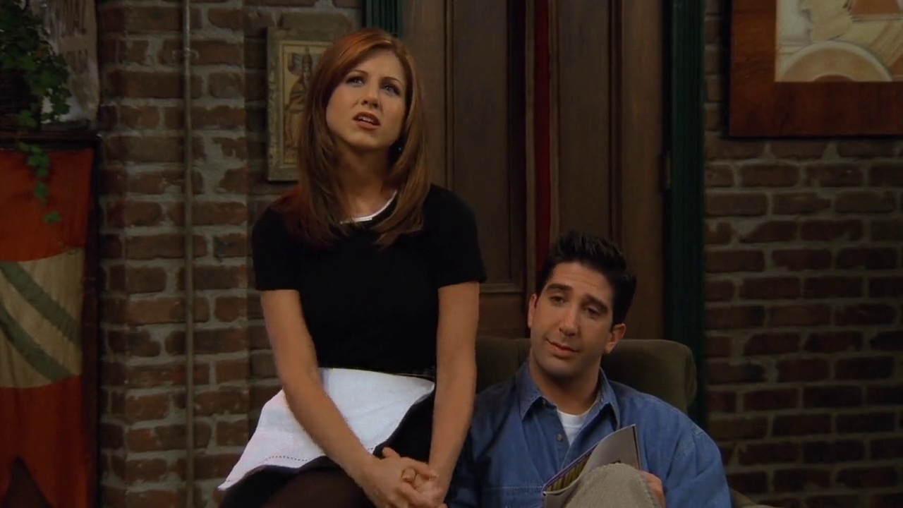

Após resposta negativa da parte da Monica, Joey se interessa na lista da Rachel, que tem:

1. *Chris O'Donnell* (1970-), ator, produtor e diretor norte-americano. Fez sua estréia no
filme *Men Don't Leave* (1990), ou *Mulher Até o Fim* em português.[^odonnell]
1. *John F. Kennedy Jr.* (1960-1999), advogado, jornalista e editor norte-americano.
Nasceu 17 dias antes de seu pai &#8212; *John F. Kennedy* (1917-1963) &#8212;
se tornar o 35&deg; presidente dos EUA.[^kennedy] Rachel não estava só nessa, já que ele foi
eleito homem mais sexy do mundo pela revista *People* em 1988[^kennedy-people]. Faleceu em
um acidente aéreo aos 38 anos.
1. *Daniel Day-Lewis* (1957-), ator britânico conhecido por sua intensidade em cena e exaustiva
preparação para seus papéis. Ganhou fama internacional em sua performance em
*The Unbearable Lightness of Being* (1988), filme já citado
em [S01E18 - Aquele com o Pôquer](/temporada/1/episodio/18/#the-unbearable-lightness-of-being).
1. *Sting* (1951-), vocalista e baixista da banda *The Police*, também já citado no episódio
[S01E13 - Aquele dos Seios](http://localhost:8080/temporada/1/episodio/13/#sting).
1. *Parker Stevenson* (1952-), ator americano mais conhecido por interpretar *Frank Hardy*
na série de TV *The Hardy Boys* (1977-1979).[^stevenson] Daí vem a confusão de nomes da cena
seguinte:

<cena>
  <rachel
    original="- ... and Parker Stevenson."
    traducao="- ... e Parker Stevenson."
  />
  <ross
    original="- Spider-man?"
    traducao="- O Homem-aranha?"
  />
  <rachel
    original="- Hardy Boy."
    traducao="- Hardy Boy."
  />
  <chandler
    original="- Peter Parker."
    traducao="- Peter Parker."
  />
  <ross
    original="- Thank you."
    traducao="- Valeu."
  />
</cena>

Ross confunde *Parker Stevenson* com *Peter Parker*, ou seja, o *Homem-aranha*. Pensou
ele que fosse algo semelhante à lista de Chandler, que tinha *Jessica Rabbit*.

[^odonnell]: [Chris O'Donnell - IMDB](https://www.imdb.com/name/nm0000563/)
[^kennedy]: [John F. Kennedy Jr. - IMDB](https://www.imdb.com/name/nm0447882/)
[^kennedy-people]: [PEOPLE Named JFK Jr. the Sexiest Man Alive in 1988: Read the Cover Story (Inglês)](https://people.com/archive/cover-story-the-sexiest-kennedy-vol-30-no-11/)
[^day-lewis]: [Daniel Day-Lewis - Encyclopædia Britannica](https://www.britannica.com/biography/Daniel-Day-Lewis)
[^stevenson]: [Parker Stevenson - IMDB](https://www.imdb.com/name/nm0829017/)

## One Hundred Years of Solitude

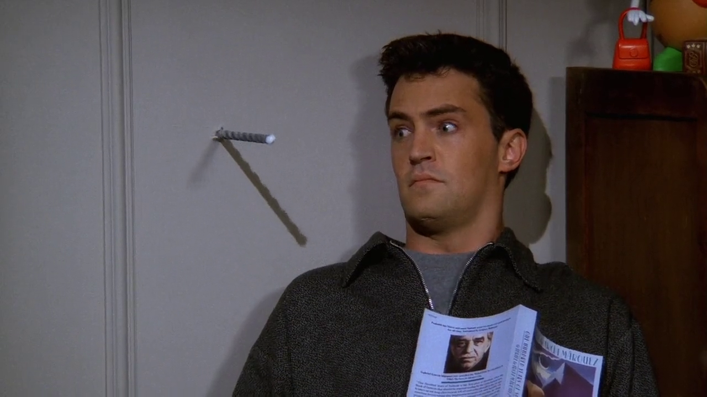

Joey, enquanto estava trabalhando no novo móvel da sala, quase acerta a furadeira
em Chandler, que estava em seu quarto dormindo após ler *One Hundred Years of Solitude*
(1967), romance de *Gabriel García Márquez* (1927-2014). Esse foi um dos livros
responsáveis por dar ao autor o prêmio Nobel em Literatura em 1982.[^solitude]

[^solitude]: [One Hundred Years of Solitude - Encyclopædia Britannica](https://www.britannica.com/topic/One-Hundred-Years-of-Solitude)

## Motörhead

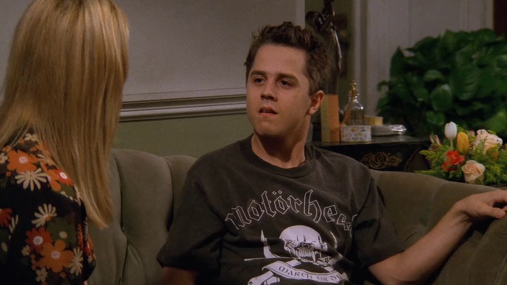

Phoebe tenta se conectar com seu meio irmão, Frank Jr., que veste uma camiseta do
*Motörhead* (1975), banda criada por *Lemmy Kilmister*, precursora do *Speed Metal*
e *Thrash Metal*. A camisa de Frank representa a capa do álbum *March ör Die*
(1992).[^motorhead]

[^motorhead]: [Motörhead - All Music (Inglês)](https://www.allmusic.com/artist/mot%C3%B6rhead-mn0000501407/biography)

## Albert Einstein

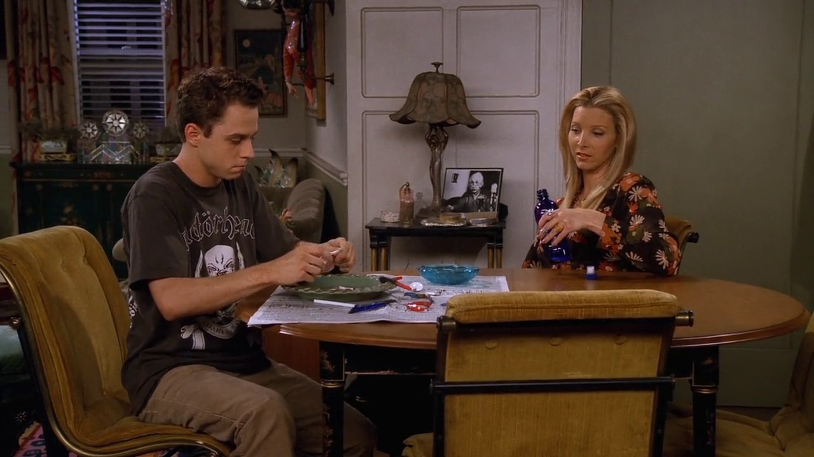

Enquanto Frank Jr. demonstra seu gosto por &#8212; literalmente &#8212; derreter coisas,
podemos ver que Phoebe ainda não percebeu que seu avô é na verdade *Albert Einstein*
(1879-1955). Esse é uma piada recorrente desde o episódio
[S02E09 - Aquele com o pai da Phoebe](/temporada/2/episodio/9).

## Cinderelly

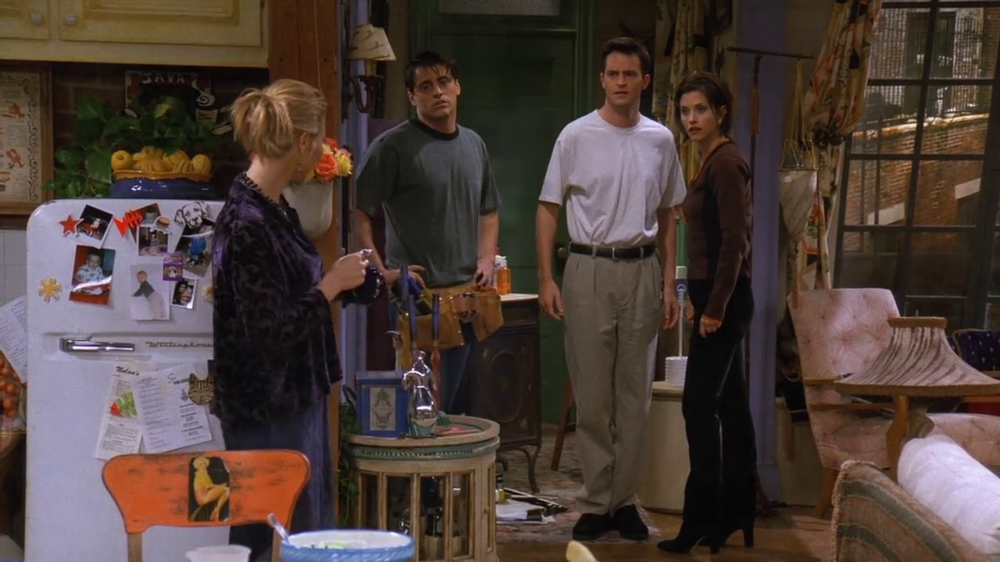

<cena>
  <chandler
    original="- Yo, spackle boy. Get up."
    traducao="- Ei, garoto da massa corrida. Levanta."
  />
  <monica
    original="- Ah-ah. You started this, you will finish it."
    traducao="- Ah-ah. Começou, vai terminar!"
  />
  <chandler
    original="- He started mine first."
    traducao="- Ele começou o meu antes!"
  />
  <phoebe
    original="- Build the unit, Cinderelly. Lay the tile, Cinderelly."
    traducao="- Faça o móvel, Cinderela. Ponha o piso, Cinderela."
  />
</cena>

Joey sugere que Monica troque o piso do banheiro, mas acaba tendo que fazer o
serviço. Enquanto isso Chandler exige que ele acabe o móvel da sala. Nessa
briga Phoebe faz uma referância a canção *Work Song* da animação da
*Disney Cinderella* (1950).[^cinderella] Segue um trecho da letra original que
se assemelha ao cantado por Phoebe:

<musica>
  <letra slot="original">
    Cinderelly, Cinderelly
    Night and day it's Cinderelly
    Make the fire, fix the breakfast
    Wash the dishes, do the mopping
  </letra>
  <letra slot="traducao">
    Cinderela, Cinderela
    Noite e dia Cinderela
    Acenda a lareira, faça o café-da-manhã
    Lave a louça, limpe a casa
  </letra>
</musica>

[^cinderella]: [Cinderella - IMDB](https://www.imdb.com/title/tt0042332/)

## Anthrax

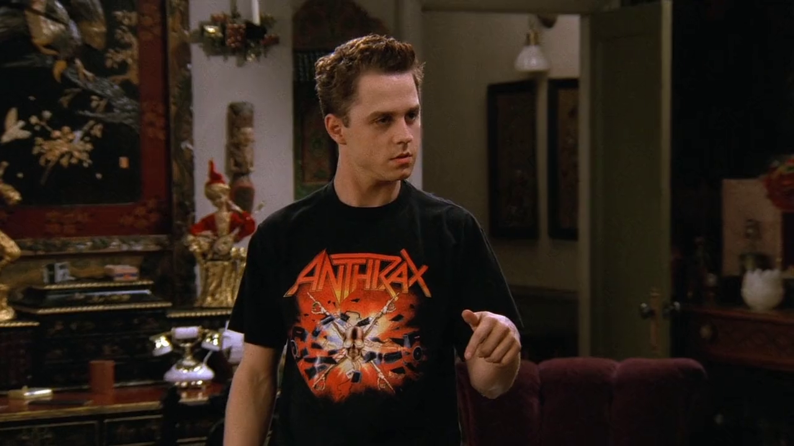

Demonstrando mais uma vez seu gosto por *Heavy Metal*, vemos o Frank Jr. vestindo
uma camiseta da banda *Anthrax* (1981), que em 2021 comemora 40 anos de carreira.
A arte da camiseta foi criada para o *tour* de divulgação do quinto álbum da banda,
*Persistence of Time* (1990).[^anthrax]

[^anthrax]: [Anthrax - All Music (Inglês)](https://www.allmusic.com/artist/anthrax-mn0000490952/biography)

## Ross' Freebie List

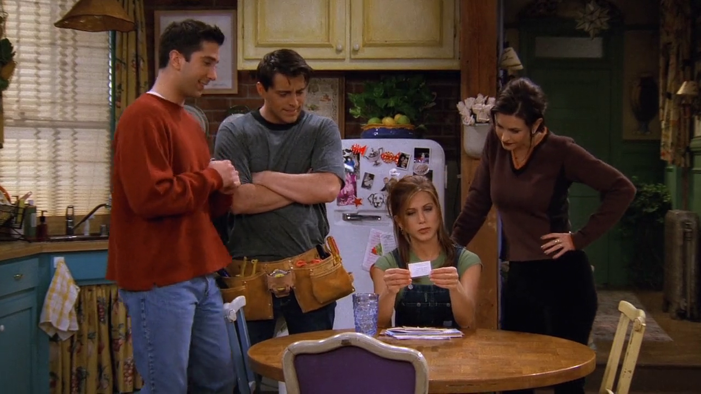

Rachel revela a lista (impressa e laminada) de Ross que tem:

1. *Uma Thurman* (1970-), atriz nascida em *Boston, Massachusetts*.
Sua carreira deslanchou ao participar dos filmes *The Adventures of Baron Munchausen* (1988) e
*Dangerous Liaisons* (1988), ou *As Aventuras do Barão Munchausen* e *Ligações Perigosas*, respectivamente.[^thurman]
1. *Winona Ryder* (1971-), atriz americana nascida na cidade de *Olmsted County, Minnesota*.
Seu primeiro filme foi *Lucas* (1986), no Brasil *A Inocência do Primeiro Amor*. Ela inclusive
protagonizou o filme *Little Women* (1994), filme baseado no livro homônimo, o qual Rachel
sugere que Joey leia no episódio
[S03E13 - Aquele em que Monica e Richard são só amigos](/temporada/3/episodio/13/).[^ryder]
1. *Elizabeth Hurley* (1965-), atriz inglesa nascida em *Basingstoke, Hampshire*. Fez sua estréia no
cinema participando do filme *Aria* (1987).[^hurley]

<cena>
  <chandler
    original="- Ooh, very attractive. Forgiving."
    traducao="- Uh, muito atraente. Sabe perdoar."
  />
</cena>

Antes de preencher toda a lista, Ross já havia mencionado *Elizabeth Hurley*, e Chandler dá a resposta
acima, que é uma referência ao incidente com seu namorado na época *Hugh Grant*, quando ele foi preso
por comportamento obsceno em via pública com uma prostituta em Junho de 1995. Em uma declaração pública
ela o perdoou e continuou o relacionamento por alguns anos.[^grant-arrest]

4. *Michelle Pfeiffer* (1958-), atriz americana nascida na cidade de *Santa Ana, California*. Começou
sua carreira no cinema nos anos 80, mas chamou atenção por estrelar *Grease 2* (1982) &#8212;
*Grease 2: Os Tempos da Brilhantina Voltaram*, em português &#8212; e *Scarface* (1983), além de
*Dangerous Liaisons* a pouco citado.[^pfeiffer]
4. *Dorothy Hamill* (1956-), patinadora artística americana nascina em *Chicago, Illinois*, vencedora
de medalha de ouro nos jogos olímpicos de inverno de *Innsbruck, 1976*.[^hamill] Daí vem o motivo da fala seguinte
de Rachel:

<cena>
  <rachel
    original="- Okay honey, you do realize she only spins like that on ice?"
    traducao="- Tá bem, querido, sabe que ela só gira daquele jeito no gelo?"
  />
</cena>

A lista inicial de Ross ainda tinha *Susan Sarandon* (1946-), atriz americana nascida na cidade de *New York*.
Ao ser mencionada por Ross, Chandler responde:

<cena>
  <chandler
    original="- You know what? She's too political."
    traducao="- Quer saber? Ela é muito politizada."
  />
</cena>

*Sarandon* estudou na *Universidade Católica* em *Washington DC*, onde se envolveu em protestos contra
a Guerra no Vietnã e em favor do movimento de direitos civis. Em *Friends* ela ainda fará o papel de *Cecilia Monroe*
no episódio [S07E15 - Aquele com o novo cérebro do Joey](/temporada/7/episodio/15).[^sarandon]

[^thurman]: [Uma Thurman - IMDB](https://www.imdb.com/name/nm0000235/)
[^ryder]: [Winona Ryder - IMDB](https://www.imdb.com/name/nm0000213/)
[^hurley]: [Elizabeth Hurley - IMDB](https://www.imdb.com/name/nm0000167/)
[^grant-arrest]: [Hugh Grant arrested with sex worker 20 years ago - The Guardian](https://bit.ly/3qrGnEr)
[^pfeiffer]: [Michelle Pfeiffer - Encyclopædia Britannica](https://www.britannica.com/biography/Michelle-Pfeiffer)
[^hamill]: [Dorothy Hamill - Encyclopædia Britannica](https://www.britannica.com/biography/Dorothy-Hamill)
[^sarandon]: [Susan Sarandon - Independent](https://www.independent.co.uk/arts-entertainment/films/features/susan-sarandon-cause-celebrity-6107003.html)

## Isabella Rossellini

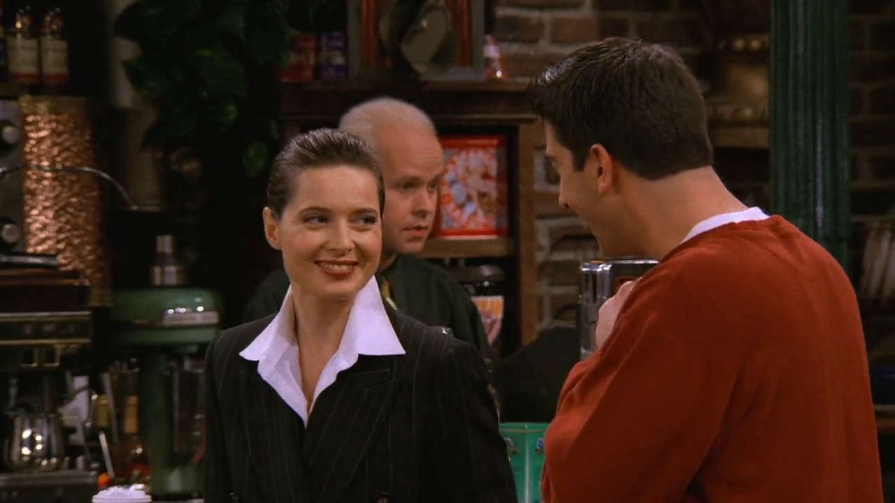

Mais tarde no *Central Perk*, adivinha quem aparece? *Isabella Rossellini* (1952-), atriz e modelo italiana,
filha de duas lendas: o diretor *Roberto Rossellini* e *Ingrid Bergman* (já citada no episódio
[S01E20 - Aquele com o Ortodontista Maligno](/temporada/1/episodio/20/#ingrid-bergman)). Ross chega a citar
o filme *Blue Velvet* (1986), em que ela é uma das protagonistas e faz uma de suas mais memoráveis atuações.[^rossellini]

[^rossellini]: [Isabella Rossellini - IMDB](https://www.imdb.com/name/nm0000618/bio)
