## Alan Alda

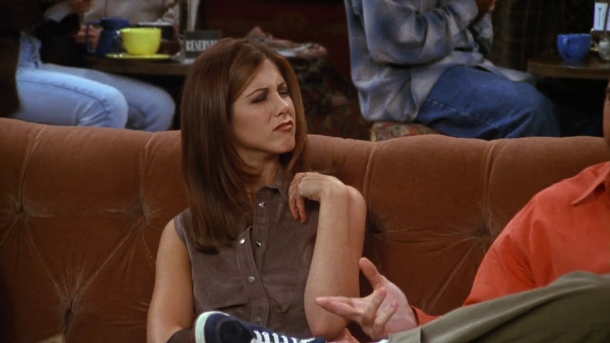

<cena>
  <rachel
    original="- If I squint, I can pretend he's Alan Alda."
    traducao="- Se fechar um pouco os olhos, posso fingir que é Alan Alda."
  />
</cena>

Enquanto Ross conta uma história do seu dia a dia no museu, Rachel finge que ele é
*Alan Alda* (1936-), ator, diretor e escritor americano nascido na cidade de *New York*.
Ficou conhecido por seu trabalho na série *M\*A\*S\*H* (1972-1983) no papel de *Capt. "Hawkeye" Pierce*.[^alda]

[^alda]: [Alan Alda - Encyclopædia Britannica (Inglês)](https://www.britannica.com/biography/Alan-Alda)

## Baby Elephant Walk

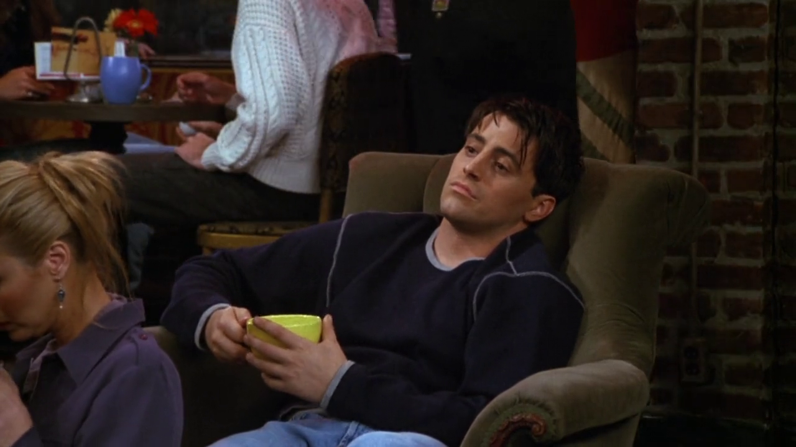

É quase possível ouvir a música apenas olhando essa imagem, onde Joey, para evitar escutar a
história de Ross, cantarola mentalmente a canção *Baby Elephant Walk* (1961), canção composta por
*Henry Mancini* (1924-1994), feita para o filme *Hatari!* (1962) e que venceu o *Grammy* de
Melhor Arranjo Instrumental em 1963.[^baby-elephant-walk-imdb] [^baby-elephant-walk-yt]

<cena>
  <phoebe
    original="- Who's singing?"
    traducao="- Quem está cantando?"
  />
</cena>

[^baby-elephant-walk-imdb]: [Grammy Winner Best Instrumental Arrangement For "Baby Elephant Walk" (1963) - IMDB](https://www.imdb.com/name/nm0000049/awards)
[^baby-elephant-walk-yt]: [Henry Mancini - Baby Elephant Walk - Youtube](https://www.youtube.com/watch?v=b1z4JfxFb6c)

## Happy Days

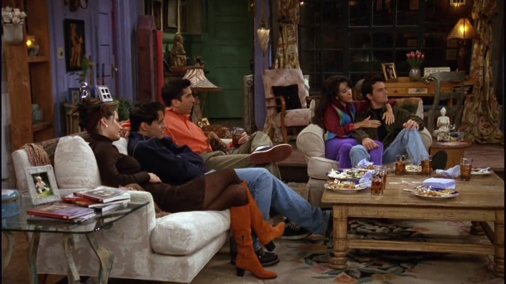

<cena>
  <ross
    original="- Hey, when you guys were kids and you played Happy Days, who were you? I was always Richie."
    traducao="- Ei, quando vocês eram crianças e brincavam de Happy Days, quem vocês eram? Eu era sempre o Richie."
  />
  <monica
    original="- I was always Joanie."
    traducao="- Eu era sempre a Joanie."
  />
</cena>

Os amigos (e a Janice) assistem ao final de um episódio de *Happy Days* (1974-1984), série de TV
americana que conta a história da família *Cunningham* e que se passa nos anos 50. Gerou uma série
de *spin-off's*, alguns já citados em episódios anteriores de *Friends*, e outros ainda por vir.[^happy-days]
Na série, *Joanie* era a irmã caçula de *Richie*, assim como Monica e Ross.

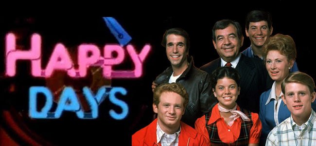

[^happy-days]: [Happy Days - IMDB](https://www.imdb.com/title/tt0070992/)

## All My Children

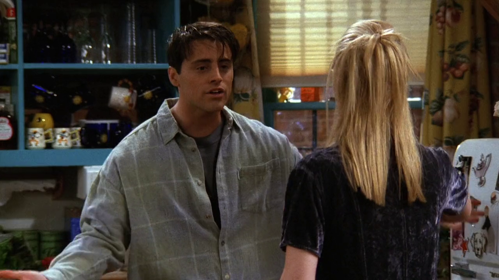

<cena>
  <joey
    original="- Oh, and guess what. I got an audition for All My Children."
    traducao="- Oh, e adivinha só. Vou fazer um teste para All My Children."
  />
</cena>

Joey encontra Phoebe no apartamento de Monica e conta como está sendo dar aulas de atuação.
Também dá a notícia que conseguiu um teste para *All My Children* (1970-2011), novela de grande
sucesso da *ABC* ambientada na cidade fictícia de *Pine Valley*, estado da Pensilvânia.[^all-my-children]

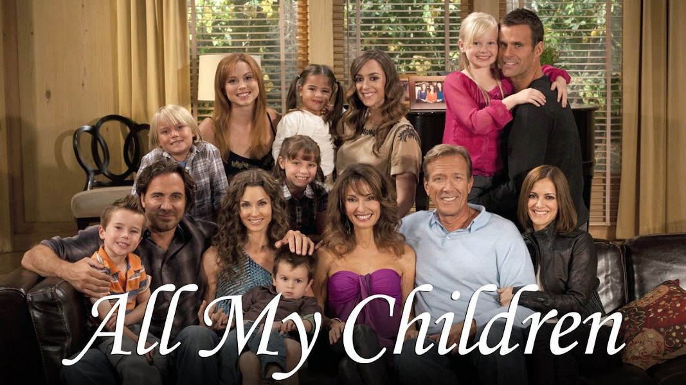

[^all-my-children]: [All My Children - IMDB](https://www.imdb.com/title/tt0065272/)

## Staying at the Y

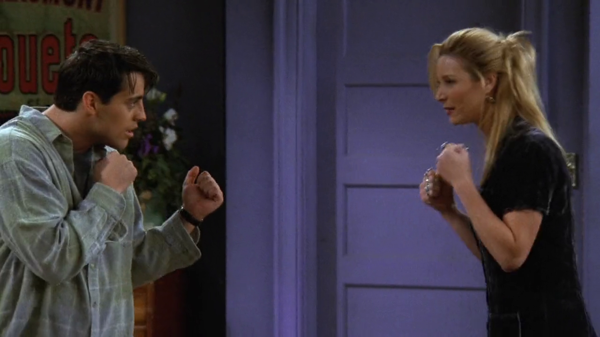

<cena>
  <joey
    original="- Hey, you're pretty good at this."
    traducao="- Ei, você é boa nisso."
  />
  <phoebe
    original="- Yeah, I had to learn. I was staying at the Y and some of the young men weren't acting Christian enough."
    traducao="- Sim, tive que aprender. Eu estava no Y e tinha uns jovens garotos que não eram católicos o suficiente."
  />
</cena>

Phoebe instiga Joey a mostrar o que ele sabe sobre lutas de boxe, e acaba revelando que aprendeu
os golpes no *The Y* ou *YMCA* (1844), da sigla inglesa *Young Men's Christian Association*.
Trata-se de uma organização religiosa criada por *George Williams* (1821-1905) em Londres,
que começa a espalhar-se pelo mundo a partir de 1850.[^ymca] E sim, é o mesmo *YMCA* (1978)
que deu inspiração para a música de mesmo nome da banda *Village People*.

[^ymca]: [YMCA - Encyclopædia Britannica](https://www.britannica.com/topic/YMCA)

## You are welcome!

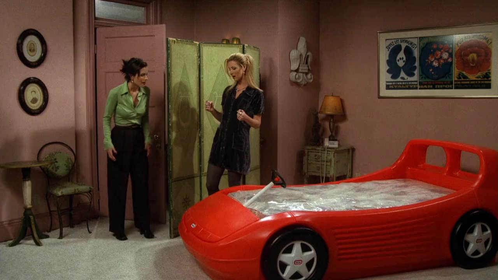

Na cena em que Monica descobre a cama de carro de corrida no seu quarto, vemos um quadro dos
Jogos Olímpicos de Verão (1980), realizado em Moscou. No quadro temos a expressão *Seja bem-vindo!*
em três idiomas: francês, russo e inglês, respectivamente. O interessante é que essa olimpíada foi
marcada por um boicote de aproximadamente 60 países, devido à invasão do Afeganistão por parte
da, então, União Soviética no ano anterior.[^welcome]

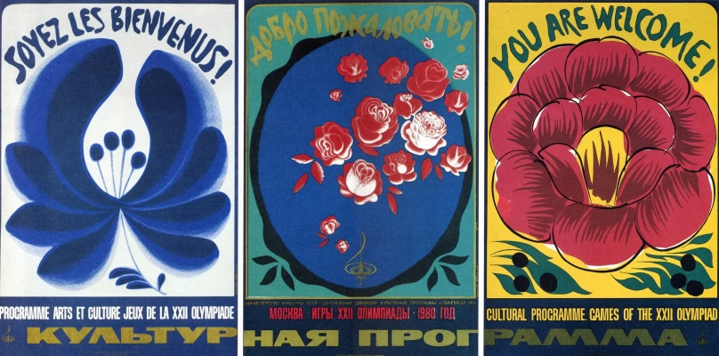

[^welcome]: [Jogos Olímpicos de Verão - Encyclopædia Britannica](https://www.britannica.com/event/Moscow-1980-Olympic-Games)

## Porto Ramos Pinto

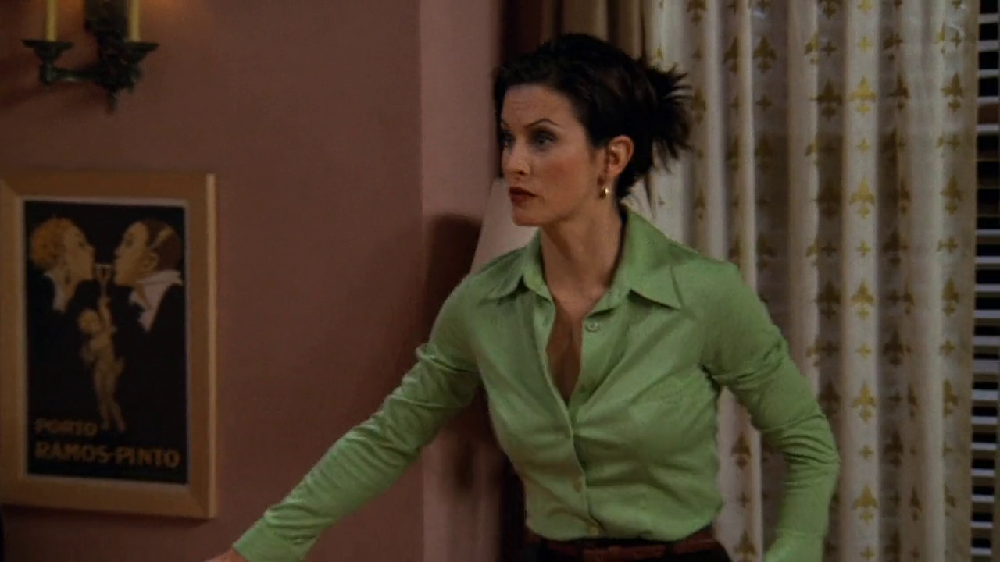

Enquanto Phoebe e Monica tentam explicar sobre a cama de carro de corrida a Chandler, é possível ver
o poster *Porto Ramos Pinto* (circa 1920) do artista *René Vincent* (1879-1936). Trata-se de uma
propaganda para o vinho de mesmo nome de *Adriano Ramos Pinto* (1859-1927), jovem empreendedor
que expandiu seu negócio ao levar seus produtos para o mercado brasileiro. Seu sucesso deu-se através
da modernização dos métodos de seleção, armazenamento e envelhecimento de vinhos, além é claro, da
propaganda.[^ramos-pinto]

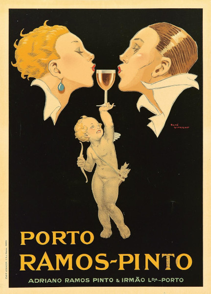

[^ramos-pinto]: [Ramos Pinto - Site oficial](https://www.ramospinto.pt/pt/casa/origem/)
